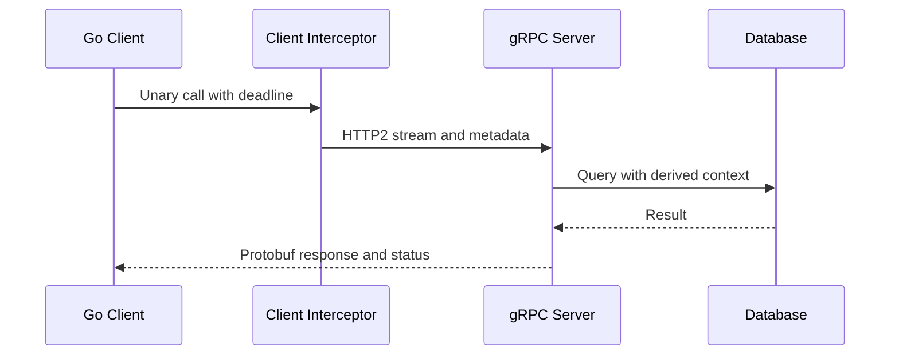

# gRPC: transport và call shapes

## Concept và Mental Model

gRPC dùng service contract, thường protobuf trên HTTP/2, với unary và streaming RPCs.

## How it works

Unary một request/response; server streaming nhiều responses; client streaming nhiều requests; bidirectional hai streams độc lập. Deadline qua context, metadata mang trace/auth, interceptors cho policy.

## Production Use Case

Reuse ClientConn, bound streams và message size; Go handlers propagate ctx tới DB/HTTP, không spawn vô hạn trên mỗi streamed message.

## Failure Scenarios

Không deadline; stream consumer chậm làm flow-control blocking; reconnect/retry có thể replay mutation.

## How I would debug this in production

Đo RPC status, deadline remaining, active streams, message bytes và stream receive/send waits.

## Trade-offs và When NOT to use

Typed contract tốt nội bộ; browser/public clients có compatibility/proxy constraints cần cân nhắc.

## Interview practice

How does a streaming RPC change backpressure? Send có thể block và phải honor cancellation; không buffer vô hạn.

## Key Takeaways

gRPC dùng service contract, thường protobuf trên HTTP/2, với unary và streaming RPCs..

## See also

- [HTTP client reuse và response ownership](../06-http-backend/http-client.md)
- [idempotency](../12-distributed-systems/idempotency.md)

## Nguồn đối chiếu

- [Tài liệu chính thức](https://grpc.io/docs/what-is-grpc/core-concepts/)

## RPC flow

Trong bidirectional streaming, đọc và ghi có thể tiến triển độc lập; phải theo concurrency contract của thư viện cho từng stream. Đóng send direction không đồng nghĩa toàn RPC hoàn tất. Interceptor cần giữ status/cause và deadline, không retry stream giữa chừng mà không protocol resume. Nguồn: [gRPC concepts](https://grpc.io/docs/what-is-grpc/core-concepts/) và [deadlines](https://grpc.io/docs/guides/deadlines/).
