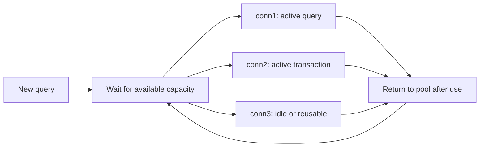
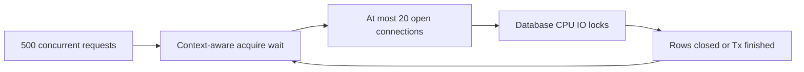

# Database connection pool: 500 requests và 20 connections

## Bài toán và ví dụ đầu tiên

Một endpoint bình thường query 20 ms nhưng lúc tải cao mất 2 giây. SQL ở server vẫn chỉ chạy 20 ms. Phần chậm có thể nằm trước query: handler chờ lấy connection từ pool. Pool giới hạn và tái sử dụng connection, nhưng khi mọi connection bận, công việc mới phải chờ trong context budget.

## Đi từng bước qua một tình huống



### Cách đọc diagram

R là một operation muốn dùng DB. Q biểu diễn bước acquire, không khẳng định có một FIFO queue như API guarantee. Conn1 và conn2 đang bận nên chưa cho operation khác mượn; conn3 có thể được chọn khi idle. Mũi tên về P biểu diễn tài nguyên được trả sau khi operation, Rows hoặc transaction kết thúc theo lifetime. Nếu cả ba bận và trần open là 3, request tiếp theo phải chờ hoặc hết context.

Giả sử ba query đều giữ connection 100 ms. Query thứ tư đến lúc t=10 ms chưa chạy SQL cho tới khi có slot, có thể gần t=100 ms. Nếu deadline còn 50 ms, nó có thể timeout trước khi tới database. Tăng statement timeout ở PostgreSQL không giúp phần chờ này.

## Hiểu cơ chế từ kết quả quan sát

SetMaxOpenConns đặt trần connection mở của handle; khi đạt trần, demand thêm phải chờ. SetMaxIdleConns đặt số connection idle được giữ, giúp tránh reconnect sau burst nhưng không là trần active. SetConnMaxIdleTime giới hạn thời gian idle, còn SetConnMaxLifetime giới hạn tuổi connection theo policy pool. Các giới hạn này không phải timer hủy query đang chạy giữa chừng; request/query cancellation là cơ chế khác.

Pool là một tài nguyên hữu hạn giống semaphore nên có thể tham gia deadlock. Ví dụ MaxOpenConns=1, Tx giữ connection duy nhất, rồi code gọi db.Query thay vì tx.Query để lấy một connection thứ hai. Nó chờ mãi nếu không có deadline, dù DB không bận gì khác. Phải dùng đúng handle của transaction và không giữ connection trong network call không liên quan.

Chọn pool từ budget toàn fleet: 20 replica × 15 connection = tối đa 300 connection ứng dụng, chưa tính migration, admin và service khác. Autoscaling từ 20 lên 40 replica có thể nhân đôi pressure dù mỗi replica cấu hình không đổi. Database chịu được bao nhiêu session và query concurrent còn tùy CPU, I/O, lock và workload; max_connections không phải throughput tối ưu.

## Khái niệm và lý do tồn tại

DB pool là concurrency limiter cho một database endpoint. Nó giảm connection setup cost nhưng không tạo thêm database CPU/IO. Quá ít connections tăng wait; quá nhiều có thể giảm throughput vì contention phía server.



### Cách đọc diagram

500 requests là nhu cầu đồng thời, còn trần20 là budget connection ví dụ. Acquire wait nằm trước DB CPU/IO/locks nên request có thể timeout khi chưa chạy SQL. Rows đóng hoặc transaction kết thúc mới trả tài nguyên để operation khác tiến triển, thể hiện bằng mũi tên quay về acquire. Các số này minh họa sự khác biệt request concurrency và pool size, không là cấu hình khuyến nghị chung.

## Cơ chế bên trong

SetMaxOpenConns cap open connections; nonpositive là unlimited theo API. SetMaxIdleConns cap idle reuse, không cap active work độc lập. SetConnMaxLifetime giới hạn thời gian reuse connection từ lúc tạo; SetConnMaxIdleTime giới hạn idle duration. Connections đang dùng không đơn giản bị kill ngay khi chạm lifetime; expire/reuse cleanup theo pool contract. Idle cap không nên vượt open cap.

Với 500 requests đồng thời cùng cần một connection và MaxOpenConns=20, tối đa khoảng 20 giữ connection; còn lại chờ acquire, timeout/cancel hoặc chưa tới DB stage. Không có bảo đảm chính xác 480 waiter nếu workload khác nhau. Nếu mean connection hold time 50ms và server chịu được, upper planning estimate 20/0.05=400 operations/s; queue wait có thể vượt deadline rất nhanh. Không dùng estimate này như benchmark result.

## Ví dụ code

```go
func ConfigurePool(db *sql.DB) {
    db.SetMaxOpenConns(20)
    db.SetMaxIdleConns(10)
    db.SetConnMaxLifetime(30 * time.Minute)
    db.SetConnMaxIdleTime(5 * time.Minute)
}
```

### Giải thích code và kết quả

ConfigurePool đặt trần20 open và giữ tối đa10 idle cho một sql.DB. Lifetime30phút và idle5phút điều chỉnh tái sử dụng/loại connection theo pool, không là query timeout. Cấu hình trước khi phục vụ và kiểm tra budget số replicas; giá trị chỉ minh họa field. DB phải được caller tạo/Close theo lifecycle, function không mở kết nối hay chứng minh DB chịu được20 queries song song.

Snippet cần imports database/sql và time. Chọn con số từ measurements; cộng mọi API/worker/admin pools trên tất cả pods trước so với DB budget.

## Từ runtime đến production

Acquire wait thường park goroutine; CPU thấp không nghĩa hệ thống khỏe. Track DB.Stats: OpenConnections, InUse, Idle, WaitCount, WaitDuration, MaxIdleClosed, MaxLifetimeClosed, MaxIdleTimeClosed. WaitCount/WaitDuration tích lũy; dùng deltas theo cửa sổ, average wait của những waits là delta duration/delta count khi count>0, không phải latency mọi request.

## Những đường lỗi cần hiểu

Rows/Tx leak giữ InUse; long lock waits chiếm connections; HPA nhân pool budget; lifetime đồng loạt hết làm connection churn; tăng max open chuyển queue từ app sang overloaded database.

## Đánh đổi

| Điều chỉnh | Có ích khi | Có hại khi |
|---|---|---|
| Tăng open cap | DB còn headroom | DB CPU/locks đã đầy |
| Tăng idle cap | Reconnect churn | FD/server slots khan hiếm |
| Giảm hold time | Query/Tx giữ lâu | Batch quá nhỏ tăng overhead |
| Admission limit | Bảo vệ latency | Reject phải có policy |

## Những cách hiểu dễ sai

Pool cap không bảo đảm fairness hoặc RPS cố định. DB nhiều connections hơn không luôn nhanh hơn. WaitDuration cumulative không được đọc trực tiếp như current latency.

## Khi nên chọn cách khác

Không tăng pool khi leak chưa sửa. Không đợi trong transaction để gọi external API. Không cho worker pool chiếm hết DB budget của latency-sensitive API.

## Lần theo bằng chứng khi có sự cố

So InUse≈MaxOpen và delta WaitCount/WaitDuration với query/transaction duration. Xem PostgreSQL active sessions, wait_event, locks và slow plans. Nếu DB nhàn nhưng InUse giữ lâu, tìm Rows/Tx ownership. Bound request admission và deadlines để giảm blast radius. Chỉ canary tăng cap sau khi chứng minh server còn headroom; đo tổng connections ở max replica count.

## Thực hành, debugging và kết luận

Sự cố pool cạn cần phân biệt pool nhỏ hợp lý dưới overload với leak. InUse cao cùng query chậm/lock wait nói về hold time; InUse cao khi queries đã kết thúc nhưng Rows/Tx không cleanup gợi ý ownership. Delta WaitCount/WaitDuration cho thấy áp lực acquire, còn profile goroutine chỉ ra caller đang chờ ở đâu.

Thử giảm concurrency hoặc sửa slow query trước khi tăng trần. Tăng pool có thể giảm chờ ở Go nhưng chuyển hàng đợi vào DB, khiến mọi query chậm và giữ connection lâu hơn. Test burst, transaction dài và cancel khi chờ acquire trên driver thật. Mỗi giá trị cấu hình cần đi cùng lý do, số replica tối đa và phép đo sau thay đổi.


## Đọc tiếp

- [connection-exhaustion](connection-exhaustion.md)
- [connection-pool-exhausted](../20-production-scenarios/connection-pool-exhausted.md)
- [design-high-throughput-api](../13-system-design/design-high-throughput-api.md)

## Nguồn đối chiếu

- [DB pool management](https://go.dev/doc/database/manage-connections)
