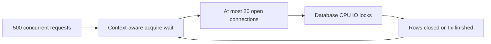

# Database connection pool: 500 requests và 20 connections

**P0 · Must know**

## Concept, Why và Mental Model

DB pool là concurrency limiter cho một database endpoint. Nó giảm connection setup cost nhưng không tạo thêm database CPU/IO. Quá ít connections tăng wait; quá nhiều có thể giảm throughput vì contention phía server.



## How và Internals

SetMaxOpenConns cap open connections; nonpositive là unlimited theo API. SetMaxIdleConns cap idle reuse, không cap active work độc lập. SetConnMaxLifetime giới hạn thời gian reuse connection từ lúc tạo; SetConnMaxIdleTime giới hạn idle duration. Connections đang dùng không đơn giản bị kill ngay khi chạm lifetime; expire/reuse cleanup theo pool contract. Idle cap không nên vượt open cap.

Với 500 requests đồng thời cùng cần một connection và MaxOpenConns=20, tối đa khoảng 20 giữ connection; còn lại chờ acquire, timeout/cancel hoặc chưa tới DB stage. Không có bảo đảm chính xác 480 waiter nếu workload khác nhau. Nếu mean connection hold time 50ms và server chịu được, upper planning estimate 20/0.05=400 operations/s; queue wait có thể vượt deadline rất nhanh. Không dùng estimate này như benchmark result.

## Code Example

```go
func ConfigurePool(db *sql.DB) {
    db.SetMaxOpenConns(20)
    db.SetMaxIdleConns(10)
    db.SetConnMaxLifetime(30 * time.Minute)
    db.SetConnMaxIdleTime(5 * time.Minute)
}
```

Snippet cần imports database/sql và time. Chọn con số từ measurements; cộng mọi API/worker/admin pools trên tất cả pods trước so với DB budget.

## Runtime behavior và Production Use Case

Acquire wait thường park goroutine; CPU thấp không nghĩa hệ thống khỏe. Track DB.Stats: OpenConnections, InUse, Idle, WaitCount, WaitDuration, MaxIdleClosed, MaxLifetimeClosed, MaxIdleTimeClosed. WaitCount/WaitDuration tích lũy; dùng deltas theo cửa sổ, average wait của những waits là delta duration/delta count khi count>0, không phải latency mọi request.

## Failure Scenarios

Rows/Tx leak giữ InUse; long lock waits chiếm connections; HPA nhân pool budget; lifetime đồng loạt hết làm connection churn; tăng max open chuyển queue từ app sang overloaded database.

## Trade-offs

| Điều chỉnh | Có ích khi | Có hại khi |
|---|---|---|
| Tăng open cap | DB còn headroom | DB CPU/locks đã đầy |
| Tăng idle cap | Reconnect churn | FD/server slots khan hiếm |
| Giảm hold time | Query/Tx giữ lâu | Batch quá nhỏ tăng overhead |
| Admission limit | Bảo vệ latency | Reject phải có policy |

## Common Misconceptions

Pool cap không bảo đảm fairness hoặc RPS cố định. DB nhiều connections hơn không luôn nhanh hơn. WaitDuration cumulative không được đọc trực tiếp như current latency.

## When NOT to use

Không tăng pool khi leak chưa sửa. Không đợi trong transaction để gọi external API. Không cho worker pool chiếm hết DB budget của latency-sensitive API.

## How I would debug this in production

So InUse≈MaxOpen và delta WaitCount/WaitDuration với query/transaction duration. Xem PostgreSQL active sessions, wait_event, locks và slow plans. Nếu DB nhàn nhưng InUse giữ lâu, tìm Rows/Tx ownership. Bound request admission và deadlines để giảm blast radius. Chỉ canary tăng cap sau khi chứng minh server còn headroom; đo tổng connections ở max replica count.

## Key Takeaways

Pool wait, query execution và transaction lifetime phải đo riêng. Budget toàn fleet quan trọng hơn config một pod.

## Interview Questions

### Basic / Mid — 10

1. What does MaxOpenConns limit?
2. What does MaxIdleConns limit?
3. What does connection lifetime mean?
4. What does max idle time mean?
5. What is InUse?
6. What is Idle?
7. What is WaitCount?
8. What is WaitDuration?
9. Are these counters cumulative?
10. What happens to excess concurrent requests?

### Senior — 10

1. How would you analyze 500 requests with 20 connections?
2. How does hold time determine capacity?
3. Why can CPU be low during exhaustion?
4. How do you calculate average observed acquire wait?
5. How does HPA multiply the DB budget?
6. Why can more connections hurt performance?
7. How does a leaked Rows affect the pool?
8. Why should worker and API budgets be separated?
9. How do lifetime limits affect churn?
10. Why is a pool not sufficient admission control?

### Production scenarios — 5

1. Why is InUse stuck at the limit after traffic drops?
2. Why did adding pods overload PostgreSQL?
3. Why are requests timing out before queries start?
4. Why did lowering lifetime increase TLS and auth load?
5. Why did raising the pool cap make P99 worse?

### Senior Follow-ups — 5

1. How many connections exist fleet-wide?
2. How long is each held?
3. What keeps them occupied?
4. Where is excess demand queued?
5. Which measurement justifies the next tuning step?

Chuỗi follow-up: trả lời lần lượt 5 câu cuối; mỗi câu cần một invariant, bằng chứng runtime hoặc trade-off cụ thể.


## See also

- [connection-exhaustion](connection-exhaustion.md)
- [connection-pool-exhausted](../20-production-scenarios/connection-pool-exhausted.md)
- [design-high-throughput-api](../13-system-design/design-high-throughput-api.md)

## Nguồn đối chiếu

- [DB pool management](https://go.dev/doc/database/manage-connections)
