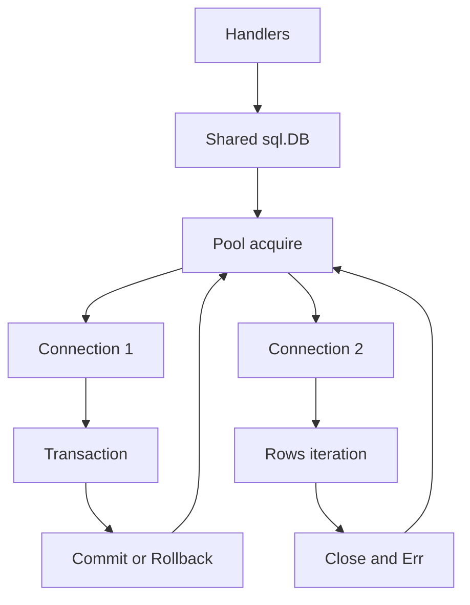

# database/sql: pool handle, rows và transaction ownership

## Bài toán và ví dụ đầu tiên

HTTP handler cần đọc user từ database. Một biến *sql.DB trông như “một connection”, nhưng nó là handle quản lý pool connection dùng chung. Mở DB một lần cho service rồi dùng qua nhiều goroutine khác với mở/đóng cho mỗi request; nhầm lẫn này dễ tạo connection churn và làm khó shutdown.

## Đi từng bước qua một tình huống

```go
func UserIDs(ctx context.Context, db *sql.DB) ([]int64, error) {
    rows, err := db.QueryContext(ctx, "SELECT id FROM users ORDER BY id LIMIT 100")
    if err != nil { return nil, fmt.Errorf("query users: %w", err) }
    defer rows.Close()
    var ids []int64
    for rows.Next() {
        var id int64
        if err := rows.Scan(&id); err != nil { return nil, err }
        ids = append(ids, id)
    }
    if err := rows.Err(); err != nil { return nil, err }
    return ids, nil
}
```

### Giải thích code từng bước

QueryContext có thể phải chờ lấy connection trước khi gửi query. Chỉ sau khi thành công mới defer rows.Close; lỗi trước đó chưa có Rows hợp lệ để cleanup. Next tiến qua kết quả, Scan chuyển field vào biến có kiểu và có thể lỗi nếu schema/type không khớp. Khi Next trả false, phải kiểm tra Err để phân biệt hết dữ liệu bình thường với lỗi giữa stream.

Limit 100 giữ ví dụ hữu hạn, không là thiết kế pagination hoàn chỉnh. Query là hằng nên không có user input ghép vào SQL. Với tham số, dùng placeholder đúng driver; không fmt.Sprintf dữ liệu người dùng vào câu lệnh. Slice result nil khi không có dòng cần được adapter HTTP xử lý theo contract null/[] nếu API phân biệt.

## Hiểu cơ chế từ kết quả quan sát

DB dùng connection theo nhu cầu; Rows có thể giữ tài nguyên trong suốt thời gian caller consume kết quả. Đọc một hàng rồi bỏ Rows mà không Close có thể giữ slot lâu hơn dự định. QueryRow thường báo lỗi như no rows tại Scan, nên phải kiểm tra ở đó. Exec phù hợp lệnh không trả rows và caller cần kiểm tra RowsAffected khi invariant phụ thuộc số dòng cập nhật.

Transaction pin một connection từ Begin tới Commit/Rollback. Các query thuộc transaction phải gọi trên Tx, không gọi DB bên ngoài rồi tưởng cùng transaction. Nếu pool nhỏ, đang giữ một Tx rồi gọi DB để lấy connection khác có thể tự mắc chờ slot mà chính transaction đang giữ.

sql.Open tạo handle và tùy driver có thể chưa xác minh kết nối thành công ngay; PingContext ở startup có thể kiểm tra dependency với deadline. Không chạy Ping trên mọi request thay cho xử lý lỗi query; nó thêm round trip và không bảo đảm query sau sẽ thành công. Driver là lớp nói protocol cụ thể, quyết định nhiều chi tiết cancellation và type mapping.

## Khái niệm và lý do tồn tại

`sql.DB` không phải một connection; nó là long-lived, concurrent-safe handle quản lý connection pool. `sql.Tx` giữ một connection cho transaction. `sql.Conn` là dedicated connection cần Close để trả về pool.



### Cách đọc diagram

Handlers chia sẻ sql.DB rồi acquire một connection từ pool. Một nhánh giữ connection qua transaction đến Commit/Rollback; nhánh khác đọc Rows rồi Close/kiểm tra Err. Các mũi tên quay về pool biểu diễn resource release để request khác dùng. DB.Close là lifecycle toàn handle, khác việc trả từng Rows/Tx resource ở các nhánh trong hình.

## Cơ chế bên trong

Open có thể chưa thiết lập kết nối thật; PingContext kiểm tra startup connectivity theo driver. QueryContext trả Rows cần Close và check Err sau Next loop. QueryRowContext trì hoãn error tới Scan; dùng errors.Is(err, sql.ErrNoRows) phân biệt not-found. SQL placeholders phụ thuộc driver, PostgreSQL dùng `$1`; identifiers không thể parameterize như values, phải allowlist.

BeginTx acquire connection, các calls trong transaction phải dùng tx, không vô tình gọi db khiến operation nằm ngoài transaction hoặc đợi connection khác. Commit error phải được trả về; rollback cleanup sau commit thường ErrTxDone và không nên che main error. Context cancellation support phụ thuộc driver và không chứng minh external side effect chưa xảy ra.

## Ví dụ code

[examples/sql.go](../examples/sql.go) có QueryContext, Rows.Close/Err và transaction helper bảo toàn main/cleanup error. Nó compile với stdlib; muốn chạy query cần PostgreSQL driver và schema được cấu hình riêng. Không gọi sample là integration test đã chạy khi không có database.

```go
// db la shared *sql.DB da duoc startup owner khoi tao.
db.SetMaxOpenConns(20)
db.SetMaxIdleConns(10)
db.SetConnMaxLifetime(30 * time.Minute)
db.SetConnMaxIdleTime(5 * time.Minute)
```

### Giải thích code và kết quả

DB đã được startup owner tạo; bốn dòng cấu hình open, idle, tuổi connection và thời gian idle trên handle chung. Chúng không chạy query và không thay Context API cho cancellation.20/10/30phút/5phút là số để phân biệt các loại trần, không là default deployment. Snippets harness cấp biến db và imports để compile ví dụ trong isolation.

## Từ runtime đến production

Request context bound acquire wait và query khi driver hỗ trợ. Rows streaming có thể giữ connection lâu dù application đang xử lý từng row; batch nhỏ hoặc đọc bounded result rồi release nếu phù hợp. DB Close thuộc service owner sau workers/handlers drain, không defer Close mỗi request.

## Những đường lỗi cần hiểu

Rows không close; Tx không commit/rollback; pool=1 nhưng code trong Tx gọi db.Query; ignored rows.Err bỏ sót network failure; SQL string interpolation gây injection; request tạo DB handle riêng làm nhân pools.

## Đánh đổi

| API | Dùng cho | Trách nhiệm |
|---|---|---|
| sql.DB | Queries độc lập | Long-lived pool sizing |
| sql.Tx | Atomic business operation | Short transaction, commit/rollback |
| sql.Conn | Session state cụ thể | Explicit release/reset |

## Những cách hiểu dễ sai

Open success không chắc DB reachable. Close Rows là release resource, khác Next hết kết quả. Parameterized query không tự kiểm tra authorization/tenant scope.

## Khi nên chọn cách khác

Không giữ transaction trong khi gọi payment provider hoặc user interaction. Không mở một sql.DB mỗi request. Không dùng context.Background ở repository khi caller đã có ctx.

## Lần theo bằng chứng khi có sự cố

DB.Stats cho pool state; DB server views cho actual queries/locks. Tách acquire wait, execution và rows iteration. Tìm missing Close, long Tx và calls db bên trong Tx. Lấy query plan trên staging/replica phù hợp; EXPLAIN ANALYZE thực thi query nên cân nhắc side effects/chi phí. Test cancel với driver thật và check connections được trả.

## Thực hành, debugging và kết luận

Ở production, đo DB.Stats với InUse/Idle/OpenConnections và delta WaitCount/WaitDuration. Những counter chờ là tích lũy, cần tính chênh theo cửa sổ quan sát thay vì lấy giá trị tuyệt đối làm latency hiện tại. Trace tách pool wait, query execute và consume rows nếu có thể.

Lab [sql.go](../examples/sql.go) có cleanup patterns; nó compile nhưng không thay integration test với PostgreSQL thật. Test lỗi Scan, hủy giữa query và transaction rollback bằng driver/database mục tiêu. Schema migration phải tương thích rolling deployment để code cũ/mới cùng hoạt động trong cửa sổ chuyển tiếp. Close DB ở cuối shutdown sau khi các owner dùng nó đã kết thúc.


## Đọc tiếp

- [database-sql-pool](database-sql-pool.md)
- [transactions](transactions.md)
- [pgx](pgx.md)

## Nguồn đối chiếu

- [database/sql](https://pkg.go.dev/database/sql)
