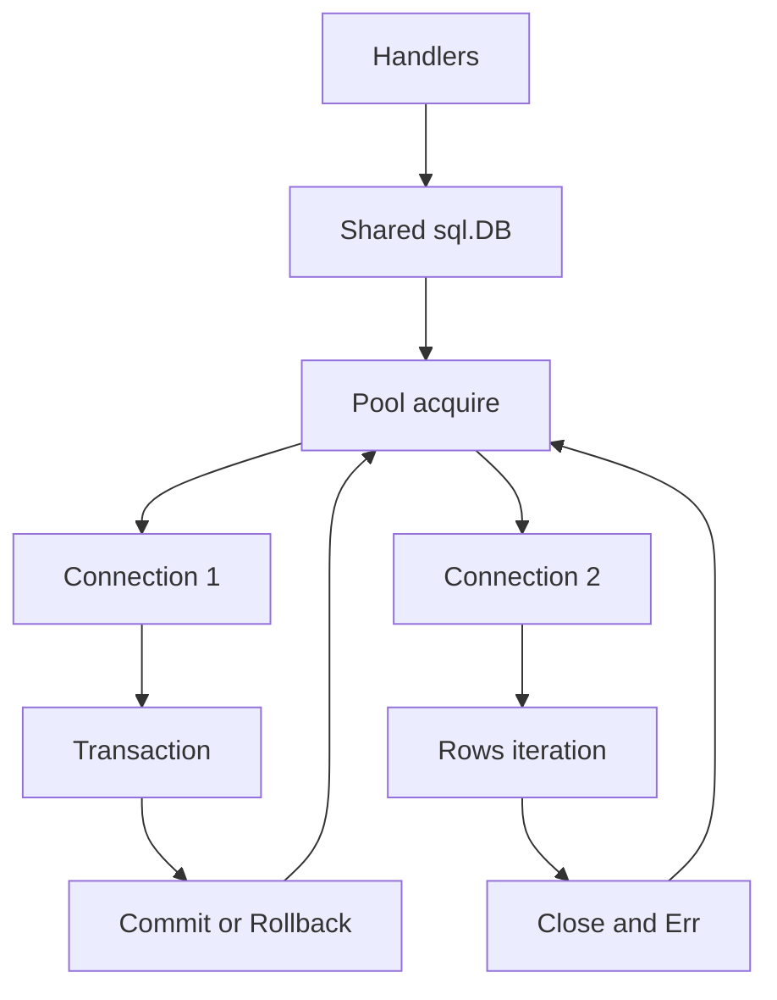

# database/sql: pool handle, rows và transaction ownership

**P0 · Must know**

## Concept, Why và Mental Model

`sql.DB` không phải một connection; nó là long-lived, concurrent-safe handle quản lý connection pool. `sql.Tx` giữ một connection cho transaction. `sql.Conn` là dedicated connection cần Close để trả về pool.



## How và Internals

Open có thể chưa thiết lập kết nối thật; PingContext kiểm tra startup connectivity theo driver. QueryContext trả Rows cần Close và check Err sau Next loop. QueryRowContext trì hoãn error tới Scan; dùng errors.Is(err, sql.ErrNoRows) phân biệt not-found. SQL placeholders phụ thuộc driver, PostgreSQL dùng `$1`; identifiers không thể parameterize như values, phải allowlist.

BeginTx acquire connection, các calls trong transaction phải dùng tx, không vô tình gọi db khiến operation nằm ngoài transaction hoặc đợi connection khác. Commit error phải được trả về; rollback cleanup sau commit thường ErrTxDone và không nên che main error. Context cancellation support phụ thuộc driver và không chứng minh external side effect chưa xảy ra.

## Code Example

[examples/sql.go](../examples/sql.go) có QueryContext, Rows.Close/Err và transaction helper bảo toàn main/cleanup error. Nó compile với stdlib; muốn chạy query cần PostgreSQL driver và schema được cấu hình riêng. Không gọi sample là integration test đã chạy khi không có database.

```go
// db la shared *sql.DB da duoc startup owner khoi tao.
db.SetMaxOpenConns(20)
db.SetMaxIdleConns(10)
db.SetConnMaxLifetime(30 * time.Minute)
db.SetConnMaxIdleTime(5 * time.Minute)
```

## Runtime behavior và Production Use Case

Request context bound acquire wait và query khi driver hỗ trợ. Rows streaming có thể giữ connection lâu dù application đang xử lý từng row; batch nhỏ hoặc đọc bounded result rồi release nếu phù hợp. DB Close thuộc service owner sau workers/handlers drain, không defer Close mỗi request.

## Failure Scenarios

Rows không close; Tx không commit/rollback; pool=1 nhưng code trong Tx gọi db.Query; ignored rows.Err bỏ sót network failure; SQL string interpolation gây injection; request tạo DB handle riêng làm nhân pools.

## Trade-offs

| API | Dùng cho | Trách nhiệm |
|---|---|---|
| sql.DB | Queries độc lập | Long-lived pool sizing |
| sql.Tx | Atomic business operation | Short transaction, commit/rollback |
| sql.Conn | Session state cụ thể | Explicit release/reset |

## Common Misconceptions

Open success không chắc DB reachable. Close Rows là release resource, khác Next hết kết quả. Parameterized query không tự kiểm tra authorization/tenant scope.

## When NOT to use

Không giữ transaction trong khi gọi payment provider hoặc user interaction. Không mở một sql.DB mỗi request. Không dùng context.Background ở repository khi caller đã có ctx.

## How I would debug this in production

DB.Stats cho pool state; DB server views cho actual queries/locks. Tách acquire wait, execution và rows iteration. Tìm missing Close, long Tx và calls db bên trong Tx. Lấy query plan trên staging/replica phù hợp; EXPLAIN ANALYZE thực thi query nên cân nhắc side effects/chi phí. Test cancel với driver thật và check connections được trả.

## Key Takeaways

Pool, query result và transaction có owner khác nhau. Mỗi acquire cần một release được chứng minh ở mọi exit path.

## Interview Questions

### Basic / Mid — 10

1. Is sql.DB one connection?
2. Is it safe to share?
3. Does Open always connect immediately?
4. What does PingContext check?
5. Who closes Rows?
6. Why check Rows.Err?
7. Where does QueryRow report errors?
8. What is sql.ErrNoRows?
9. What does a transaction pin?
10. Who owns DB.Close?

### Senior — 10

1. How can using db inside a Tx break atomicity?
2. How can that pattern deadlock with pool size one?
3. What does context cancellation depend on in a driver?
4. Why can streaming rows hold a connection?
5. How should rollback errors be handled?
6. Why can commit outcome be ambiguous?
7. How do placeholders differ from identifier escaping?
8. How do dedicated Conn sessions require cleanup?
9. How should pool lifetime align with service lifetime?
10. How do you test cancellation against a real driver?

### Production scenarios — 5

1. Why are all requests waiting despite an idle database?
2. Why did a query silently return partial results?
3. Why did one transaction update only half the intended state?
4. Why did creating DB per request overwhelm PostgreSQL?
5. Why is canceled work still running remotely?

### Senior Follow-ups — 5

1. Who owns the handle?
2. Who owns the acquired connection?
3. Which result or transaction retains it?
4. What releases it on every path?
5. Which metric proves release occurred?

Chuỗi follow-up: trả lời lần lượt 5 câu cuối; mỗi câu cần một invariant, bằng chứng runtime hoặc trade-off cụ thể.


## See also

- [database-sql-pool](database-sql-pool.md)
- [transactions](transactions.md)
- [pgx](pgx.md)

## Nguồn đối chiếu

- [database/sql](https://pkg.go.dev/database/sql)
