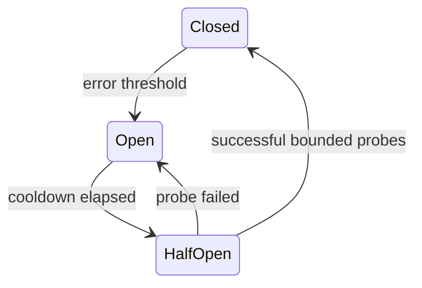

# Circuit breaker state machine

## Concept và Mental Model

Breaker ngừng calls tới dependency đang fail để giảm pressure và fail nhanh; không thay timeout.

## How it works

Closed thu samples; Open reject; Half-open cho ít probes rồi close/reopen theo threshold/window. Scope theo dependency/operation, avoid global one breaker.

## Production Use Case

Optional recommendations degrade khi breaker open, payment critical path có explicit failure response.

## Failure Scenarios

Threshold quá nhạy flaps; all pods half-open cùng lúc tạo herd; counting validation errors làm breaker sai.

## How I would debug this in production

Track state transitions, rejected calls, probe outcomes và dependency latency.

## Trade-offs và When NOT to use

Breaker thêm state/tuning; với nhỏ workload timeout+concurrency cap có thể đủ.

## Interview practice

What should half-open limit? Số probe concurrent và window để không flood dependency vừa hồi phục.

## Key Takeaways

Breaker ngừng calls tới dependency đang fail để giảm pressure và fail nhanh; không thay timeout..

## See also

- [Idempotent consumer transaction](../10-messaging/idempotent-consumer.md)
- [system-design-framework](../13-system-design/system-design-framework.md)
- [HTTP client reuse và response ownership](../06-http-backend/http-client.md)

## Nguồn đối chiếu

- [Tài liệu chính thức](https://www.postgresql.org/docs/current/transaction-iso.html)

