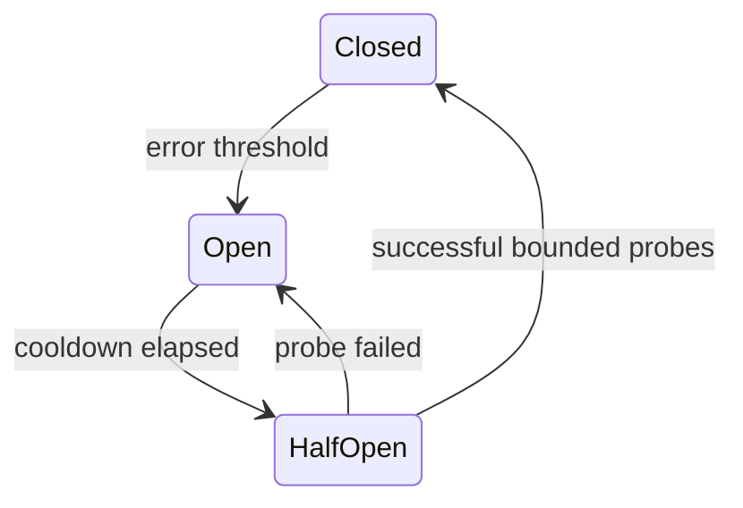

# Circuit breaker state machine

## Bài toán và ví dụ đầu tiên

Partner thanh toán đang lỗi và mỗi call đợi 3 giây rồi thất bại. Các request mới tiếp tục chiếm worker chờ vô ích. Circuit breaker theo dõi failure để tạm dừng gọi dependency, trả lỗi nhanh và cho tài nguyên còn lại phục vụ công việc khác.

## Đi từng bước qua một tình huống

Trạng thái closed cho calls đi qua; khi điều kiện lỗi đủ, open từ chối trong một khoảng. Half-open cho một số probe có giới hạn để kiểm tra phục hồi, rồi đóng lại hoặc mở tiếp. Không cho mọi request đồng thời làm probe khi timer hết, nếu không tạo đợt tải lớn đúng lúc partner yếu.

## Hiểu cơ chế từ kết quả quan sát

Breaker cần định nghĩa lỗi nào được tính, cửa sổ thống kê và minimum volume để tránh nhiễu. Lỗi validation của client không chứng minh partner hỏng. Breaker cũng không giới hạn thời gian một call đã được cho qua; timeout và bulkhead vẫn cần. Fallback phải giữ semantics, không bịa payment success.

## Khái niệm và mô hình làm việc

Breaker ngừng calls tới dependency đang fail để giảm pressure và fail nhanh; không thay timeout.

## Cơ chế và những ranh giới cần giữ

Closed thu samples; Open reject; Half-open cho ít probes rồi close/reopen theo threshold/window. Scope theo dependency/operation, avoid global one breaker.

## Áp dụng vào hệ thống thật

Optional recommendations degrade khi breaker open, payment critical path có explicit failure response.

## Những đường lỗi cần hiểu

Threshold quá nhạy flaps; all pods half-open cùng lúc tạo herd; counting validation errors làm breaker sai.

## Lần theo bằng chứng khi có sự cố

Track state transitions, rejected calls, probe outcomes và dependency latency.

## Đánh đổi và giới hạn sử dụng

Breaker thêm state/tuning; với nhỏ workload timeout+concurrency cap có thể đủ.

## Thực hành, debugging và kết luận

Đo rejected-by-breaker riêng với remote failures và latency. Test flapping, low traffic và recovery probes. Trade-off là một số request bị fail-fast dù partner có thể vừa hồi phục; đổi lại tránh giữ toàn bộ capacity trong những call có xác suất thành công thấp.

## Đọc tiếp

- [Idempotent consumer transaction](../10-messaging/idempotent-consumer.md)
- [system-design-framework](../13-system-design/system-design-framework.md)
- [HTTP client reuse và response ownership](../06-http-backend/http-client.md)

## Nguồn đối chiếu

- [Tài liệu chính thức](https://www.postgresql.org/docs/current/transaction-iso.html)

### Cách đọc diagram

Closed cho calls đi qua; đủ điều kiện lỗi chuyển sang Open để fail-fast. Sau cooldown chuyển HalfOpen và chỉ cho probes có bound. Probe thành công theo policy đóng circuit, thất bại mở lại. Mũi tên thể hiện state transition, không bảo đảm thời gian recovery; timeout vẫn cần cho từng call/probe được phép thực thi.
