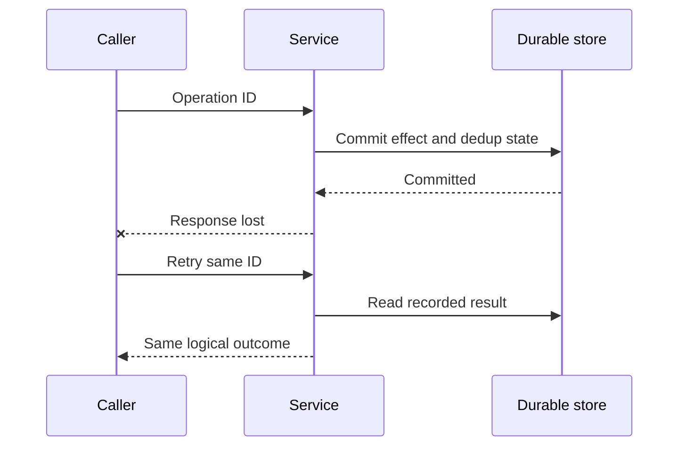

# Distributed systems: safety, liveness và replay

**P0 · Must know**

## Concept, Why và Mental Model

Distributed operation đi qua nhiều independent processes và durable stores. Network delay/failure làm caller không biết remote outcome; safety là invariant không bị phá, liveness là cuối cùng work tiến triển dưới assumptions đã nêu.



## How và Internals

Định nghĩa operation identity và authoritative state trước retry. Nếu invariant nằm một DB, transaction + unique constraint là boundary rõ. Nếu DB + broker, outbox ghi intent cùng transaction rồi relay at-least-once. Nếu external provider, dùng provider idempotency key và reconciliation; local transaction không bao remote effect.

Ordering có scope: Kafka partition order không tự giữ completion order trong worker pool. Lease expiry không dừng old actor; fencing/version check tại target ngăn stale writes. Eventual convergence đòi events không mất vĩnh viễn, retries/DLQ có owner và conflict resolution deterministic. CAP nói quyết định consistency/availability dưới partition, không phải slogan chọn hai trong ba ở mọi tình huống.

## Code Example

Schema minh họa PostgreSQL cho một durable dedup boundary:

```sql
CREATE TABLE processed_events (
    consumer_name text NOT NULL,
    event_id text NOT NULL,
    processed_at timestamptz NOT NULL DEFAULT now(),
    PRIMARY KEY (consumer_name, event_id)
);
```

Consumer transaction insert dedup record và business mutation cùng commit; duplicate unique key không được chạy effect lại. Record retention phải dài hơn replay horizon. Xem [InTx](../examples/sql.go) cho lifecycle Go; SQL ở đây không tự tạo end-to-end exactly-once với provider bên ngoài.

## Runtime behavior và Production Use Case

Go context hủy local wait, không rollback remote server. Shared pools và semaphores bound damage khi dependency chậm. Worker fixed count, bounded queue bytes, retry budget và graceful drain giúp system còn capacity để recovery. Idempotency giảm hậu quả duplicate; backpressure bảo vệ liveness dưới overload.

## Failure Scenarios

Commit success rồi response mất; consumer crash trước offset commit; old leader wake sau lease hết; cache stale refill; cross-region partition; retries tăng demand khi dependency giảm service rate.

## Trade-offs

| Policy | Safety/availability benefit | Cost |
|---|---|---|
| Reject khi authority unreachable | Giữ strong invariant | Availability giảm |
| Serve bounded stale read | Read availability | Freshness giảm |
| Durable async intent | Recoverable work | Lag/state complexity |
| Idempotent replay | Duplicate-safe effect | Metadata/retention |

## Common Misconceptions

At-least-once không phải lỗi broker. Exactly-once broker không mở rộng tự động tới DB/email. Timeout không có nghĩa failure cuối cùng. Lock lease không có nghĩa owner cũ đã chết.

## When NOT to use

Không dùng distributed lock nếu DB conditional update giải quyết được invariant. Không chia transaction thành services chỉ để gọi architecture “microservices”. Không retry unsafe operations với fresh identity.

## How I would debug this in production

Dựng timeline theo logical operation ID, source offset/version và durable state. Phân biệt duplicate delivery với duplicate business intent. Xác định last confirmed commit và unknown gap; reconcile bằng source authority thay suy từ thiếu log. Inject crash ngay trước/sau từng commit, verify state và bounded recovery time. Đo lag age cùng error rate để bắt silent stalled work.

## Key Takeaways

Thiết kế quanh commit boundaries, stable identities và recovery. Mọi claim consistency/delivery phải nêu scope và failure assumptions.

## Interview Questions

### Basic / Mid — 10

1. What is safety?
2. What is liveness?
3. What is an ambiguous outcome?
4. What is idempotency?
5. What is at-least-once delivery?
6. What is an outbox?
7. What is a lease?
8. What is a fencing token?
9. What is eventual consistency?
10. What is a partition?

### Senior — 10

1. Why can timeout not prove failure?
2. Why must dedup and effect commit atomically?
3. How do broker transactions differ from end-to-end effects?
4. Why can lease holders overlap operationally?
5. How does per-key order differ from global order?
6. How does Go context affect remote side effects?
7. How do retry budgets protect liveness?
8. What must be true for eventual convergence?
9. When should availability be sacrificed for safety?
10. How do you choose a reconciliation authority?

### Production scenarios — 5

1. What happens after DB commit but before offset commit?
2. What happens when an old leader resumes after lease expiry?
3. What happens when Redis fails and every request hits DB?
4. What happens when a payment response is lost?
5. What happens when a worker commits past an unfinished offset?

### Senior Follow-ups — 5

1. What is the stable operation identity?
2. Which state is authoritative?
3. Where is the durable commit?
4. Which crash window permits replay?
5. How is the invariant verified after recovery?

Chuỗi follow-up: trả lời lần lượt 5 câu cuối; mỗi câu cần một invariant, bằng chứng runtime hoặc trade-off cụ thể.


## See also

- [Transactional outbox](outbox-pattern.md)
- [Leases, locks và fencing tokens](distributed-lock.md)
- [Retries như một capacity policy](retry.md)
- [System design framework cho Senior Go](../13-system-design/system-design-framework.md)

## Nguồn đối chiếu

- [Kafka design](https://kafka.apache.org/41/design/design/)
- [PostgreSQL constraints](https://www.postgresql.org/docs/current/ddl-constraints.html)
