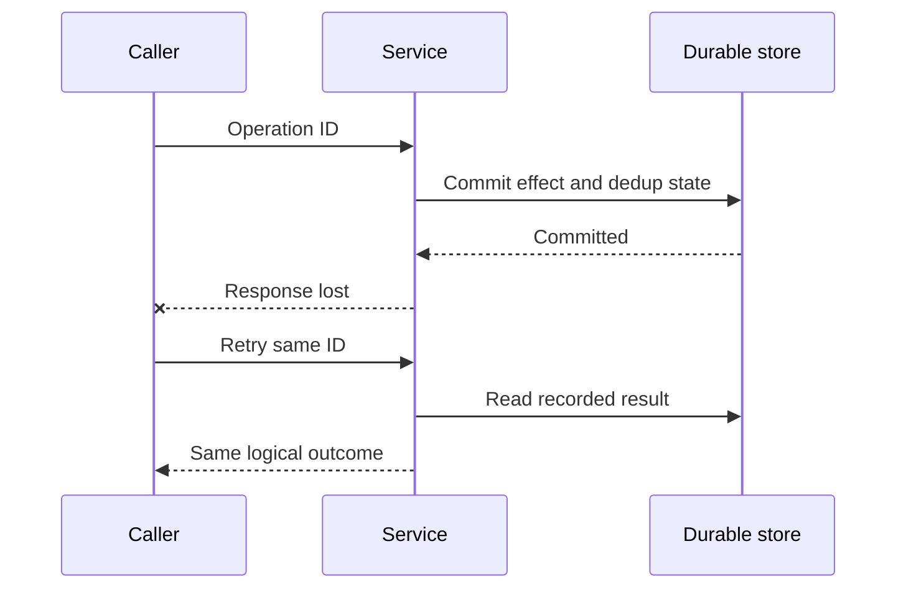

# Distributed systems: safety, liveness và replay

## Bài toán và ví dụ đầu tiên

Một service gửi yêu cầu charge đến service khác. Bên nhận commit thành công, nhưng response bị mất trên mạng. Caller chỉ nhìn thấy timeout. Nếu gọi lại như một yêu cầu mới, khách có thể bị charge hai lần; nếu bỏ cuộc, UI có thể báo thất bại trong khi tiền đã trừ. Đây là bài toán nền tảng của hệ phân tán: không phải lúc nào một bên cũng biết chính xác điều gì đã xảy ra ở bên kia.

## Đi từng bước qua một tình huống

Vẽ ba thời điểm: request được gửi, side effect được commit, response được nhận. Lỗi có thể xảy ra trước commit, sau commit hoặc chỉ ở đường response. Từ một timeout ở caller, không thể phân biệt đầy đủ các trường hợp này. Cần operation ID và trạng thái durable để query/retry/reconcile; một bool success ở memory caller không tồn tại qua crash.

Nếu request chỉ đọc dữ liệu, thử lại thường dễ hơn vì không tạo thêm tác dụng nghiệp vụ, nhưng vẫn làm tăng load và có thể thấy version khác. Nếu request ghi, idempotency là contract nhiều lần thử cùng một operation identity tạo tác dụng tương đương một lần. Nó cần xử lý concurrent attempts và crash windows, không chỉ cache response ở process.

## Hiểu cơ chế từ kết quả quan sát

Partial failure nghĩa là một phần hệ thống lỗi trong khi phần khác còn chạy. Process A thấy B timeout nhưng B có thể vẫn phục vụ C hoặc đang hoàn tất A. Network partition là các node không trao đổi được một số thông điệp dù bản thân node có thể còn hoạt động. Timeout giúp nghi ngờ thiếu tiến triển để giới hạn chờ, không là bằng chứng node chết.

Consistency mô tả những kết quả đọc/ghi được phép quan sát. Durability mô tả dữ liệu đã được chấp nhận có tồn tại qua loại lỗi nào theo contract. Availability phải được định nghĩa theo request nào thành công trong thời gian nào; trả một trang lỗi rất nhanh chưa phải availability nghiệp vụ. Replication, cache và queue thay đổi các trade-off này chứ không tự loại bỏ failure.

Mỗi boundary durable cần một invariant rõ: một order ID không được tạo hai lần, một message không áp dụng balance hai lần, một client không thấy quyền của tenant khác. Dùng transaction/constraint khi state cùng một DB; qua nhiều DB/service, cần workflow, retries và compensation có trạng thái. Không gọi một chuỗi HTTP request là transaction chỉ vì viết trong cùng hàm Go.

## Khái niệm và lý do tồn tại

Distributed operation đi qua nhiều independent processes và durable stores. Network delay/failure làm caller không biết remote outcome; safety là invariant không bị phá, liveness là cuối cùng work tiến triển dưới assumptions đã nêu.



### Cách đọc diagram

Caller gửi operation ID, service commit effect cùng dedup state vào durable store. Dấu mất response nằm sau commit nên caller timeout dù effect đã có. Retry cùng ID đọc recorded result và trả cùng logical outcome. Transaction trong sơ đồ chỉ atomic khi effect và dedup thật sự cùng durable boundary; effect ở provider ngoài cần workflow/idempotency riêng.

## Cơ chế bên trong

Định nghĩa operation identity và authoritative state trước retry. Nếu invariant nằm một DB, transaction + unique constraint là boundary rõ. Nếu DB + broker, outbox ghi intent cùng transaction rồi relay at-least-once. Nếu external provider, dùng provider idempotency key và reconciliation; local transaction không bao remote effect.

Ordering có scope: Kafka partition order không tự giữ completion order trong worker pool. Lease expiry không dừng old actor; fencing/version check tại target ngăn stale writes. Eventual convergence đòi events không mất vĩnh viễn, retries/DLQ có owner và conflict resolution deterministic. CAP nói quyết định consistency/availability dưới partition, không phải slogan chọn hai trong ba ở mọi tình huống.

## Ví dụ code

Schema minh họa PostgreSQL cho một durable dedup boundary:

```sql
CREATE TABLE processed_events (
    consumer_name text NOT NULL,
    event_id text NOT NULL,
    processed_at timestamptz NOT NULL DEFAULT now(),
    PRIMARY KEY (consumer_name, event_id)
);
```

### Giải thích code và kết quả

Primary key gồm consumer_name và event_id cho mỗi consumer effect một marker riêng. Processed_at giúp vận hành/retention nhưng timestamp không là dedup identity. Consumer phải insert marker và áp business effect trong cùng transaction durable phù hợp; tạo bảng một mình không bảo đảm idempotency. SQL là ví dụ PostgreSQL schema, chưa được chạy integration trong lab không có DB.

Consumer transaction insert dedup record và business mutation cùng commit; duplicate unique key không được chạy effect lại. Record retention phải dài hơn replay horizon. Xem [InTx](../examples/sql.go) cho lifecycle Go; SQL ở đây không tự tạo end-to-end exactly-once với provider bên ngoài.

## Từ runtime đến production

Go context hủy local wait, không rollback remote server. Shared pools và semaphores bound damage khi dependency chậm. Worker fixed count, bounded queue bytes, retry budget và graceful drain giúp system còn capacity để recovery. Idempotency giảm hậu quả duplicate; backpressure bảo vệ liveness dưới overload.

## Những đường lỗi cần hiểu

Commit success rồi response mất; consumer crash trước offset commit; old leader wake sau lease hết; cache stale refill; cross-region partition; retries tăng demand khi dependency giảm service rate.

## Đánh đổi

| Policy | Safety/availability benefit | Cost |
|---|---|---|
| Reject khi authority unreachable | Giữ strong invariant | Availability giảm |
| Serve bounded stale read | Read availability | Freshness giảm |
| Durable async intent | Recoverable work | Lag/state complexity |
| Idempotent replay | Duplicate-safe effect | Metadata/retention |

## Những cách hiểu dễ sai

At-least-once không phải lỗi broker. Exactly-once broker không mở rộng tự động tới DB/email. Timeout không có nghĩa failure cuối cùng. Lock lease không có nghĩa owner cũ đã chết.

## Khi nên chọn cách khác

Không dùng distributed lock nếu DB conditional update giải quyết được invariant. Không chia transaction thành services chỉ để gọi architecture “microservices”. Không retry unsafe operations với fresh identity.

## Lần theo bằng chứng khi có sự cố

Dựng timeline theo logical operation ID, source offset/version và durable state. Phân biệt duplicate delivery với duplicate business intent. Xác định last confirmed commit và unknown gap; reconcile bằng source authority thay suy từ thiếu log. Inject crash ngay trước/sau từng commit, verify state và bounded recovery time. Đo lag age cùng error rate để bắt silent stalled work.

## Thực hành, debugging và kết luận

Bắt đầu thiết kế bằng một API và database khi chúng đủ phục vụ yêu cầu. Thêm replica khi cần availability hoặc capacity và hiểu routing/failover. Thêm cache khi có read bottleneck đo được và product chịu stale data. Thêm queue khi công việc có thể hoàn thành sau response và cần hấp thụ burst/durable retry. Kafka chỉ đáng thêm khi yêu cầu log/replay/fan-out hoặc throughput biện minh chi phí vận hành.

Production debugging phải nối trace với durable state theo operation ID. Trace thiếu span không chứng minh operation chưa chạy; telemetry có thể bị mất cùng crash. Khi mitigate, giảm retries và admission để hệ thống yếu không bị đánh thêm. Khi service trở lại healthy, kiểm tra backlog, unknown outcomes và reconciliation trước khi coi dữ liệu đã phục hồi.


## Đọc tiếp

- [Transactional outbox](outbox-pattern.md)
- [Leases, locks và fencing tokens](distributed-lock.md)
- [Retries như một capacity policy](retry.md)
- [System design framework cho Senior Go](../13-system-design/system-design-framework.md)

## Nguồn đối chiếu

- [Kafka design](https://kafka.apache.org/41/design/design/)
- [PostgreSQL constraints](https://www.postgresql.org/docs/current/ddl-constraints.html)
