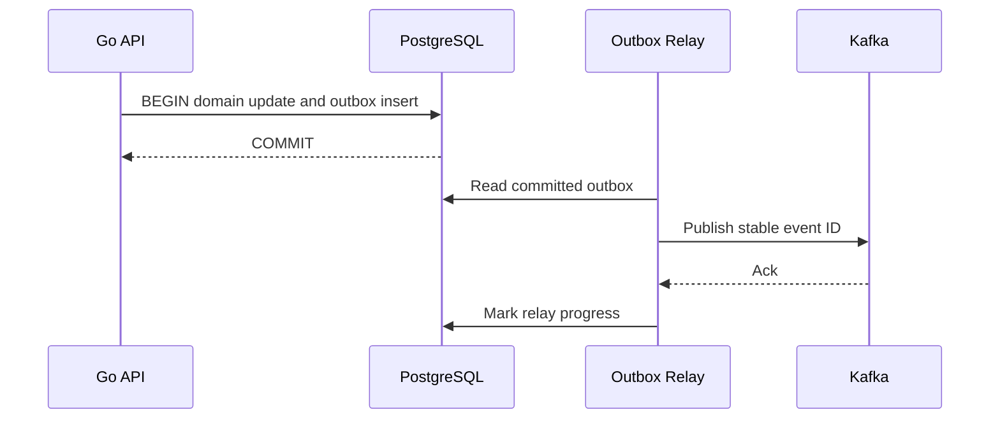

# Transactional outbox

## Bài toán và ví dụ đầu tiên

Order service phải ghi đơn vào DB rồi phát OrderCreated lên broker. Nếu commit DB trước rồi process crash trước publish, đơn tồn tại nhưng consumer không biết. Nếu publish trước rồi DB rollback, consumer thấy sự kiện về đơn chưa tồn tại. Hai write tới hai hệ thống không tự atomic chỉ vì nằm cạnh nhau trong source.

## Đi từng bước qua một tình huống

Outbox đặt một bảng events trong cùng DB transaction với order. Transaction ghi order và outbox row cùng commit hoặc rollback. Một relay đọc outbox đã commit rồi publish lên broker, sau đó đánh dấu trạng thái theo policy. Khi process chết trước publish, row vẫn còn để relay thử lại.

Cửa sổ còn lại: broker đã nhận event nhưng relay crash trước khi đánh dấu sent. Relay sẽ publish lại sau restart. Vì vậy outbox thường cung cấp ít nhất một lần phát theo thiết kế và consumer phải chịu duplicate. Nó giải quyết mất sự kiện giữa DB commit và publish, không hứa side effect toàn hệ thống exactly-once.

## Hiểu cơ chế từ kết quả quan sát

Outbox row cần event ID, aggregate ID, payload/version và thông tin tiến trình phù hợp. Aggregate là nhóm state nghiệp vụ có cùng identity, chẳng hạn một order. Nếu thứ tự event của một order quan trọng, sequence/version cần được bảo toàn ở relay và consumer; nhiều relay song song không được vô tình đảo thứ tự rồi giả định broker sửa hộ.

Polling dễ bắt đầu nhưng có chi phí scan/lock; CDC đọc change log có mô hình vận hành khác. Worker claim theo lease hoặc transaction cần xử lý crash và stale owner. Mark sent, retention và cleanup đều phải tránh xóa record chưa đảm bảo publish theo contract. Payload nên chứa dữ liệu cần tại thời điểm event, không chỉ ID rồi mong future query luôn tái hiện trạng thái cũ.

## Khái niệm và mô hình làm việc

Outbox giải quyết dual write DB+broker bằng ghi domain state và event trong một DB transaction.

## Cơ chế và những ranh giới cần giữ

Relay poll/CDC đọc committed outbox, publish stable event ID, mark progress. Crash sau publish trước mark tạo duplicate; consumers phải idempotent.

## Áp dụng vào hệ thống thật

Order commit kèm OrderCreated; event có schema version, aggregate ID/version và occurred_at.

## Những đường lỗi cần hiểu

Publish trước DB commit tạo ghost event; delete outbox trước publish mất event; relay down đầy table.

## Lần theo bằng chứng khi có sự cố

Outbox oldest age/size, publish latency/errors và consumer dedup; replay crash windows.

## Đánh đổi và giới hạn sử dụng

Extra storage/relay/cleanup; không tạo exactly-once end-to-end tự động.

## Thực hành, debugging và kết luận

Test crash sau domain commit, sau publish và trước mark sent, rồi kiểm tra consumer áp effect đúng một lần nhờ dedup. Metric quan trọng là tuổi event chưa phát, publish failures, attempts và backlog; đếm row tổng không đủ vì retention có thể giữ lịch sử đã sent.

Khi broker down, API có thể vẫn nhận đơn nếu DB/outbox chịu được và product chấp nhận downstream chậm. Nhưng backlog dùng disk và có giới hạn; cần admission policy, SLO về độ trễ sự kiện và cách replay. Outbox thêm một workflow vận hành nhưng làm dual-write failure có đường phục hồi cụ thể.

## Đọc tiếp

- [Idempotent consumer transaction](../10-messaging/idempotent-consumer.md)
- [system-design-framework](../13-system-design/system-design-framework.md)
- [HTTP client reuse và response ownership](../06-http-backend/http-client.md)

## Nguồn đối chiếu

- [Tài liệu chính thức](https://www.postgresql.org/docs/current/transaction-iso.html)

### Cách đọc diagram

API ghi domain state và outbox trong một PostgreSQL transaction, chỉ sau commit relay mới đọc được event. Relay publish stable ID tới Kafka, nhận ack rồi ghi progress. Khoảng giữa broker ack và progress commit là cửa sổ có thể publish lặp sau crash. Diagram giải thích vì sao outbox chống mất intent nhưng consumer vẫn cần dedup.
