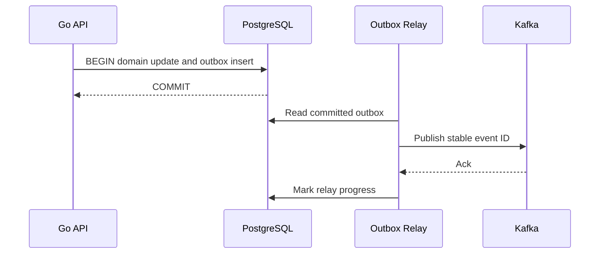

# Transactional outbox

## Concept và Mental Model

Outbox giải quyết dual write DB+broker bằng ghi domain state và event trong một DB transaction.

## How it works

Relay poll/CDC đọc committed outbox, publish stable event ID, mark progress. Crash sau publish trước mark tạo duplicate; consumers phải idempotent.

## Production Use Case

Order commit kèm OrderCreated; event có schema version, aggregate ID/version và occurred_at.

## Failure Scenarios

Publish trước DB commit tạo ghost event; delete outbox trước publish mất event; relay down đầy table.

## How I would debug this in production

Outbox oldest age/size, publish latency/errors và consumer dedup; replay crash windows.

## Trade-offs và When NOT to use

Extra storage/relay/cleanup; không tạo exactly-once end-to-end tự động.

## Interview practice

What happens if relay crashes after publish? Event có thể publish lại với cùng ID.

## Key Takeaways

Outbox giải quyết dual write DB+broker bằng ghi domain state và event trong một DB transaction..

## See also

- [Idempotent consumer transaction](../10-messaging/idempotent-consumer.md)
- [system-design-framework](../13-system-design/system-design-framework.md)
- [HTTP client reuse và response ownership](../06-http-backend/http-client.md)

## Nguồn đối chiếu

- [Tài liệu chính thức](https://www.postgresql.org/docs/current/transaction-iso.html)

