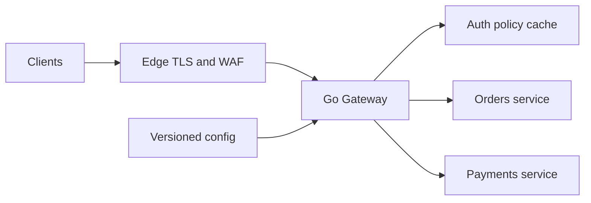
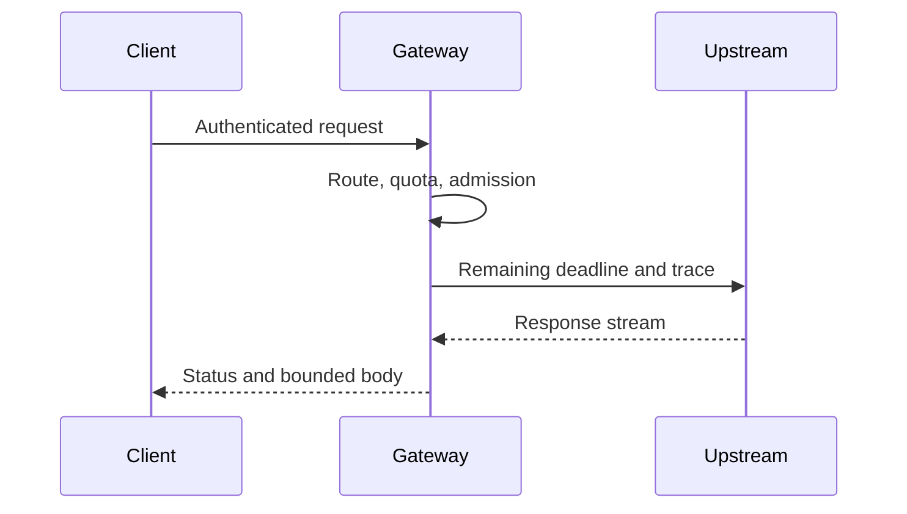
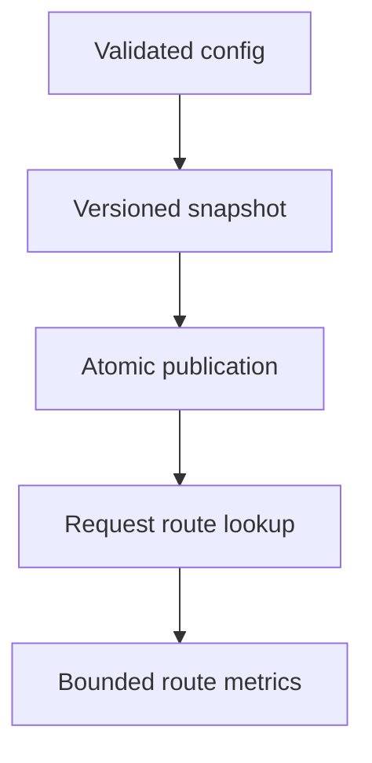
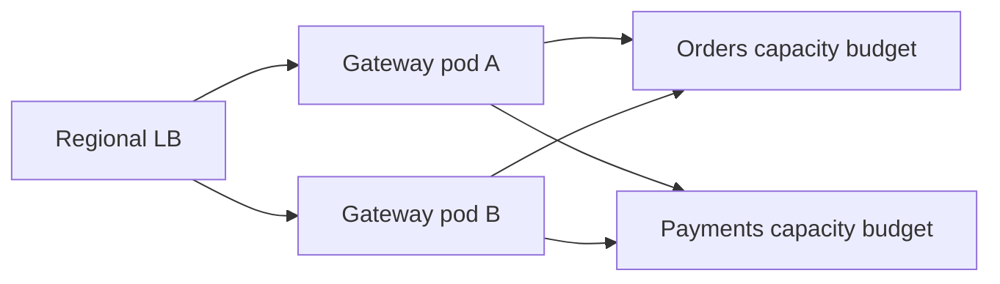
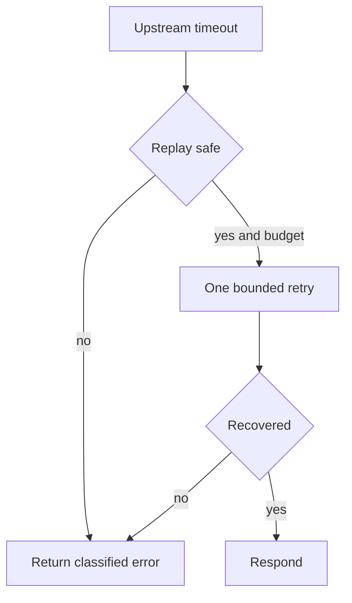

# Design API Gateway

## Bài toán và ví dụ đầu tiên

Gateway là cửa vào chung để route, authenticate và áp policy cho nhiều services. Nó phải giữ deadline và semantics lỗi đủ rõ cho client, tránh biến một lớp tiện ích thành nơi chứa mọi business rule hoặc điểm nghẽn duy nhất.

## Đi từng bước qua một tình huống

Phiên bản 1 là reverse proxy có route table rõ, TLS/auth theo trust boundary và request IDs. Backend vẫn authorize resource vì gateway không luôn có đủ state nghiệp vụ. Body size, header limits và timeout bảo vệ tài nguyên ngay ở cửa vào. Một Go service đơn không nhất thiết cần custom gateway nếu ingress/proxy sẵn có đáp ứng contract.

Khi cần availability/capacity, phiên bản 2 có nhiều gateway replicas sau load balancer và cấu hình immutable versioned. Health/readiness cùng drain giữ rollout; total outbound pools tới mỗi backend phải tính theo toàn gateway fleet. Local rate limit hữu ích để bảo vệ instance nhưng quota tenant toàn fleet cần semantics riêng.

## Hiểu cơ chế từ kết quả quan sát

Phiên bản 3 bổ sung quota store hoặc policy service khi cần limit chung và cập nhật quyền tập trung. Cache policy cần freshness/revocation, fallback fail-open/fail-closed theo loại route. Không thêm Kafka vào request forwarding path chỉ vì gateway có nhiều routes; chỉ dùng async event pipeline cho audit/analytics có durability yêu cầu cụ thể.

Latency budget gateway gồm auth, route/pool wait và proxy response. Retry tự động mutation ở gateway có thể double-apply nếu backend đã commit; chỉ cho phép theo contract method/operation rõ. HTTP/2/WebSocket/streaming cần proxy behavior và timeout riêng, không được buffer body vô hạn để log hoặc inspect.

**Design lab:** các con số dưới đây là giả định để ước lượng, chưa phải kết quả benchmark. Khi phỏng vấn, xác nhận semantics và workload trước khi chọn hạ tầng.

## Requirements

Route nhiều backend, authenticate request, enforce tenant quota, propagate deadline/trace và trả errors nhất quán. Gateway không giữ business transaction hoặc join arbitrary domain data.

## Non-functional Requirements

Giả định 30k RPS, gateway added P99 <20ms trong cùng region, availability 99.95%; giới hạn headers/body và route config rollout có rollback.

## Capacity Estimation

Payload trung bình 4KiB mỗi chiều: khoảng 117MiB/s mỗi chiều ở 30k RPS chưa tính TLS/protocol overhead. Mean upstream time 80ms → khoảng 2400 concurrent requests toàn fleet. Nếu 12 pods thì trung bình 200/pod; load-test CPU TLS và tail trước chọn cap.

## API

Public `/v1/orders` route theo method/path; admin config API private có version/ETag. Error body có code/request_id; 429 quota, 503 overload, 504 upstream deadline theo policy.

## Data Model

Route{ID,match,target,timeout,auth_policy,version}; tenant quota policy; không lưu raw token trong cache. Config snapshot immutable và audit history.

## High-Level Architecture

### Cách đọc diagram

Clients đi qua edge TLS/WAF tới gateway; gateway dùng auth cache và route tới Orders hoặc Payments. Versioned config đi vào gateway từ luồng quản trị riêng. Mũi tên là dependencies, không nghĩa mọi request gọi cả hai backends. Auth cache và config cần freshness/validation vì một bản cập nhật sai ảnh hưởng mọi route.

## Request Flow

Authenticate trước route tới protected backend; rate/admission trước costly fan-out. Reverse proxy sanitize hop-by-hop/forwarded headers, stream có bound. Không retry sau response bytes đã commit nếu protocol không hỗ trợ.

### Cách đọc diagram

Client gửi request, gateway kiểm tra route/quota/admission rồi forward với deadline còn lại và trace. Upstream trả stream, gateway chuyển status/body về client theo bound. Từ trên xuống là thời gian; nếu upstream đã gửi headers rồi lỗi, gateway không thể tùy ý viết lại một response hoàn chỉnh như chưa gửi gì.

## Data Flow

### Cách đọc diagram

Config phải validated trước khi thành snapshot có version. Atomic publication đưa cả snapshot mới cho request lookup, tránh reader thấy nửa cấu hình. Lookup dẫn tới route metrics có labels hữu hạn. Các mũi tên là dữ liệu cấu hình tới quan sát, không cho phép sửa snapshot mutable sau publish.

## Go Service Implementation

Dùng net/http và httputil.ReverseProxy với Rewrite theo API hiện đại, shared Transport theo upstream policy. Context propagation cho cancellation; bounded per-route semaphore trước forwarding. Handler goroutines có request owner; shutdown drain proxy requests và quản lý upgraded connections riêng.

## Scaling

Scale gateway stateless theo CPU/active requests; separate upstream semaphores và transports, giới hạn aggregate backend demand. H2 stream multiplexing cần request-aware LB nếu per-pod skew.

### Cách đọc diagram

Load balancer chia traffic tới hai gateway Pods; cả hai vẫn dùng chung capacity Orders và Payments. Hai nhánh vào cùng backend nhắc budget phải tính toàn fleet. Thêm gateway tăng khả năng nhận request nhưng không tự nhân downstream quota hay connection capacity.

## Failure Modes

Upstream slow giữ gateway slots; retry storm; config sai route cross-tenant; DNS failure; stale pooled connections. Bulkhead từng upstream ngăn orders outage kéo payment down.

## Những đường lỗi cần hiểu

Thử crash/network loss tại từng durable boundary ở request flow; kiểm tra invariant sau recovery, không chỉ việc service khởi động lại. Nếu config validation fail giữ snapshot trước; nếu auth authority unavailable dùng cached keys còn hợp lệ theo policy, không tự bỏ auth.

### Cách đọc diagram

Upstream timeout đi vào quyết định replay-safe. Chỉ nhánh có safety và budget được thử thêm một lần theo ví dụ; nhánh không an toàn trả lỗi phân loại. Retry thành công trả response, không phục hồi thì lỗi. Cây này không chứng minh timeout nghĩa remote chưa commit; identity/contract quyết định safety.

## Observability

Gateway added latency tách upstream time, active/queued requests, reject rate, TLS CPU, config version và upstream connect/TTFB.

## Lần theo bằng chứng khi có sự cố

Gateway added latency tách upstream time, active/queued requests, reject rate, TLS CPU, config version và upstream connect/TTFB. Tách offered, accepted và completed rates; chọn dependency/queue đầu tiên lệch baseline. Thu profile đúng triệu chứng, đối chiếu trace với durable state theo operation ID. Sau mitigation kiểm tra cả SLO và backlog/reconciliation để tránh tuyên bố phục hồi quá sớm.

## Security

Validate issuer/audience, object authorization vẫn ở backend; trusted proxy chain, SSRF-safe configured targets, header size bound, private admin/pprof.

## Đánh đổi

| Option | Best for | Weakness |
|---|---|---|
| Central gateway | Policy nhất quán | Blast radius/config ownership |
| Client direct routing | Ít hop | Policy phân tán |
| Per-upstream pools | Isolation | Tổng connections lớn hơn |

## Evolution

Bắt đầu static routes + immutable reload; thêm dynamic discovery khi services/rollout cần; multi-region gateway sau khi state/auth dependencies có regional strategy.

## Thực hành, debugging và kết luận

Test backend chậm, response headers đã gửi rồi upstream lỗi, client disconnect và config reload sai. Giữ snapshot cũ khi config mới invalid thay vì publish nửa bảng routes. Per-route/dependency metrics cần labels hữu hạn, không dùng raw URL chứa IDs.

Trong outage gateway, phân biệt auth dependency với backend errors và network saturation. Shed optional policy work chỉ nếu product/security cho phép; không mặc nhiên bỏ auth khi auth service down. Gateway thêm operational dependency, nên dùng sản phẩm/proxy sẵn có khi custom behavior chưa biện minh tự viết.

## Đọc tiếp

- [capacity-estimation](capacity-estimation.md)
- [Worker pool và bounded concurrency](../04-concurrency/worker-pool.md)
- [Distributed idempotency và ambiguous outcomes](../12-distributed-systems/idempotency.md)
- [Transactional outbox](../12-distributed-systems/outbox-pattern.md)
