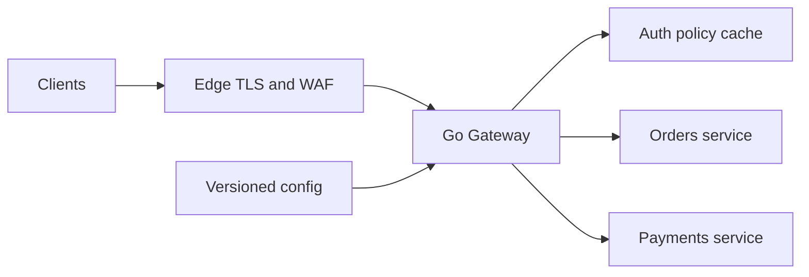
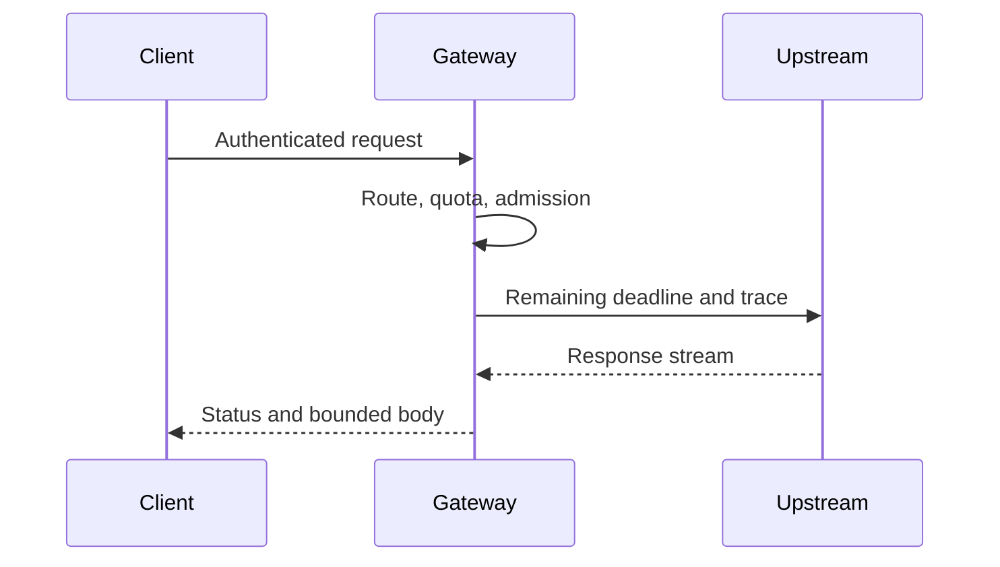
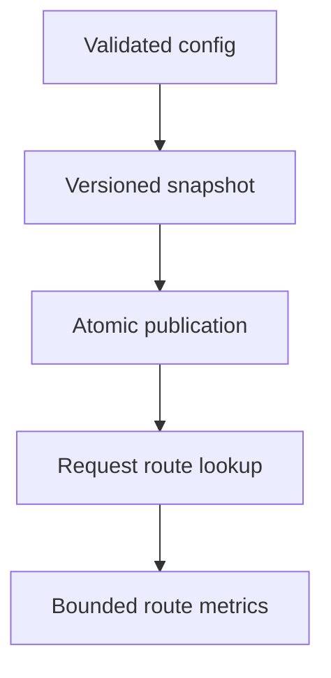
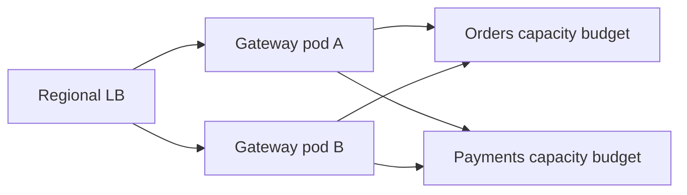
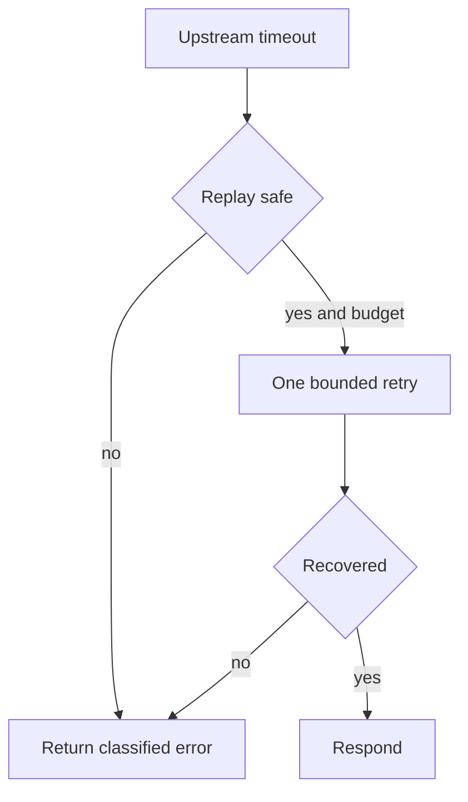

# Design API Gateway

**Design lab:** các con số dưới đây là giả định để ước lượng, chưa phải kết quả benchmark. Khi phỏng vấn, xác nhận semantics và workload trước khi chọn hạ tầng.

## Requirements

Route nhiều backend, authenticate request, enforce tenant quota, propagate deadline/trace và trả errors nhất quán. Gateway không giữ business transaction hoặc join arbitrary domain data.

## Non-functional Requirements

Giả định 30k RPS, gateway added P99 <20ms trong cùng region, availability 99.95%; giới hạn headers/body và route config rollout có rollback.

## Capacity Estimation

Payload trung bình 4KiB mỗi chiều: khoảng 117MiB/s mỗi chiều ở 30k RPS chưa tính TLS/protocol overhead. Mean upstream time 80ms → khoảng 2400 concurrent requests toàn fleet. Nếu 12 pods thì trung bình 200/pod; load-test CPU TLS và tail trước chọn cap.

## API

Public `/v1/orders` route theo method/path; admin config API private có version/ETag. Error body có code/request_id; 429 quota, 503 overload, 504 upstream deadline theo policy.

## Data Model

Route{ID,match,target,timeout,auth_policy,version}; tenant quota policy; không lưu raw token trong cache. Config snapshot immutable và audit history.

## High-Level Architecture

## Request Flow

Authenticate trước route tới protected backend; rate/admission trước costly fan-out. Reverse proxy sanitize hop-by-hop/forwarded headers, stream có bound. Không retry sau response bytes đã commit nếu protocol không hỗ trợ.

## Data Flow

## Go Service Implementation

Dùng net/http và httputil.ReverseProxy với Rewrite theo API hiện đại, shared Transport theo upstream policy. Context propagation cho cancellation; bounded per-route semaphore trước forwarding. Handler goroutines có request owner; shutdown drain proxy requests và quản lý upgraded connections riêng.

## Scaling

Scale gateway stateless theo CPU/active requests; separate upstream semaphores và transports, giới hạn aggregate backend demand. H2 stream multiplexing cần request-aware LB nếu per-pod skew.

## Failure Modes

Upstream slow giữ gateway slots; retry storm; config sai route cross-tenant; DNS failure; stale pooled connections. Bulkhead từng upstream ngăn orders outage kéo payment down.

## Failure Scenarios

Thử crash/network loss tại từng durable boundary ở request flow; kiểm tra invariant sau recovery, không chỉ việc service khởi động lại. Nếu config validation fail giữ snapshot trước; nếu auth authority unavailable dùng cached keys còn hợp lệ theo policy, không tự bỏ auth.

## Observability

Gateway added latency tách upstream time, active/queued requests, reject rate, TLS CPU, config version và upstream connect/TTFB.

## How I would debug this in production

Gateway added latency tách upstream time, active/queued requests, reject rate, TLS CPU, config version và upstream connect/TTFB. Tách offered, accepted và completed rates; chọn dependency/queue đầu tiên lệch baseline. Thu profile đúng triệu chứng, đối chiếu trace với durable state theo operation ID. Sau mitigation kiểm tra cả SLO và backlog/reconciliation để tránh tuyên bố phục hồi quá sớm.

## Security

Validate issuer/audience, object authorization vẫn ở backend; trusted proxy chain, SSRF-safe configured targets, header size bound, private admin/pprof.

## Trade-offs

| Option | Best for | Weakness |
|---|---|---|
| Central gateway | Policy nhất quán | Blast radius/config ownership |
| Client direct routing | Ít hop | Policy phân tán |
| Per-upstream pools | Isolation | Tổng connections lớn hơn |

## Evolution

Bắt đầu static routes + immutable reload; thêm dynamic discovery khi services/rollout cần; multi-region gateway sau khi state/auth dependencies có regional strategy.

## Interview rehearsal

1. What is the primary correctness invariant?
2. Which measured resource limits throughput first?
3. What happens if a response is lost after commit?
4. How would you handle a tenfold hot-key skew?
5. Which evidence would justify the next architectural change?

Trả lời bằng API semantics, capacity arithmetic và failure flow cụ thể của bài này. Một câu trả lời senior phải giải thích điểm commit, ownership trong Go, bounds của concurrency/pools và recovery cho unknown outcome.

## See also

- [capacity-estimation](capacity-estimation.md)
- [Worker pool và bounded concurrency](../04-concurrency/worker-pool.md)
- [Distributed idempotency và ambiguous outcomes](../12-distributed-systems/idempotency.md)
- [Transactional outbox](../12-distributed-systems/outbox-pattern.md)
