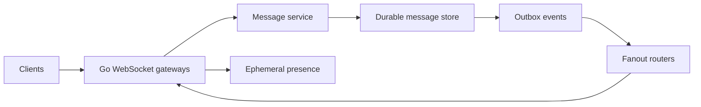
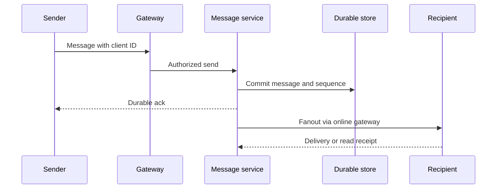
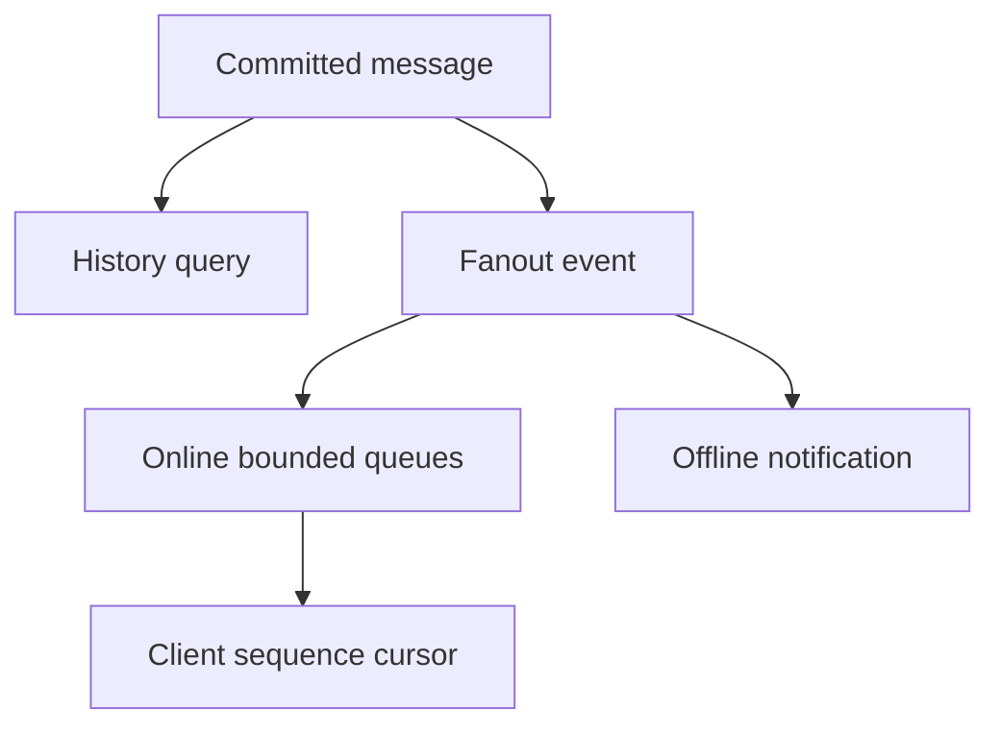
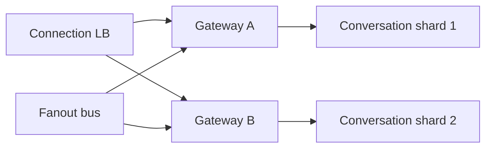
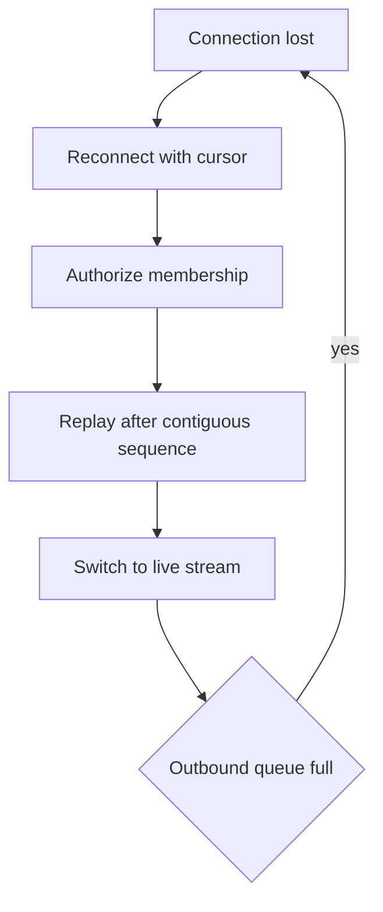

# Design Chat System

## Bài toán và ví dụ đầu tiên

Chat cần phân biệt message đã được server lưu, đã chuyển tới thiết bị và đã được người nhận đọc. Nếu coi ba mốc này là một ack, reconnect có thể làm user nghĩ tin đã tới dù chỉ được giữ trong memory gateway. Thiết kế bắt đầu từ durable history và cursor để phục hồi session.

## Đi từng bước qua một tình huống

Phiên bản 1 có một Go service, PostgreSQL message store và WebSocket connections. Client gửi client_msg_id, server authorize membership rồi commit message/sequence trước durable ack. Người nhận offline đọc history khi quay lại. Một bảng unique(sender,client_msg_id) giữ retry không tạo hai tin. Chưa cần Kafka để một nhóm nhỏ chat trong cùng service.

Khi connection count hoặc egress vượt một instance, phiên bản 2 tách hoặc nhân gateway và lưu routing session có TTL. Message service vẫn sở hữu durable history; presence là gợi ý tạm thời, không là nguồn sự thật message đã giao. Gateway nào chết thì client reconnect với last contiguous sequence và replay.

## Hiểu cơ chế từ kết quả quan sát

Phiên bản 3 thêm fanout bus khi nhiều gateways cần nhận events độc lập hoặc backlog/replay yêu cầu rõ. Partition theo conversation giữ một phần thứ tự, nhưng một room cực hot vẫn cần chiến lược riêng; tăng tổng partitions không chia room đó tự động. Kafka có ích cho durable stream/fanout consumers khi cần, còn local routing hoặc broker nhỏ hơn có thể đủ trước đó.

Mỗi session có outbound budget theo bytes và tuổi message. Slow consumer phải bị disconnect hoặc drop chỉ event ephemeral được phép, rồi lấy lại durable messages qua history. Một unbounded slice outbound biến một điện thoại mạng yếu thành memory leak ở server. Reader/writer goroutine phải tuân contract thư viện WebSocket và có owner shutdown.

**Design lab:** các con số dưới đây là giả định để ước lượng, chưa phải kết quả benchmark. Khi phỏng vấn, xác nhận semantics và workload trước khi chọn hạ tầng.

## Requirements

Realtime one-to-one/group messages, durable history, per-conversation order, reconnect/resume và presence best effort. Delivery ack khác read receipt.

## Non-functional Requirements

Giả định200k concurrent connections,10k messages/s peak; online delivery P99<200ms trong region; durable accepted messages replay được khi reconnect.

## Capacity Estimation

200k connections ×20KiB measured state giả định≈3.8GiB chỉ session state, chưa tính kernel buffers/G/stacks. 10k msg/s×1KiB≈9.8MiB/s ingress; average fanout20 →195MiB/s outbound chưa protocol overhead.

## API

WebSocket send{client_msg_id,conversation_id,payload}; server ack{message_id,seq}; GET /conversations/{id}/messages?after_seq=...; resume session dùng cursor per conversation.

## Data Model

messages(conversation_id,seq,message_id,sender,body); unique(sender,client_msg_id); membership và authorization; session routing ephemeral TTL; receipts versioned.

## High-Level Architecture

### Cách đọc diagram

Clients giữ session ở gateways; Message service commit durable store, outbox chuyển fact tới fanout routers rồi quay lại gateways để giao online. Presence là nhánh ephemeral tại gateway. Vòng fanout không phải vòng commit lặp: durable history là nguồn replay, presence chỉ hỗ trợ tìm session hiện tại.

## Request Flow

Authenticate upgrade và authorize từng conversation action. Commit trước sender durable ack; duplicate client_msg_id trả message cũ. Online fanout at-least-once nên client dedup bằng message ID/seq.

### Cách đọc diagram

Sender gửi client message ID tới gateway, gateway authorize rồi message service commit message/sequence. Durable ack sau commit khác receipt từ recipient ở cuối. Fanout có thể lặp hoặc recipient offline; ack không nói người nhận đã đọc. Các mũi tên bỏ routing chi tiết để phân biệt ba mốc lưu, giao và đọc.

## Data Flow

### Cách đọc diagram

Message đã commit phục vụ history query và tạo fanout event. Fanout chia tới bounded online queues hoặc offline notification; online client cập nhật sequence cursor. Những nhánh không cần hoàn tất cùng thời điểm, nhưng cursor phải là sequence liên tục để reconnect không bỏ qua gap.

## Go Service Implementation

Mỗi connection có read/write lifecycle theo library contract, bounded outbound bytes và heartbeat deadlines. Fanout dùng fixed workers/batching, không G per recipient per message vô hạn. Shutdown registry đóng WebSockets rồi join; Server.Shutdown alone không đủ.

## Scaling

Shard conversation storage/processing; gateways scale by connections+egress, drain by session close with resume. Hot large groups cần fanout strategy riêng; partition by conversation không tự scale một hot room.

### Cách đọc diagram

Connection LB phân sessions tới Gateway A/B; bus phân sự kiện để gateway có session nhận được message. Storage chia theo conversation shards. Hình minh họa một mapping đơn giản; production router phải định vị mọi conversation, không mặc định gateway chỉ được truy cập một shard cố định. Hot room vẫn có thể tập trung trên một shard.

## Failure Modes

Slow consumers, reconnect storm, duplicate message, sequence gap, stale presence, hot room và gateway crash. Presence TTL không là source of truth cho message durability.

## Những đường lỗi cần hiểu

Thử crash/network loss tại từng durable boundary ở request flow; kiểm tra invariant sau recovery, không chỉ việc service khởi động lại. Client reconnect gửi last contiguous seq; replay durable history rồi stream live có boundary chống gap. Slow receiver bị disconnect hoặc drop ephemeral events, không drop durable history silent.

### Cách đọc diagram

Connection mất dẫn tới reconnect kèm cursor; server kiểm tra membership rồi replay sau sequence liên tục trước khi nối live. Nếu outbound queue đầy, session bị đóng theo policy và đi lại đường reconnect. Vòng này giữ durable replay nhưng phải rate-limit/backoff để slow client không tạo reconnect storm.

## Observability

Active connections, outbound queue age/bytes, delivery latency, reconnect rate, sequence gaps và persistence P99.

## Lần theo bằng chứng khi có sự cố

Active connections, outbound queue age/bytes, delivery latency, reconnect rate, sequence gaps và persistence P99. Tách offered, accepted và completed rates; chọn dependency/queue đầu tiên lệch baseline. Thu profile đúng triệu chứng, đối chiếu trace với durable state theo operation ID. Sau mitigation kiểm tra cả SLO và backlog/reconciliation để tránh tuyên bố phục hồi quá sớm.

## Security

Membership check mỗi send/read, tenant isolation, message size/rate caps, abuse reporting, encrypted transport và retention access controls.

## Đánh đổi

| Option | Best for | Weakness |
|---|---|---|
| Per-conversation order | Simple user semantics | Hot room bottleneck |
| Presence cache | Fast ephemeral state | Staleness tolerated |
| Durable replay | Recovery | Storage/index cost |

## Evolution

One region with durable history trước; thêm large-room fanout/cache khi measured skew; multi-region cần conversation home region và failover sequence authority.

## Thực hành, debugging và kết luận

Test mất response sau message commit rồi retry cùng client_msg_id; test reconnect ở boundary replay/live để không gap hoặc double-apply. Delivery duplicate được client dedup bằng message ID/sequence, read receipt có semantics riêng. Membership cần kiểm tra cả send và history, tránh chỉ authorize lúc upgrade rồi để quyền cũ sống mãi.

Trong incident reconnect storm, đo session opens, queue bytes, persistence P99 và replay requests. Rate-limit reconnect có jitter/client policy, bảo vệ DB history bằng pagination và budget. Server.Shutdown không tự join hijacked sessions; registry gateway phải đóng/join trong drain window.

## Đọc tiếp

- [capacity-estimation](capacity-estimation.md)
- [Worker pool và bounded concurrency](../04-concurrency/worker-pool.md)
- [Distributed idempotency và ambiguous outcomes](../12-distributed-systems/idempotency.md)
- [Transactional outbox](../12-distributed-systems/outbox-pattern.md)
