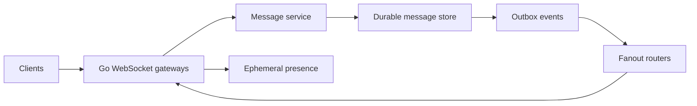
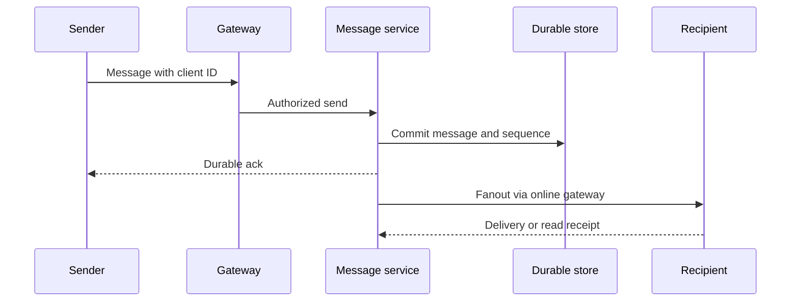
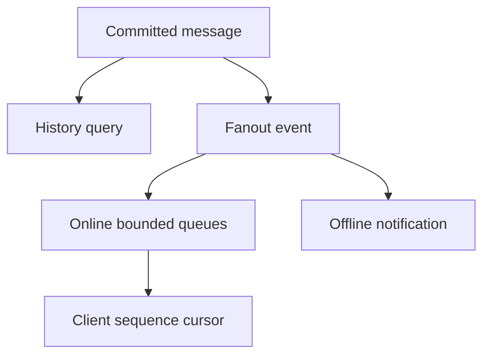
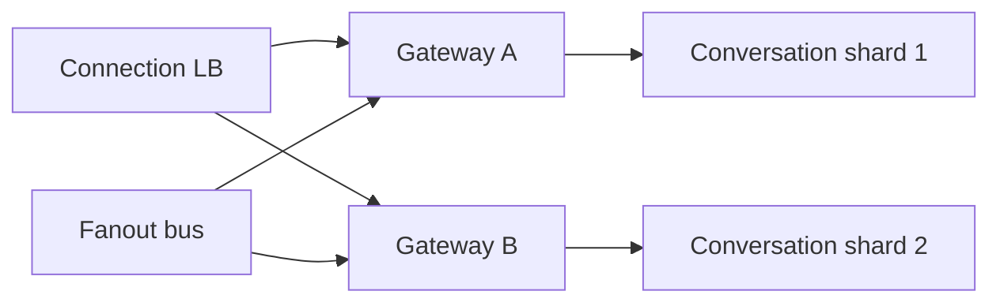
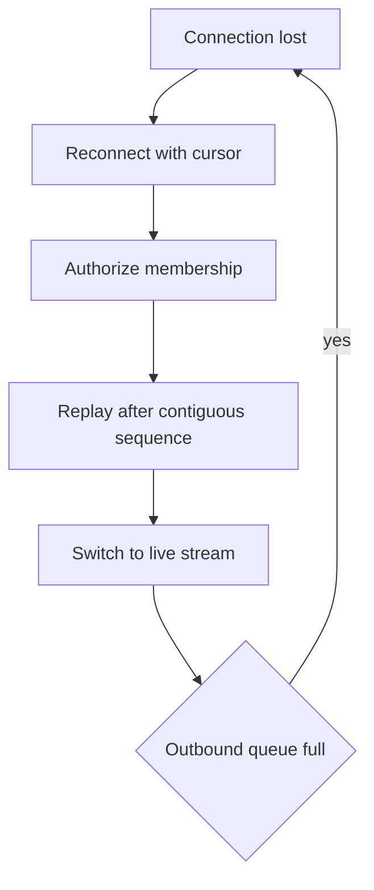

# Design Chat System

**Design lab:** các con số dưới đây là giả định để ước lượng, chưa phải kết quả benchmark. Khi phỏng vấn, xác nhận semantics và workload trước khi chọn hạ tầng.

## Requirements

Realtime one-to-one/group messages, durable history, per-conversation order, reconnect/resume và presence best effort. Delivery ack khác read receipt.

## Non-functional Requirements

Giả định200k concurrent connections,10k messages/s peak; online delivery P99<200ms trong region; durable accepted messages replay được khi reconnect.

## Capacity Estimation

200k connections ×20KiB measured state giả định≈3.8GiB chỉ session state, chưa tính kernel buffers/G/stacks. 10k msg/s×1KiB≈9.8MiB/s ingress; average fanout20 →195MiB/s outbound chưa protocol overhead.

## API

WebSocket send{client_msg_id,conversation_id,payload}; server ack{message_id,seq}; GET /conversations/{id}/messages?after_seq=...; resume session dùng cursor per conversation.

## Data Model

messages(conversation_id,seq,message_id,sender,body); unique(sender,client_msg_id); membership và authorization; session routing ephemeral TTL; receipts versioned.

## High-Level Architecture

## Request Flow

Authenticate upgrade và authorize từng conversation action. Commit trước sender durable ack; duplicate client_msg_id trả message cũ. Online fanout at-least-once nên client dedup bằng message ID/seq.

## Data Flow

## Go Service Implementation

Mỗi connection có read/write lifecycle theo library contract, bounded outbound bytes và heartbeat deadlines. Fanout dùng fixed workers/batching, không G per recipient per message vô hạn. Shutdown registry đóng WebSockets rồi join; Server.Shutdown alone không đủ.

## Scaling

Shard conversation storage/processing; gateways scale by connections+egress, drain by session close with resume. Hot large groups cần fanout strategy riêng; partition by conversation không tự scale một hot room.

## Failure Modes

Slow consumers, reconnect storm, duplicate message, sequence gap, stale presence, hot room và gateway crash. Presence TTL không là source of truth cho message durability.

## Failure Scenarios

Thử crash/network loss tại từng durable boundary ở request flow; kiểm tra invariant sau recovery, không chỉ việc service khởi động lại. Client reconnect gửi last contiguous seq; replay durable history rồi stream live có boundary chống gap. Slow receiver bị disconnect hoặc drop ephemeral events, không drop durable history silent.

## Observability

Active connections, outbound queue age/bytes, delivery latency, reconnect rate, sequence gaps và persistence P99.

## How I would debug this in production

Active connections, outbound queue age/bytes, delivery latency, reconnect rate, sequence gaps và persistence P99. Tách offered, accepted và completed rates; chọn dependency/queue đầu tiên lệch baseline. Thu profile đúng triệu chứng, đối chiếu trace với durable state theo operation ID. Sau mitigation kiểm tra cả SLO và backlog/reconciliation để tránh tuyên bố phục hồi quá sớm.

## Security

Membership check mỗi send/read, tenant isolation, message size/rate caps, abuse reporting, encrypted transport và retention access controls.

## Trade-offs

| Option | Best for | Weakness |
|---|---|---|
| Per-conversation order | Simple user semantics | Hot room bottleneck |
| Presence cache | Fast ephemeral state | Staleness tolerated |
| Durable replay | Recovery | Storage/index cost |

## Evolution

One region with durable history trước; thêm large-room fanout/cache khi measured skew; multi-region cần conversation home region và failover sequence authority.

## Interview rehearsal

1. What is the primary correctness invariant?
2. Which measured resource limits throughput first?
3. What happens if a response is lost after commit?
4. How would you handle a tenfold hot-key skew?
5. Which evidence would justify the next architectural change?

Trả lời bằng API semantics, capacity arithmetic và failure flow cụ thể của bài này. Một câu trả lời senior phải giải thích điểm commit, ownership trong Go, bounds của concurrency/pools và recovery cho unknown outcome.

## See also

- [capacity-estimation](capacity-estimation.md)
- [Worker pool và bounded concurrency](../04-concurrency/worker-pool.md)
- [Distributed idempotency và ambiguous outcomes](../12-distributed-systems/idempotency.md)
- [Transactional outbox](../12-distributed-systems/outbox-pattern.md)
