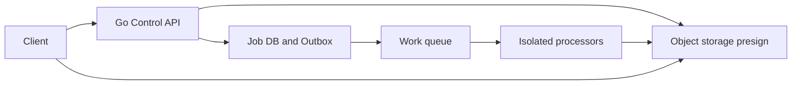
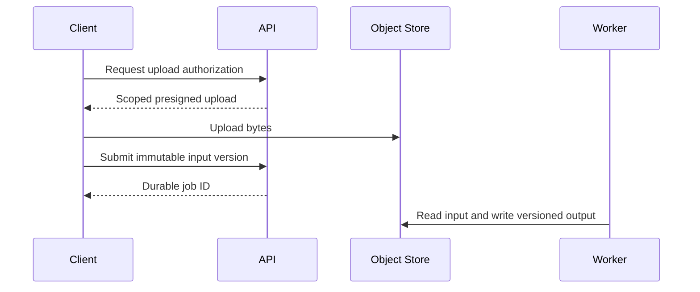
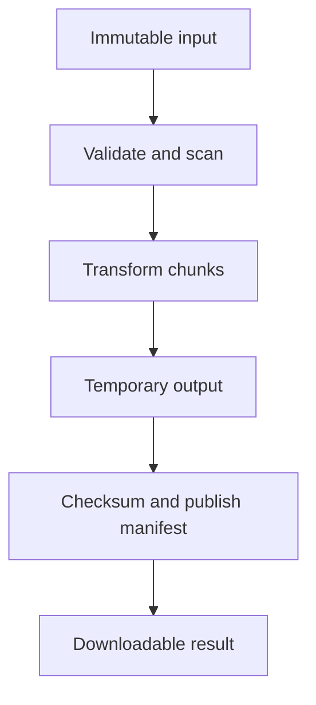
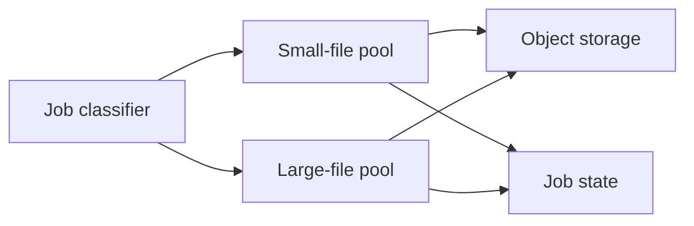
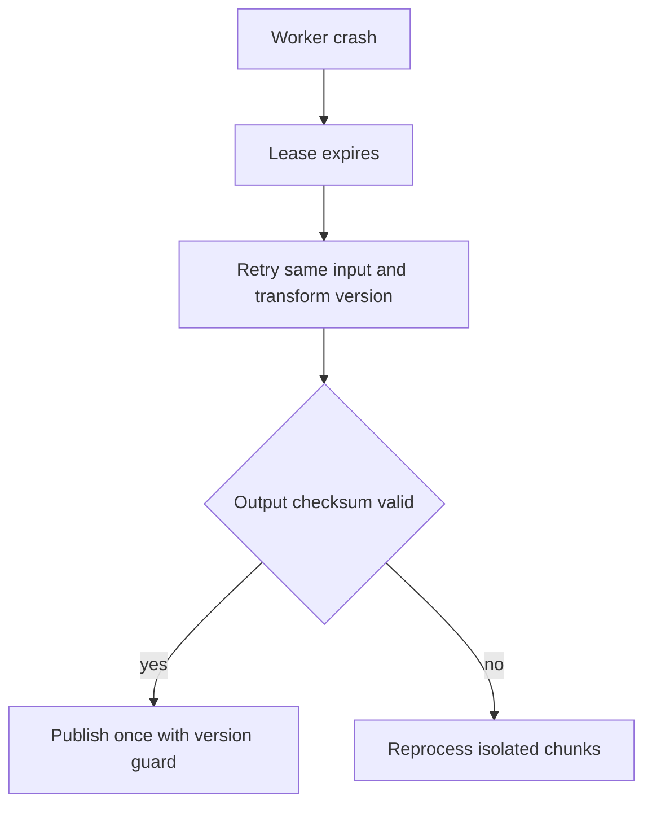

# Design File Processing

## Bài toán và ví dụ đầu tiên

Người dùng upload file lớn để parse và transform. Đọc toàn bộ file vào []byte rồi tạo goroutine cho mọi record dễ cạn memory. Thiết kế tách nhận file bền, xử lý streaming/chunk và publish kết quả để restart không phải đoán phần nào đã xong.

## Đi từng bước qua một tình huống

Phiên bản 1 API kiểm tra metadata/quota, lưu file vào object storage theo cơ chế upload phù hợp rồi tạo job DB. Worker đọc có giới hạn, decode từng phần, transform và ghi output tạm. Chỉ khi output hoàn tất mới publish trạng thái/result reference; file nửa chừng không được trả như kết quả hợp lệ.

Phiên bản 2 có fixed worker pools hoặc pipeline stages với concurrency theo CPU/target storage. Bounded queues theo bytes ngăn parser đi quá xa writer. Chunk boundaries phải giữ record semantics; cắt một byte range tùy ý có thể chia giữa UTF-8 hoặc record nén.

## Hiểu cơ chế từ kết quả quan sát

Phiên bản 3 phân chunk cho nhiều workers nếu format và operation cho phép độc lập, giữ manifest/version cùng checkpoint. Broker hỗ trợ phân phối/retry khi job coordination cần scale, nhưng Kafka không cần ở giai đoạn một worker đọc file tuần tự đã đủ. Input checksum/version ngăn replay nhầm file bị đổi dưới cùng path.

Idempotent output dùng deterministic chunk key và finalize manifest atomically theo storage contract. Nếu transform cần order toàn file, reorder/merge có memory và time cost. Với dữ liệu không tin cậy, kiểm soát decompression expansion, record size và CPU budget trước khi gọi parser tốn tài nguyên.

**Design lab:** các con số dưới đây là giả định để ước lượng, chưa phải kết quả benchmark. Xác nhận semantics và workload trước khi chọn hạ tầng.

## Requirements

Upload files, scan/validate, transform và download outputs. Jobs resumable/idempotent; file bytes không đi qua API memory khi object storage upload trực tiếp phù hợp.

## Non-functional Requirements

Giả định100k files/ngày, mean20MiB, peak 20 jobs/s; accepted P99<200 ms, processing 95%<2min cho class small. Untrusted file processing phải isolate.

## Capacity Estimation

100k×20MiB≈1.9TiB/day raw ingress. Transform mean CPU5s, arrival 20/s peak →100 CPU-seconds/s nếu sustained; cần ~100 cores at 100% ideal hoặc queue/shaping. Memory budget per worker đo decoded size, không file compressed size.

## API

POST /uploads trả bounded presign; POST /jobs với object version+transform version+idempotency key; GET /jobs/{id}; GET /outputs/{id}/download.

## Data Model

objects(id,tenant,key,version,checksum,size); jobs(input_version,transform_version,state,attempt,lease_epoch); outputs unique(job_id,version); checkpoint per chunk nếu streamable.

## High-Level Architecture

### Cách đọc diagram

Client xin quyền upload từ Go control API rồi gửi bytes tới object storage theo authorization đã scope. API lưu job/outbox, queue đưa việc tới isolated processors và workers đọc/ghi object storage. Control path nhỏ tách khỏi data bytes path; job chỉ accepted khi durable state theo contract đã có.

## Request Flow

Upload completion phải verify size/checksum/object ownership trước job ready. Worker claim job, process bounded stream, persist output manifest atomically trong DB; API status dựa manifest, không dựa existence của temporary file.

### Cách đọc diagram

Client nhận presigned upload có phạm vi, upload bytes rồi submit input version bất biến. API trả durable job ID; worker sau đó đọc input và ghi output versioned. Mũi tên theo thời gian nhắc upload hoàn tất và tạo job là hai bước cần validation/idempotency, không mặc nhiên một transaction chung.

## Data Flow

### Cách đọc diagram

Input bất biến được validate/scan, transform theo chunks rồi ghi output tạm. Chỉ sau checksum và publish manifest mới có downloadable result. Các node là giai đoạn hoàn thành có điều kiện; output tạm không được coi như result chính thức khi worker crash giữa chừng.

## Go Service Implementation

Go workers dùng streaming io.Reader/Writer và buffers bounded; CPU-heavy native decoders có memory/process isolation riêng. Semaphore trước job start theo memory estimate; context-aware object clients; cleanup temporary files trong mọi error path và shutdown join.

## Scaling

Scale processing pools theo file class/resource cost; reserve memory per worker và CPU quota. Large files separate lane; target storage throughput và upload egress budget.

### Cách đọc diagram

Classifier tách small-file và large-file pools để workload lớn không giữ hết capacity của file nhỏ. Cả hai vẫn dùng chung object storage và job state, nên có budget chung ở sink. Mũi tên không có nghĩa nhân workers có thể vượt storage throughput mà vẫn tăng completion.

## Failure Modes

Zip bomb/decompression expansion, corrupt input, disk full, retry writes overwrite output, orphan objects và hung native decoder. Process timeout có thể cần kill isolated subprocess chứ context alone không đủ.

## Những đường lỗi cần hiểu

Thử crash/network loss tại từng durable boundary ở request flow; kiểm tra invariant sau recovery, không chỉ việc service khởi động lại. Write temporary output, publish manifest only after verification; duplicate attempt uses conditional state/version update and cleanup orphan objects by retention.

### Cách đọc diagram

Worker crash làm lease hết và attempt mới dùng lại input/transform version. Nếu output checksum hợp lệ, publish có version guard; nếu không, xử lý lại chunks cô lập. Lease không tự dừng worker cũ, nên version guard/idempotent writes vẫn cần để stale completion không thắng attempt mới.

## Observability

Queue age by file class, bytes processed/s, peak RSS per job, CPU duration, failure category, orphan storage bytes.

## Lần theo bằng chứng khi có sự cố

Queue age by file class, bytes processed/s, peak RSS per job, CPU duration, failure category, orphan storage bytes. Tách offered, accepted và completed rates; chọn dependency/queue đầu tiên lệch baseline. Thu profile đúng triệu chứng, đối chiếu trace với durable state theo operation ID. Sau mitigation kiểm tra cả SLO và backlog/reconciliation để tránh tuyên bố phục hồi quá sớm.

## Security

Content sniff/allowlist, sandbox transformation, no arbitrary filesystem paths/URLs, signed downloads scoped tenant, malware scanning và retention policy.

## Đánh đổi

| Option | Best for | Weakness |
|---|---|---|
| Stream processing | Bounded memory | Một số formats cần seek |
| Local staging | Random access | Disk quota/cleanup |
| Separate processes | Isolation | Startup/IPC overhead |

## Evolution

Bắt đầu one transform với immutable versions; thêm chunk checkpoints cho large files khi retry cost đáng kể; autoscale theo work units/queue age thay count đơn thuần.

## Thực hành, debugging và kết luận

Test crash giữa chunk, sau output write trước checkpoint và lúc finalize. Retry phải tạo kết quả hợp lệ không trộn outputs hai versions; orphan temp objects cần cleanup có retention. Client cancel request upload khác user cancel durable processing job.

Observability theo bytes/records processed, throughput stages, queue age và lỗi format. Khi CPU bình thường nhưng pipeline chậm, xem writer I/O hoặc DB pool chứ không thêm parser goroutines. Quota tenant và auth trên object reference ngăn một user đọc output của user khác.

## Đọc tiếp

- [capacity-estimation](capacity-estimation.md)
- [Worker pool và bounded concurrency](../04-concurrency/worker-pool.md)
- [Distributed idempotency và ambiguous outcomes](../12-distributed-systems/idempotency.md)
- [Transactional outbox](../12-distributed-systems/outbox-pattern.md)
