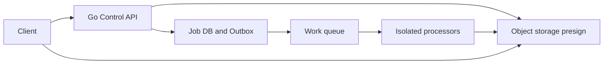
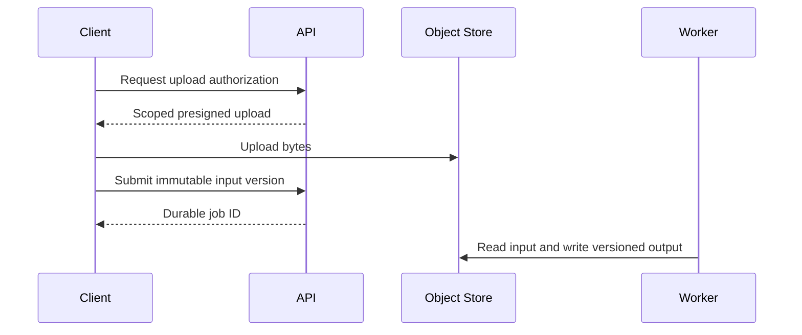
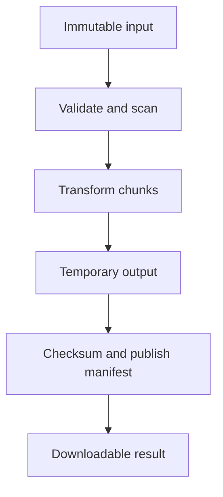
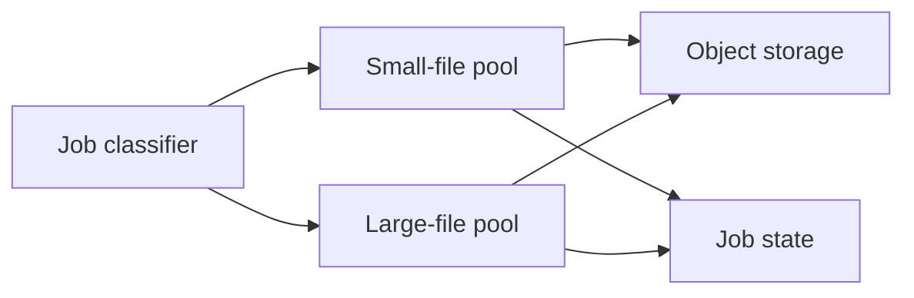
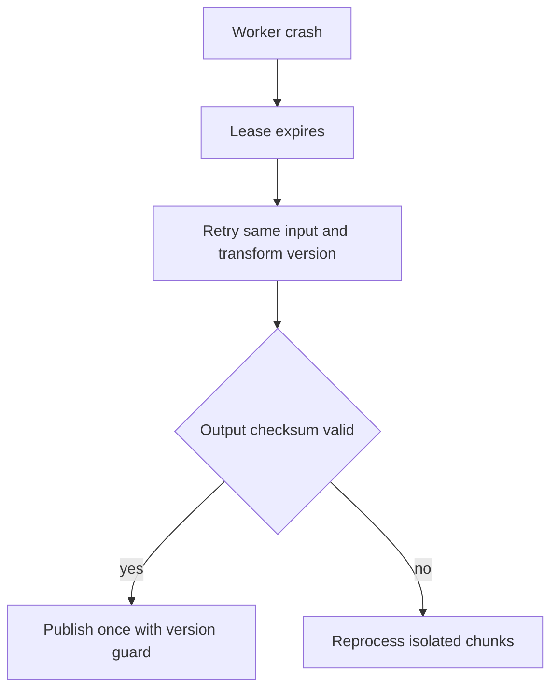

# Design File Processing

**Design lab:** các con số dưới đây là giả định để ước lượng, chưa phải kết quả benchmark. Khi phỏng vấn, xác nhận semantics và workload trước khi chọn hạ tầng.

## Requirements

Upload files, scan/validate, transform và download outputs. Jobs resumable/idempotent; file bytes không đi qua API memory khi object storage upload trực tiếp phù hợp.

## Non-functional Requirements

Giả định100k files/ngày, mean20MiB, peak20 jobs/s; accepted P99<200ms, processing95%<2min cho class small. Untrusted file processing phải isolate.

## Capacity Estimation

100k×20MiB≈1.9TiB/day raw ingress. Transform mean CPU5s, arrival20/s peak →100 CPU-seconds/s nếu sustained; cần ~100 cores at 100% ideal hoặc queue/shaping. Memory budget per worker đo decoded size, không file compressed size.

## API

POST /uploads trả bounded presign; POST /jobs với object version+transform version+idempotency key; GET /jobs/{id}; GET /outputs/{id}/download.

## Data Model

objects(id,tenant,key,version,checksum,size); jobs(input_version,transform_version,state,attempt,lease_epoch); outputs unique(job_id,version); checkpoint per chunk nếu streamable.

## High-Level Architecture

## Request Flow

Upload completion phải verify size/checksum/object ownership trước job ready. Worker claim job, process bounded stream, persist output manifest atomically trong DB; API status dựa manifest, không dựa existence của temporary file.

## Data Flow

## Go Service Implementation

Go workers dùng streaming io.Reader/Writer và buffers bounded; CPU-heavy native decoders có memory/process isolation riêng. Semaphore trước job start theo memory estimate; context-aware object clients; cleanup temporary files trong mọi error path và shutdown join.

## Scaling

Scale processing pools theo file class/resource cost; reserve memory per worker và CPU quota. Large files separate lane; target storage throughput và upload egress budget.

## Failure Modes

Zip bomb/decompression expansion, corrupt input, disk full, retry writes overwrite output, orphan objects và hung native decoder. Process timeout có thể cần kill isolated subprocess chứ context alone không đủ.

## Failure Scenarios

Thử crash/network loss tại từng durable boundary ở request flow; kiểm tra invariant sau recovery, không chỉ việc service khởi động lại. Write temporary output, publish manifest only after verification; duplicate attempt uses conditional state/version update and cleanup orphan objects by retention.

## Observability

Queue age by file class, bytes processed/s, peak RSS per job, CPU duration, failure category, orphan storage bytes.

## How I would debug this in production

Queue age by file class, bytes processed/s, peak RSS per job, CPU duration, failure category, orphan storage bytes. Tách offered, accepted và completed rates; chọn dependency/queue đầu tiên lệch baseline. Thu profile đúng triệu chứng, đối chiếu trace với durable state theo operation ID. Sau mitigation kiểm tra cả SLO và backlog/reconciliation để tránh tuyên bố phục hồi quá sớm.

## Security

Content sniff/allowlist, sandbox transformation, no arbitrary filesystem paths/URLs, signed downloads scoped tenant, malware scanning và retention policy.

## Trade-offs

| Option | Best for | Weakness |
|---|---|---|
| Stream processing | Bounded memory | Một số formats cần seek |
| Local staging | Random access | Disk quota/cleanup |
| Separate processes | Isolation | Startup/IPC overhead |

## Evolution

Bắt đầu one transform với immutable versions; thêm chunk checkpoints cho large files khi retry cost đáng kể; autoscale theo work units/queue age thay count đơn thuần.

## Interview rehearsal

1. What is the primary correctness invariant?
2. Which measured resource limits throughput first?
3. What happens if a response is lost after commit?
4. How would you handle a tenfold hot-key skew?
5. Which evidence would justify the next architectural change?

Trả lời bằng API semantics, capacity arithmetic và failure flow cụ thể của bài này. Một câu trả lời senior phải giải thích điểm commit, ownership trong Go, bounds của concurrency/pools và recovery cho unknown outcome.

## See also

- [capacity-estimation](capacity-estimation.md)
- [Worker pool và bounded concurrency](../04-concurrency/worker-pool.md)
- [Distributed idempotency và ambiguous outcomes](../12-distributed-systems/idempotency.md)
- [Transactional outbox](../12-distributed-systems/outbox-pattern.md)
