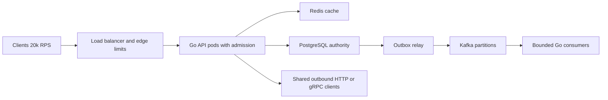
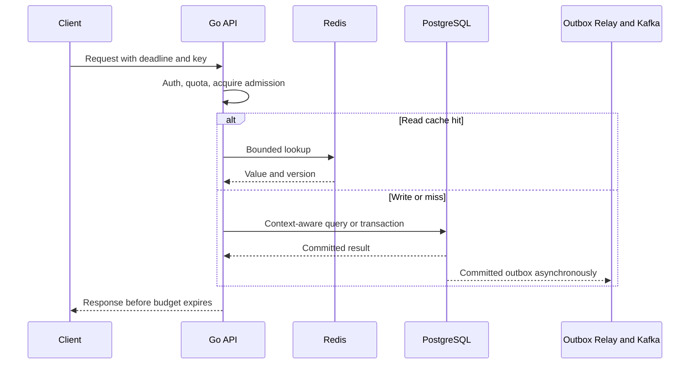
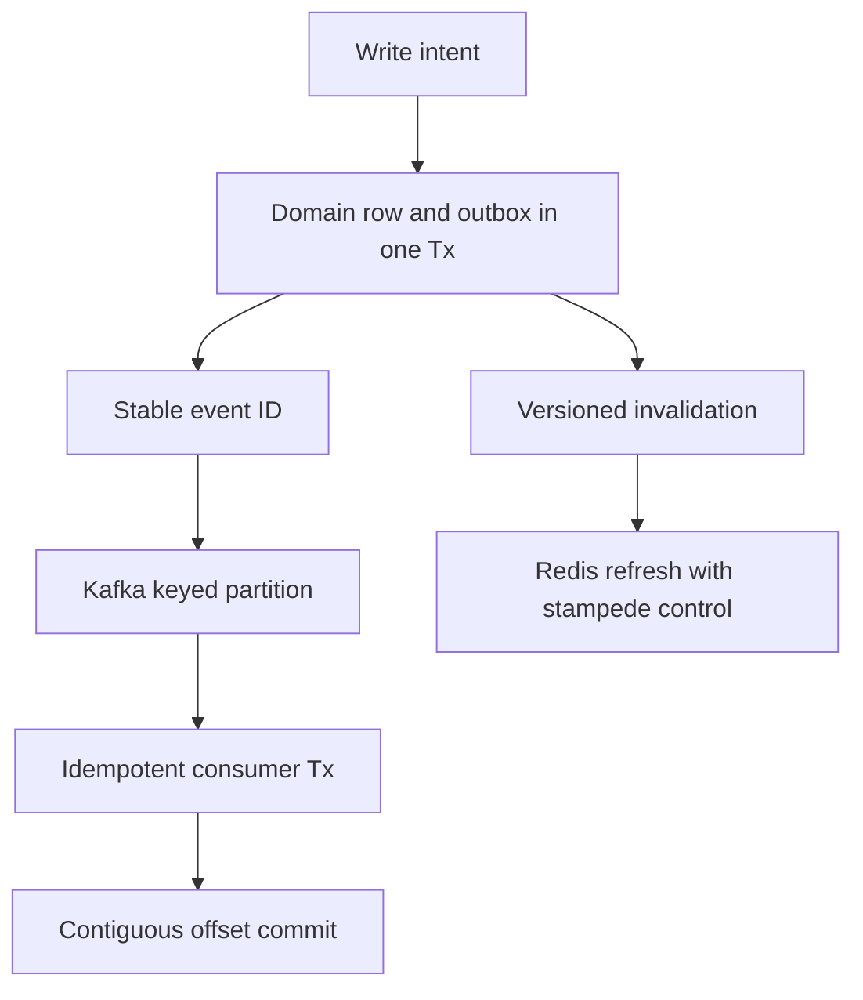
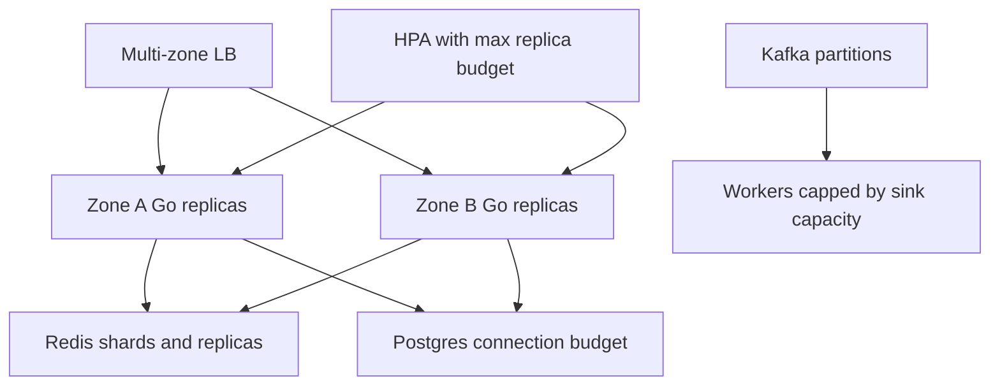
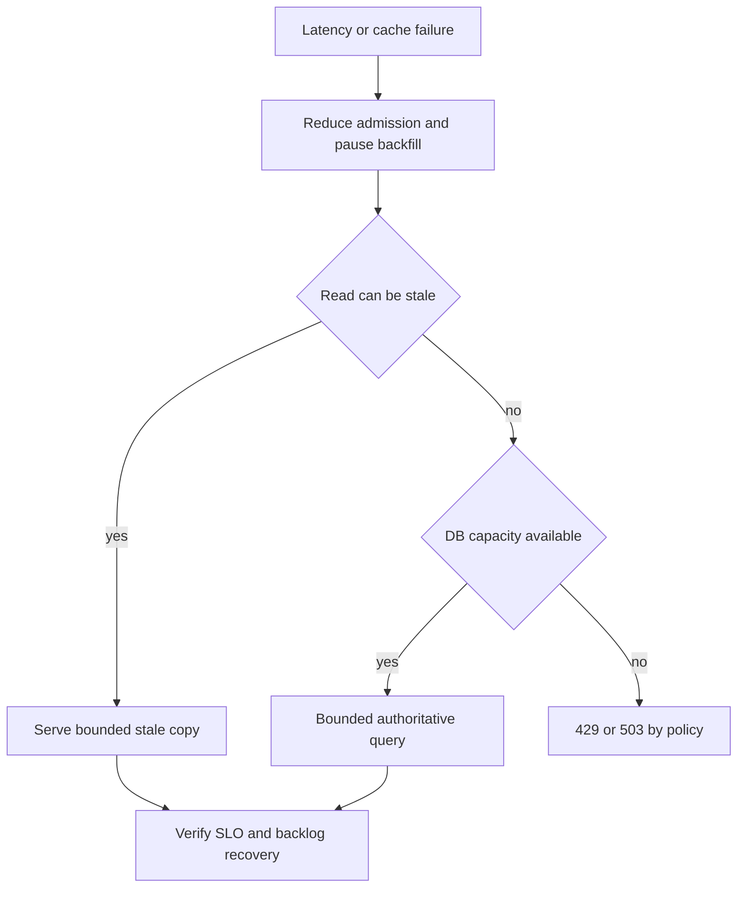

# Design High-Throughput API — 20,000 RPS

## Bài toán và ví dụ đầu tiên

Mục tiêu 20000 RPS không nói đủ nếu chưa biết payload, tỷ lệ đọc/ghi, query count và latency yêu cầu. Một API /ping và API tạo order có cùng RPS nhưng resource/failure model khác. Bài này xây từng phiên bản rồi kiểm tra bằng arithmetic và đo thực.

## Đi từng bước qua một tình huống

Phiên bản 1 có Go API, SQL DB, explicit HTTP/SQL clients và request deadlines. Đo baseline route distribution, CPU/request, bytes/request và query duration. Giữ invariant với transaction/unique constraint trước khi song song hóa. Nếu một query thiếu index chiếm phần lớn latency, thêm Kafka hay 100 replicas không sửa query đó.

Phiên bản 2 scale stateless API sau load balancer khi CPU/availability yêu cầu. Chọn max replicas rồi chia DB connection budget theo fleet; autoscaling không được vượt capacity DB. Cache thêm cho reads lặp có stale tolerance, giữ miss path có bound để cache-down không dồn toàn traffic vào DB.

## Hiểu cơ chế từ kết quả quan sát

Phiên bản 3 tách công việc không cần hoàn tất trước response như notifications/report sang durable queue/workers. Outbox giữ event cùng local commit. Kafka được cân nhắc nếu nhiều consumer groups cần replay hoặc event throughput biện minh, còn queue/job table simpler có thể đủ. Synchronous write invariant vẫn ở authoritative store; async không làm client được báo completed trước thực tế.

Với 20000 RPS và mean service time 50 ms trong hệ ổn định, mean in-flight khoảng 1000. Nếu downstream chậm làm mean thành 500 ms mà input giữ nguyên, nhu cầu in-flight có thể tăng tới khoảng 10000 trước giới hạn hệ thống. Queue/concurrency caps và shedding giữ resource bounded; buffer lớn chỉ trì hoãn overload.

**Design lab:** các con số dưới đây là giả định để ước lượng, chưa phải kết quả benchmark. Khi phỏng vấn, xác nhận semantics và workload trước khi chọn hạ tầng.

## Requirements

Phục vụ API read/write với PostgreSQL làm authority, Redis cache derived reads, Kafka cho side effects async và Kubernetes cho stateless Go replicas. Mục tiêu20k RPS, P99<200ms; phân biệt accepted writes với side effects hoàn tất.

## Non-functional Requirements

Giả định90% reads,10% writes; read cache hit95%, mean request50ms; availability99.95% trong region. Durable write ack sau DB commit; cache có stale bound30s cho fields được phép. Không cache quyết định authorization/balance nếu cần authoritative.

## Capacity Estimation

20k×0.05=1000 mean in-flight requests toàn fleet theo Little's Law. 18k reads/s×5% misses=900 DB read ops/s, cộng2k writes/s →2900 logical DB ops/s nếu mỗi operation một query/Tx. Query count/Tx hold time thực tế có thể lớn hơn. Mean connection hold10ms →29 concurrent DB connections lý tưởng; burst, locks và distribution cần measured headroom. Response2KiB →~39MiB/s outbound trước TLS/headers. Event1KiB×2k/s≈1.95MiB/s, ~165GiB/day raw Kafka payload ở sustained rate, trước replication/index/retention.

## API

GET /v1/items/{id} với ETag/version; POST /v1/orders với Idempotency-Key; GET /v1/orders/{id} cho async status. Request body cap64KiB giả định; page cap100. Trả429 tenant quota,503 admission overload, deadline errors theo contract; không silently accept khi không durable.

## Data Model

items(id,tenant,version,updated_at,data) với indexes theo tenant+id; orders(unique tenant+idempotency_key,request_hash,state,version); outbox(event_id unique,aggregate_id,aggregate_version,payload,published_at). Cache key chứa entity/version strategy; Kafka key theo aggregate giữ order.

## High-Level Architecture

### Cách đọc diagram

Clients qua edge limits/load balancer tới Go Pods có admission. API đọc cache hoặc authoritative PostgreSQL; outbox relay phát Kafka cho consumers hữu hạn và API có clients outbound dùng chung. Đây là phiên bản sau khi từng bottleneck được xác nhận, không yêu cầu mọi request đi qua Redis, DB và Kafka.

## Request Flow

Request budget giả định 200ms: admission≤10ms, cache≤10ms, DB or dependency≤120ms, serialization/write≤30ms và30ms headroom; các budgets không phải mọi phase luôn thực thi. Child context không vượt parent. Chọn hit/miss/write paths riêng để latency histogram không che miss tail. Write trả sau transaction commit, side effects trả pending status nếu async.

### Cách đọc diagram

Client đưa deadline/key; API auth, quota và acquire admission trước work. Khối alt phân read cache hit với write/miss vào PostgreSQL; outbox phát bất đồng bộ sau commit. Response phải ở budget caller nhưng việc response mất không đảo commit. Trace cần tách acquire và dependency wait ở các bước này.

## Data Flow

### Cách đọc diagram

Write intent commit domain row và outbox cùng Tx. Một nhánh cập nhật/invalidate cache có version; nhánh stable event ID đi vào keyed Kafka partition, consumer transaction idempotent rồi commit progress liên tục. Cache và offset không nằm trong cùng DB transaction, nên có recovery riêng khi crash ở từng cạnh.

## Go Service Implementation

net/http handlers vốn concurrent; thêm semaphore trước expensive work, không spawn unlimited children. CPU-bound tasks theo effective GOMAXPROCS/quota; IO calls theo downstream budgets. Shared sql.DB, Redis client, http.Transport/grpc ClientConn; deadlines cho acquire và execute. Pool10/pod không tự đủ nếu Tx giữ100ms: capacity planning phải dùng hold time thật. Kafka consumers dùng bounded batches/per-key ordering, idempotent transaction và contiguous commit. SIGTERM readiness/drain, join workers rồi close pools. pprof private và trace propagation xuyên calls/events.

## Scaling

Planning example: nếu load test chứng minh1k RPS/pod ở latency target và acceptable saturation, cần20 pods steady plus failure/burst headroom; không lấy số này làm default. Giả định min24/max32 pods, pool10/pod →240..320 app DB connections, còn reserve workers/admin trong total server budget400 giả định. Rollout surge4 pods làm tổng360 trước workers; phải giảm caps hoặc tăng verified budget nếu không đủ. Redis và HTTP/gRPC pools có aggregate budget tương tự. HPA theo CPU cùng in-flight/queue indicators; DB wait cao CPU thấp cần admission, không scale mù.

### Cách đọc diagram

LB trải traffic hai zones; HPA có max replica budget điều khiển API count. Hai zone dùng cache/DB chung theo topology mô tả, còn workers bị trần sink capacity. Mũi tên nhiều-to-một cho thấy autoscaling API không làm DB/Kafka sink scale vô hạn; phải tính headroom khi mất zone.

## Failure Modes

CPU saturation do JSON/TLS/compression, GC pressure do payload copies, lock contention local cache, DB slow query/lock, Redis stampede, Kafka lag, DNS failure, HPA/surge overbudget. 20k runnable G khác20k parked G; dùng CPU/trace/goroutine profile để tách.

## Những đường lỗi cần hiểu

Thử crash/network loss tại từng durable boundary ở request flow; kiểm tra invariant sau recovery, không chỉ việc service khởi động lại. Khi Redis down, hypothetical read DB demand nhảy từ900 lên18k/s: không cho toàn bộ fallback tự do. Local stale cache cho data được phép, per-route miss semaphore, shed low-priority load và protect DB. Kafka down: DB outbox vẫn nhận trong giới hạn storage/age đã định nghĩa; vượt bound thì reject writes cần event durability workflow.

### Cách đọc diagram

Latency/cache failure dẫn tới giảm admission và pause backfill trước. Read chịu stale có thể dùng bản cũ trong giới hạn; read cần nguồn chính chỉ chạy nếu DB còn budget, không thì429/503 theo policy. Mọi nhánh phục vụ cần kiểm tra SLO/backlog sau đó; lỗi được trả nhanh cũng phải được tính vào user outcome.

## Observability

SLO tại edge gồm rejected/timed-out requests theo eligible policy. Per-route offered/accepted/completed RPS và P50/P95/P99, CPU/throttle, heap/alloc rate/GC assists, scheduler latency, DB acquire wait/hold time, Redis hit/miss/latency, Kafka oldest age và outbox backlog.

## Lần theo bằng chứng khi có sự cố

SLO tại edge gồm rejected/timed-out requests theo eligible policy. Per-route offered/accepted/completed RPS và P50/P95/P99, CPU/throttle, heap/alloc rate/GC assists, scheduler latency, DB acquire wait/hold time, Redis hit/miss/latency, Kafka oldest age và outbox backlog. Tách offered, accepted và completed rates; chọn dependency/queue đầu tiên lệch baseline. Thu profile đúng triệu chứng, đối chiếu trace với durable state theo operation ID. Sau mitigation kiểm tra cả SLO và backlog/reconciliation để tránh tuyên bố phục hồi quá sớm.

## Security

Tenant authz trên mọi DB/cache path; cache key chứa tenant; size/decompression limits; rate limits theo identity và global admission; private metrics/pprof; TLS/secret rotation không tạo reconnect herd.

## Đánh đổi

| Option | Best for | Weakness |
|---|---|---|
| Cache reads | Giảm DB2900 ops/s theo assumptions | Staleness và miss storm |
| Async outbox | Bound request latency, durable intent | Lag/duplicate/reconciliation |
| Tight admission | Bảo vệ P99 và DB | Explicit rejects khi peak |
| More pods | Thêm app CPU | Nhân downstream pools |

## Evolution

1k RPS baseline: đo per-request work và fix N+1/reuse. 5k: load realistic cache misses, add bounds/SLO metrics. 10k: verify DB/query indexes và Kafka consumer headroom. 20k: multi-zone capacity test, one-zone-loss budget, Redis outage, rolling deploy và backlog recovery. Sharding chỉ sau profiling/query/schema fixes và primary capacity evidence.

## Thực hành, debugging và kết luận

Load test phải giữ offered/accepted/completed riêng, đo P99/errors và resource limits. Chạy case cache down, DB chậm, một zone mất và deployment drain để xem headroom. Retry budget và idempotency ngăn failure trở thành work amplification/duplicate effects.

Tối ưu Go từ profile: serialization CPU, allocation churn, goroutine/pool waits có cách sửa khác nhau. Con số pool/worker trong design là giả định cần kiểm chứng, không cấu hình production universal. Chỉ công bố đạt target khi workload, topology, duration và failure scope được đo, cùng invariant dữ liệu giữ đúng.

## Đọc tiếp

- [capacity-estimation](capacity-estimation.md)
- [Worker pool và bounded concurrency](../04-concurrency/worker-pool.md)
- [Distributed idempotency và ambiguous outcomes](../12-distributed-systems/idempotency.md)
- [Transactional outbox](../12-distributed-systems/outbox-pattern.md)

## Load-test acceptance gates

- Generator phát offered load theo lịch độc lập khi cần để thấy queue growth; báo cả requests timeout/reject, không loại khỏi latency accounting tùy tiện.
- Warm cache, cold cache, 95% hit và Redis unavailable là bốn experiments riêng. Thêm skew một hot tenant/key, realistic auth/JSON payloads.
- Ramp1k→5k→10k→20k, giữ đủ lâu qua nhiều GC/HPA cycles; sau overload hạ tải và yêu cầu queue age/live heap/G count về plateau.
- Kill một pod, rollout với surge, làm DB query chậm10×, block Kafka publish; kiểm tra idempotent writes và outbox catch-up.
- Chỉ công nhận target khi P99<200ms, error/reject policy thỏa SLO, no lost durable writes và downstream không vượt budget. Không có benchmark20k RPS được chạy trong repository này; đây là thiết kế thí nghiệm.
