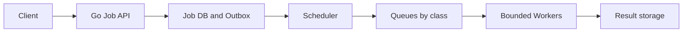
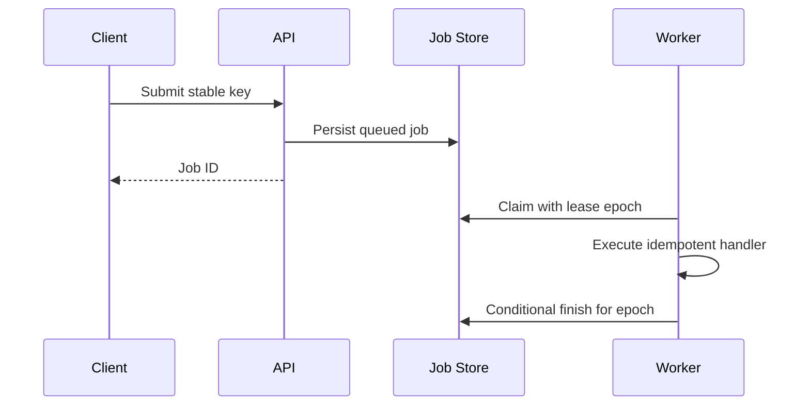
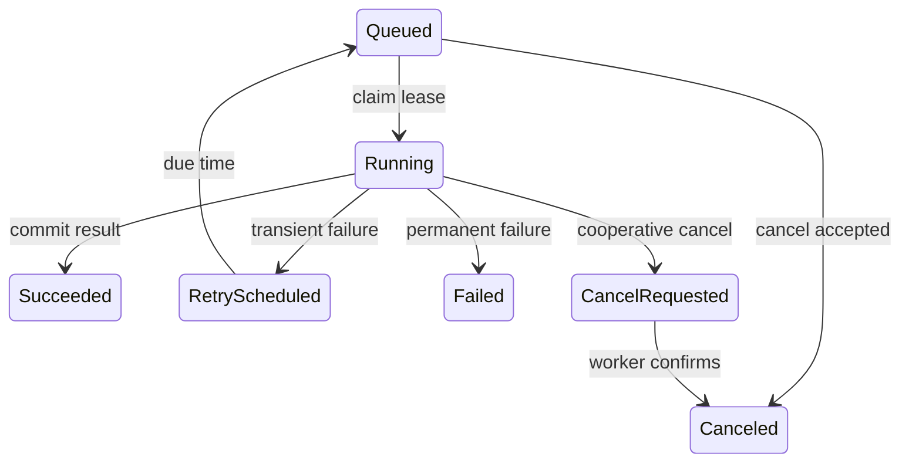
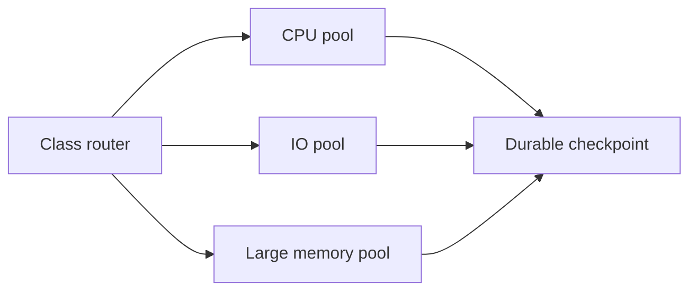
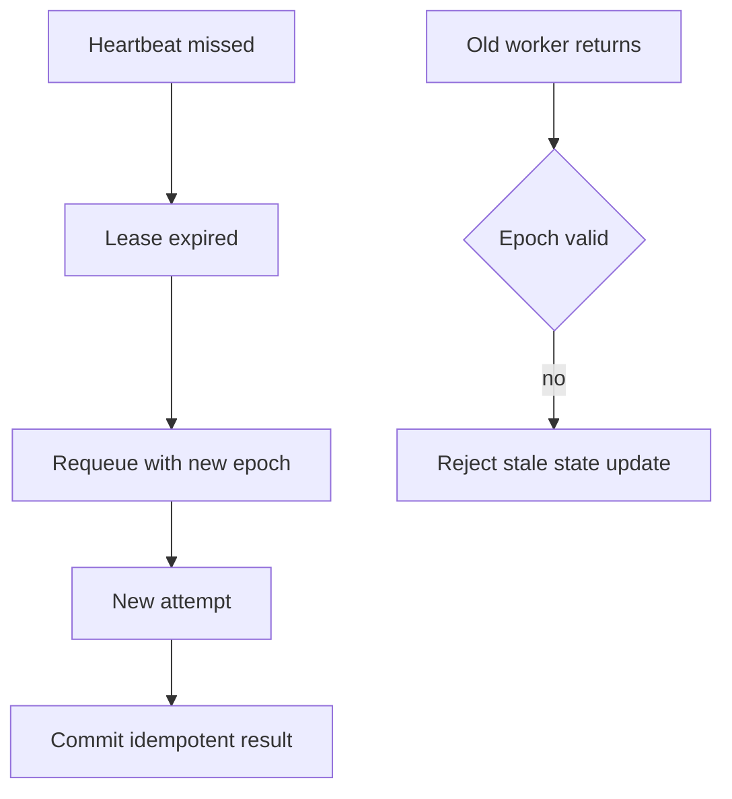

# Design Job Processing System

## Bài toán và ví dụ đầu tiên

User gửi job xuất báo cáo mất vài phút. Giữ HTTP connection suốt thời gian đó làm client retry khó và tiêu tài nguyên; trả accepted trước khi lưu job lại làm process crash mất yêu cầu. Thiết kế phải định nghĩa điểm hệ thống nhận trách nhiệm durable.

## Đi từng bước qua một tình huống

Phiên bản 1 dùng API và bảng jobs với ID, input reference, state và attempt. API validate rồi commit job trước 202; worker lấy job có claim/lease và cập nhật progress. Client poll status/result. Một fixed worker pool theo CPU/DB budget đủ cho bước đầu; channel chỉ là queue nội bộ sau durable record.

Phiên bản 2 thêm nhiều workers/replicas và cơ chế claim atomic. Lease hết cho phép retry nhưng worker cũ có thể còn chạy, nên effect cần idempotency/version/fencing theo resource. Payload lớn lưu object storage và job chỉ giữ reference để queue không tiêu nhiều RAM.

## Hiểu cơ chế từ kết quả quan sát

Phiên bản 3 thêm broker khi polling DB hoặc fanout/replay requirements trở thành bottleneck. Ack/checkpoint chỉ sau durable completion theo semantics, duplicate delivery được coi bình thường. Kafka phù hợp log replay/partition processing; task broker hoặc job table có thể đơn giản hơn nếu chỉ cần work queue. Không chọn broker trước khi biết ordering, scheduling và retry needs.

Backpressure gồm cap jobs nhận mới, bytes input, in-flight worker và queue age. Job priority/fairness theo tenant tránh một khách chiếm hết capacity. Cancellation của user là state transition durable; worker kiểm tra ở chunk boundary, nhưng không được tuyên bố side effect đã undo chỉ vì cờ canceled.

**Design lab:** các con số dưới đây là giả định để ước lượng, chưa phải kết quả benchmark. Xác nhận semantics và workload trước khi chọn hạ tầng.

## Requirements

Submit delayed/immediate jobs, retry, cancel, inspect progress và schedule recurring tasks. Accepted job phải durable; processing at-least-once với idempotent handler.

## Non-functional Requirements

Giả định5k submit/s peak, processing seconds-minutes; API P99<150 ms, queue age SLO theo job class; tenant fairness và bounded resources.

## Capacity Estimation

Average500/s ×86400=43.2M jobs/day;1KiB metadata≈41GiB/day trước indexes/retention. Mean execution2s tại500/s →1000 concurrent slots ideal; capacity theo CPU/IO/memory class thay count chung.

## API

POST /jobs {type,payload_ref,idempotency_key,run_at}; GET /jobs/{id}; POST /jobs/{id}/cancel; POST /schedules có unique schedule ID.

## Data Model

jobs(id,tenant,type,state,attempt,run_at,lease_epoch,version); attempt logs bounded; unique schedule_id+fire_time; payload object reference; durable retry schedule.

## High-Level Architecture

### Cách đọc diagram

Client submit tới API, job/outbox được lưu trước khi scheduler đưa việc theo class vào queues. Bounded workers lấy job rồi lưu result. Các mũi tên thể hiện ownership chuyển qua durable state và queue; response accepted không cần đợi result nhưng cần job có đường phục hồi khi process chết.

## Request Flow

Admission validate job type/size/tenant quota, persist before ack. Scheduler enqueue due job with stable ID; worker acquires class budget, claims epoch, runs bounded task, persists status before ack. Cancellation is request state until worker confirms stop.

### Cách đọc diagram

API lưu queued job cùng stable key trước trả ID. Worker claim với lease epoch, chạy handler idempotent rồi finish có điều kiện epoch còn hợp lệ. Epoch là phiên quyền sở hữu; nó giúp reject worker cũ sau lease loss, không tự ngăn mọi side effect bên ngoài nếu sink không kiểm tra identity/version.

## Data Flow

### Cách đọc diagram

Queued được claim sang Running. Success tới Succeeded; lỗi transient đi RetryScheduled rồi quay Queued khi tới hạn; lỗi permanent tới Failed. Cancel queued có thể hoàn tất sớm, còn running đi CancelRequested rồi chỉ thành Canceled khi worker xác nhận. Các mũi tên phân biệt yêu cầu dừng và thực sự dừng.

## Go Service Implementation

Fixed workers + context per attempt; heartbeat owner and task join together. No goroutine per scheduled timer for millions of jobs; DB/broker due-time index. Shared clients/pools and explicit per-class budgets; drain intake then finish/requeue in-flight on SIGTERM.

## Scaling

Separate worker fleets by class and tenant quota; scheduler partition due jobs và unique firing keys. Broker partitions/DB claim contention bound useful workers.

### Cách đọc diagram

Router chia CPU, IO và large-memory work thành pools để mỗi loại có concurrency budget phù hợp. Cả ba ghi durable checkpoint. Tách pool tránh một loại job giữ mọi slot nhưng không loại bỏ giới hạn DB/storage chung phía checkpoint.

## Failure Modes

Worker crash, stale lease owner, poison task, scheduler split brain, duplicate enqueue và task ignores cancel. Process-isolated executors cần kill policy cho untrusted compute.

## Những đường lỗi cần hiểu

Thử crash/network loss tại từng durable boundary ở request flow; kiểm tra invariant sau recovery, không chỉ việc service khởi động lại. Expired lease permits another attempt; fencing/version guard ngăn old worker publish state. External effects vẫn cần operation idempotency, lease alone không đủ.

### Cách đọc diagram

Missed heartbeat dẫn tới lease expiry và requeue epoch mới. Nhánh worker cũ quay lại phải kiểm tra epoch; không hợp lệ thì reject state update. Attempt mới commit result idempotent. Hình bỏ renew details nhưng làm rõ lease hết không có nghĩa process cũ đã chết.

## Observability

Oldest runnable age, scheduled delay, success/retry/cancel latency, lease expiry, stale-write rejects và tenant fairness.

## Lần theo bằng chứng khi có sự cố

Oldest runnable age, scheduled delay, success/retry/cancel latency, lease expiry, stale-write rejects và tenant fairness. Tách offered, accepted và completed rates; chọn dependency/queue đầu tiên lệch baseline. Thu profile đúng triệu chứng, đối chiếu trace với durable state theo operation ID. Sau mitigation kiểm tra cả SLO và backlog/reconciliation để tránh tuyên bố phục hồi quá sớm.

## Security

Allowlisted handlers, authenticated submissions, payload refs tenant-scoped, secrets via short-lived access, sandbox untrusted executors.

## Đánh đổi

| Option | Best for | Weakness |
|---|---|---|
| DB queue | Atomic claim/state | Poll/lock pressure |
| Broker queue | High dispatch throughput | Dual-state reconciliation |
| Leases | Crash recovery | Fencing and heartbeat complexity |

## Evolution

Start DB-backed queue for modest load with SKIP LOCKED semantics verified; add broker when measured dispatch contention, giữ same durable job identity/state machine.

## Thực hành, debugging và kết luận

Test worker crash sau output ghi trước mark completed, lease expire khi worker pause và duplicate submit. Result path dùng deterministic operation ID hoặc version để retry không tạo nhiều outputs không quản lý. DLQ/manual review cho lỗi không thể tự sửa cần owner.

Đo accepted/completed/rejected, oldest queued/running age và attempts per job. Khi downstream chậm, tăng worker có thể làm nặng hơn; giữ bounds và ramp recovery. Shutdown ngừng claim mới, drain trong budget rồi để lease/retry xử lý phần chưa hoàn tất theo contract.

## Đọc tiếp

- [capacity-estimation](capacity-estimation.md)
- [Worker pool và bounded concurrency](../04-concurrency/worker-pool.md)
- [Distributed idempotency và ambiguous outcomes](../12-distributed-systems/idempotency.md)
- [Transactional outbox](../12-distributed-systems/outbox-pattern.md)
