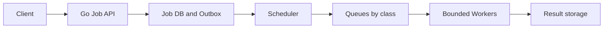
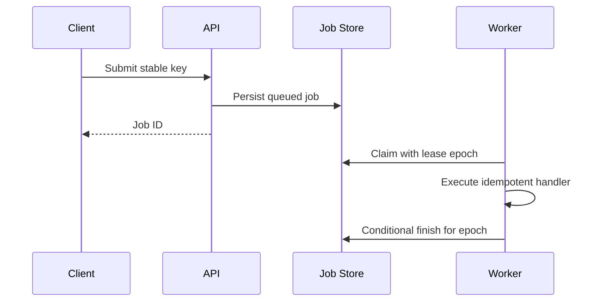
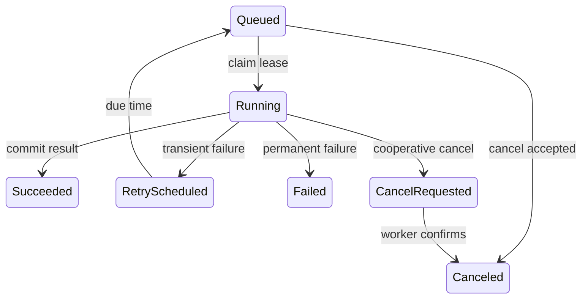
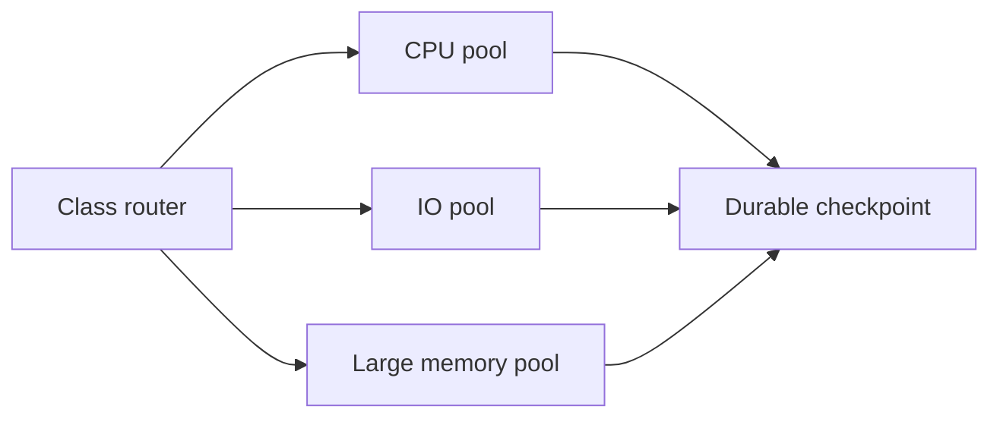
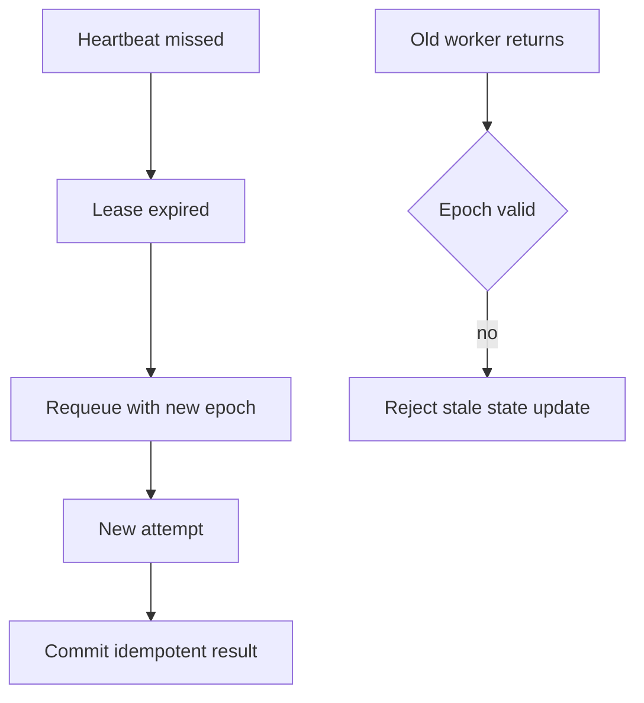

# Design Job Processing System

**Design lab:** các con số dưới đây là giả định để ước lượng, chưa phải kết quả benchmark. Khi phỏng vấn, xác nhận semantics và workload trước khi chọn hạ tầng.

## Requirements

Submit delayed/immediate jobs, retry, cancel, inspect progress và schedule recurring tasks. Accepted job phải durable; processing at-least-once với idempotent handler.

## Non-functional Requirements

Giả định5k submit/s peak, processing seconds-minutes; API P99<150ms, queue age SLO theo job class; tenant fairness và bounded resources.

## Capacity Estimation

Average500/s ×86400=43.2M jobs/day;1KiB metadata≈41GiB/day trước indexes/retention. Mean execution2s tại500/s →1000 concurrent slots ideal; capacity theo CPU/IO/memory class thay count chung.

## API

POST /jobs {type,payload_ref,idempotency_key,run_at}; GET /jobs/{id}; POST /jobs/{id}/cancel; POST /schedules có unique schedule ID.

## Data Model

jobs(id,tenant,type,state,attempt,run_at,lease_epoch,version); attempt logs bounded; unique schedule_id+fire_time; payload object reference; durable retry schedule.

## High-Level Architecture

## Request Flow

Admission validate job type/size/tenant quota, persist before ack. Scheduler enqueue due job with stable ID; worker acquires class budget, claims epoch, runs bounded task, persists status before ack. Cancellation is request state until worker confirms stop.

## Data Flow

## Go Service Implementation

Fixed workers + context per attempt; heartbeat owner and task join together. No goroutine per scheduled timer for millions of jobs; DB/broker due-time index. Shared clients/pools and explicit per-class budgets; drain intake then finish/requeue in-flight on SIGTERM.

## Scaling

Separate worker fleets by class and tenant quota; scheduler partition due jobs và unique firing keys. Broker partitions/DB claim contention bound useful workers.

## Failure Modes

Worker crash, stale lease owner, poison task, scheduler split brain, duplicate enqueue và task ignores cancel. Process-isolated executors cần kill policy cho untrusted compute.

## Failure Scenarios

Thử crash/network loss tại từng durable boundary ở request flow; kiểm tra invariant sau recovery, không chỉ việc service khởi động lại. Expired lease permits another attempt; fencing/version guard ngăn old worker publish state. External effects vẫn cần operation idempotency, lease alone không đủ.

## Observability

Oldest runnable age, scheduled delay, success/retry/cancel latency, lease expiry, stale-write rejects và tenant fairness.

## How I would debug this in production

Oldest runnable age, scheduled delay, success/retry/cancel latency, lease expiry, stale-write rejects và tenant fairness. Tách offered, accepted và completed rates; chọn dependency/queue đầu tiên lệch baseline. Thu profile đúng triệu chứng, đối chiếu trace với durable state theo operation ID. Sau mitigation kiểm tra cả SLO và backlog/reconciliation để tránh tuyên bố phục hồi quá sớm.

## Security

Allowlisted handlers, authenticated submissions, payload refs tenant-scoped, secrets via short-lived access, sandbox untrusted executors.

## Trade-offs

| Option | Best for | Weakness |
|---|---|---|
| DB queue | Atomic claim/state | Poll/lock pressure |
| Broker queue | High dispatch throughput | Dual-state reconciliation |
| Leases | Crash recovery | Fencing and heartbeat complexity |

## Evolution

Start DB-backed queue for modest load with SKIP LOCKED semantics verified; add broker when measured dispatch contention, giữ same durable job identity/state machine.

## Interview rehearsal

1. What is the primary correctness invariant?
2. Which measured resource limits throughput first?
3. What happens if a response is lost after commit?
4. How would you handle a tenfold hot-key skew?
5. Which evidence would justify the next architectural change?

Trả lời bằng API semantics, capacity arithmetic và failure flow cụ thể của bài này. Một câu trả lời senior phải giải thích điểm commit, ownership trong Go, bounds của concurrency/pools và recovery cho unknown outcome.

## See also

- [capacity-estimation](capacity-estimation.md)
- [Worker pool và bounded concurrency](../04-concurrency/worker-pool.md)
- [Distributed idempotency và ambiguous outcomes](../12-distributed-systems/idempotency.md)
- [Transactional outbox](../12-distributed-systems/outbox-pattern.md)
