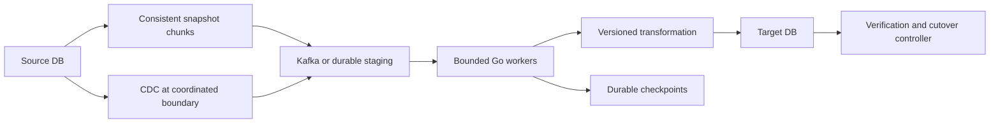
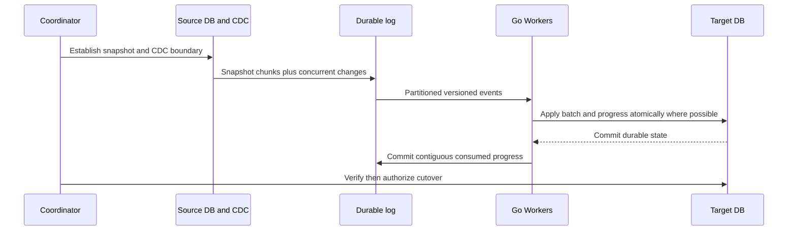
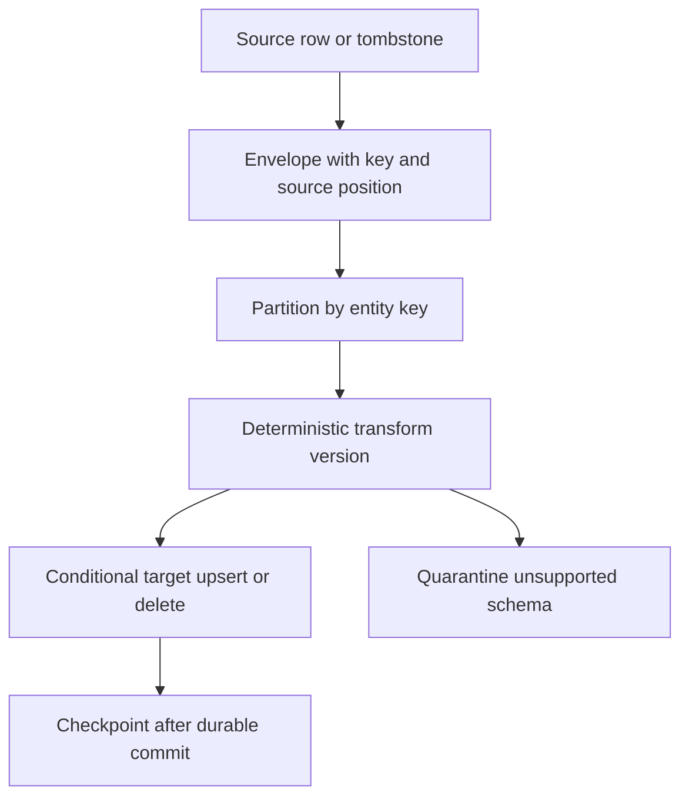
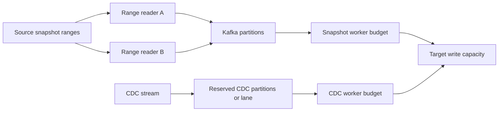
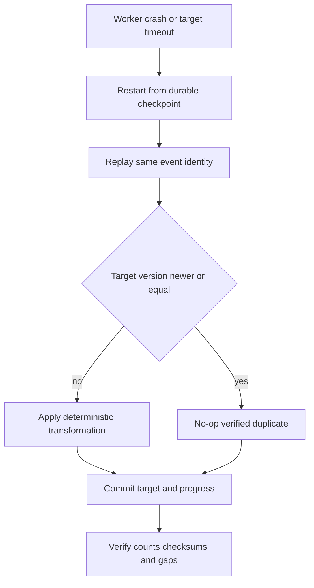

# Design Migration Platform — 4–5 Billion Records

**Design lab:** các con số dưới đây là giả định để ước lượng, chưa phải kết quả benchmark. Khi phỏng vấn, xác nhận semantics và workload trước khi chọn hạ tầng.

## Requirements

Migrate4–5 tỷ records từ Source DB sang Target DB với snapshot song song CDC, transformation versioned, checkpoints, retry/DLQ và verification. Source vẫn nhận writes trong migration; cutover có rollback plan và ownership rõ.

## Non-functional Requirements

Không mất committed changes trong phạm vi snapshot+CDC protocol; per-key final state/order đúng; deletes được propagate; schema evolution có control. Giả định window72h cho snapshot5B, CDC peak20k changes/s, cutover lag<30s và zero unexplained verification mismatches.

## Capacity Estimation

5B/72h≈19,290 snapshot rows/s; chọn planning target 25k/s để có headroom trước validation/retries, không claim measured. Mean raw row1KiB →~4.66TiB snapshot chưa index/encoding;25k rows/s≈24.4MiB/s raw. Nếu transform+write throughput40k/s tổng và CDC consumes20k/s thì snapshot còn20k/s, chỉ vừa theoretical window. Cần capacity riêng hoặc kéo dài window. 24h CDC buffer ở20k/s×1KiB≈1.61TiB raw trước replication; Kafka replication3x≈4.83TiB cộng overhead/retention reserve.

## API

POST /migrations {source_ref,target_ref,tables,transform_version}; GET /migrations/{id}/progress; POST pause/resume; POST verify; POST cutover với verification revision và operator authorization. Secrets qua references, không trong request payload.

## Data Model

migrations(id,state,source_boundary,transform_version,schema_version); chunks(table,key_start,key_end,snapshot_boundary,status,checkpoint,checksum); source events có source_position,transaction_id,table,primary_key,op,schema_version; target applied_version per entity và processed_event ID khi cần; DLQ chứa cause và original position.

## High-Level Architecture

## Request Flow

Coordinator chốt source-specific snapshot/CDC boundary. Một cách triển khai: giữ CDC từ boundary, đọc consistent snapshot, load snapshot trước, rồi replay mọi changes từ boundary theo order. Hoặc interleave chỉ khi protocol target versions bảo đảm snapshot cũ không overwrite CDC mới. Không lấy snapshot và “bắt đầu CDC sau đó” vì có gap. Multi-table transaction atomicity cần explicit transaction grouping nếu business yêu cầu, per-key order alone chưa đủ.

## Data Flow

## Go Service Implementation

Go source readers stream bounded rows/batches, không load whole table; target workers fixed concurrency, DB acquire deadlines và retries theo SQLSTATE. Queue bound theo bytes lẫn count, reserve CDC lane; pause intake khi target chậm. HTTP control requests dùng request ctx, long migration có persisted state/service ownership riêng. Cancellation pause tạo checkpoint rồi join; shutdown đóng readers/rows/Tx đúng order, không ack uncommitted batch. Kafka clients pin version, handle rebalance ownership và commit contiguous progress.

## Scaling

Parallel snapshot chia key ranges với bounded chunks, không OFFSET pagination qua billions rows. CDC priority để WAL/log retention không bị vượt; per-key workers preserve order hoặc target compare source version. Source/target pool budgets riêng, batch sizes theo bytes/time và transaction WAL pressure. Kafka partitions phân đều keys, nhưng hot key/table cần strategy riêng; thêm workers không chữa target IO bottleneck.

## Failure Modes

Snapshot cũ overwrite CDC, missed deletes, source log retention exhausted, target commit ambiguous, duplicates after crash, cross-table order sai, schema change giữa run, transformation nondeterministic, hot partition, DLQ backlog và checksum giả do canonicalization khác.

## Failure Scenarios

Thử crash/network loss tại từng durable boundary ở request flow; kiểm tra invariant sau recovery, không chỉ việc service khởi động lại. Checkpoint chỉ advance sau durable target effect. Crash sau write trước offset/checkpoint tạo replay; upsert/version guard và dedup giữ idempotency. Không commit offset vượt hole khi parallel processing. Schema incompatible dừng affected stream/quarantine có alert; không silently skip rồi tuyên bố migration complete.

## Observability

Progress theo rows/bytes và estimated remaining time, source_position lag theo wall time, WAL/CDC retention headroom, target throughput/lock/IO, per-partition oldest age, checkpoint age, retries/DLQ by schema/error, verification mismatches và worker memory.

## How I would debug this in production

Progress theo rows/bytes và estimated remaining time, source_position lag theo wall time, WAL/CDC retention headroom, target throughput/lock/IO, per-partition oldest age, checkpoint age, retries/DLQ by schema/error, verification mismatches và worker memory. Tách offered, accepted và completed rates; chọn dependency/queue đầu tiên lệch baseline. Thu profile đúng triệu chứng, đối chiếu trace với durable state theo operation ID. Sau mitigation kiểm tra cả SLO và backlog/reconciliation để tránh tuyên bố phục hồi quá sớm.

## Security

Read-only source credential trừ CDC privileges tối thiểu; scoped target writer, encrypted transit/staging, tenant/table authorization, redact row payloads, audit cutover approval và retention/delete staging sau acceptance.

## Trade-offs

| Option | Best for | Weakness |
|---|---|---|
| Snapshot then CDC replay | Ordering dễ chứng minh | Lớn CDC backlog/retention |
| Interleaved snapshot and CDC | Catch-up sớm | Version/watermark protocol khó |
| Bigger batches | Amortize commit overhead | Memory, locks, replay cost |
| Per-key ordering | Parallel scalable | Không tự giữ cross-table Tx atomicity |

## Evolution

Pilot một table10M rows với inserts/updates/deletes đồng thời, crash/rebalance tests và end-to-end checksums. Scale100M để đo source/target/WAL bottleneck; dry run full-size estimates với storage retention. Cutover chỉ khi snapshot complete, CDC caught up tới agreed boundary, DLQ resolved, verification approved; freeze/redirect writes theo plan rồi continue reconcile. Rollback sau target nhận writes cần reverse replication hoặc write reconciliation, không chỉ đổi DNS.

## Interview rehearsal

1. What is the primary correctness invariant?
2. Which measured resource limits throughput first?
3. What happens if a response is lost after commit?
4. How would you handle a tenfold hot-key skew?
5. Which evidence would justify the next architectural change?

Trả lời bằng API semantics, capacity arithmetic và failure flow cụ thể của bài này. Một câu trả lời senior phải giải thích điểm commit, ownership trong Go, bounds của concurrency/pools và recovery cho unknown outcome.

## See also

- [capacity-estimation](capacity-estimation.md)
- [Worker pool và bounded concurrency](../04-concurrency/worker-pool.md)
- [Distributed idempotency và ambiguous outcomes](../12-distributed-systems/idempotency.md)
- [Transactional outbox](../12-distributed-systems/outbox-pattern.md)

## Snapshot, checkpoint và verification protocol

1. Ghi migration ID, table schema và transform version bất biến. Source connector phải chứng minh snapshot boundary và change log position có quan hệ đúng theo DB-specific protocol; không tự ghép timestamp wall-clock thành transaction order.
2. Chia key ranges có deterministic boundaries; composite key dùng canonical tuple ordering. Chunk checkpoint lưu last committed source key/position, không dùng số row đã đọc làm vị trí resumable khi source thay đổi.
3. Target apply conditional theo source version chỉ khi version so sánh được trong scope key/partition. Transaction/source position có semantics khác nhau giữa DBs; log rotation/reset/failover cần epoch.
4. Nếu checkpoint cùng target DB, commit applied rows và checkpoint trong một transaction. Nếu checkpoint ở hệ thống khác, effect idempotent rồi checkpoint sau, chấp nhận replay window. Không claim atomicity cross-store khi chưa có protocol.
5. Deletes cần tombstone/version để old replay không resurrect row. DDL/schema changes có barrier hoặc connector schema event được version hóa; transform không gọi external mutable service mà không snapshot/reference version.
6. Verification theo table/range: counts, null/type constraints, key coverage và canonical row hashes theo stable order; aggregate checksums có collision risk nên combine với sampled row-level diff và targeted full diff khi mismatch. Source/target so tại cùng logical boundary, không so hai snapshots khác thời điểm rồi kết luận mất dữ liệu.
7. Cutover checklist có source writes freeze/drain hoặc routing epoch, final CDC boundary reached, outstanding Tx settled, DLQ zero hoặc explicit approved exclusions, replication/backup verified. Ghi rõ ai có thể rollback và dữ liệu target-only sẽ về đâu.

## Failure injection lab

- Kill worker sau target commit nhưng trước offset commit: restart không tạo duplicate business effect.
- Delay snapshot chunk trong khi CDC update/delete cùng key: final target không bị overwrite/resurrect.
- Giảm target throughput xuống5k/s trong10 phút: source readers backpressure, CDC retention headroom vẫn còn, memory không tăng vô hạn.
- Add nullable column rồi đổi incompatible type: compatible rollout pass, incompatible stream bị quarantine có alert và resumable checkpoint.
- Fail over source và replay boundary: epoch/source position không bị so sánh sai; verification phát hiện gaps.

Đây là design lab, không có migration 5B records được thực thi trong workspace. Để kết luận72h khả thi cần benchmark source snapshot, Kafka retention/network, transform CPU và target write/index/WAL trên dữ liệu đại diện.
