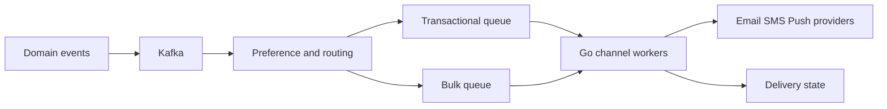
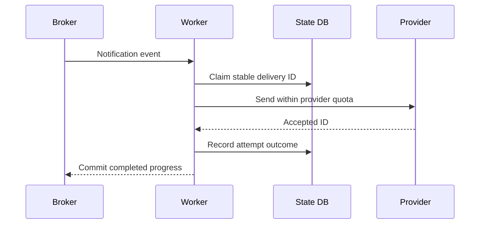
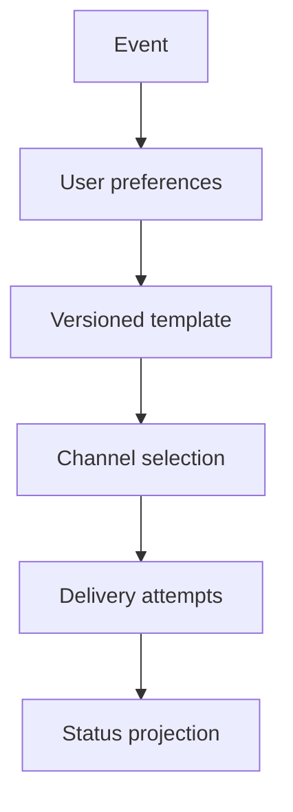
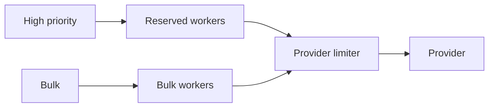
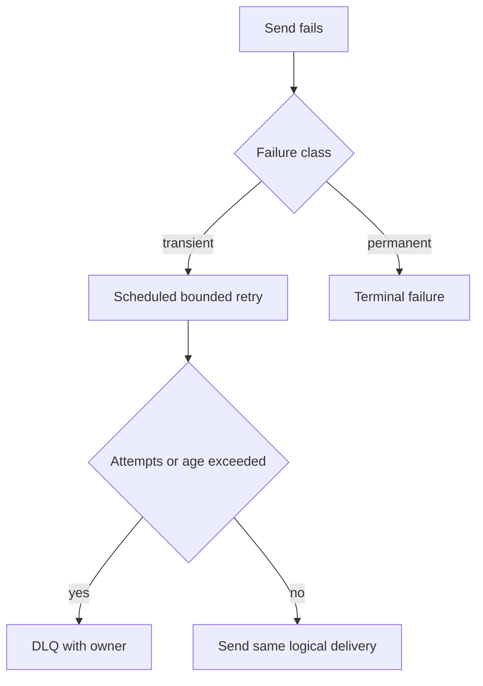

# Design Notification System

## Bài toán và ví dụ đầu tiên

Khi order hoàn tất, user nhận email/push theo preference. API order không nên chờ provider email chậm, nhưng notification đã nhận trách nhiệm cần có state để retry. “Gửi tới provider” và “user đã đọc” là hai contract khác nhau.

## Đi từng bước qua một tình huống

Phiên bản 1 lưu notification job trong DB cùng hoặc sau durable event theo boundary rõ, một worker hữu hạn gửi qua provider. Job có recipient, template version, channel và dedup identity. Retry giữ identity và phân loại địa chỉ sai với provider lỗi tạm thời. Chưa cần Kafka nếu một job table đáp ứng volume và replay.

Phiên bản 2 thêm worker replicas và claim jobs có lease/version để chia tải. Rate/concurrency theo provider và tenant ngăn một chiến dịch làm trễ transactional email. Template render có size/input validation; preference được kiểm tra tại thời điểm phù hợp với yêu cầu unsubscribe.

## Hiểu cơ chế từ kết quả quan sát

Phiên bản 3 dùng event bus khi nhiều nguồn sự kiện/consumer và replay độc lập tăng. Outbox nối business commit với notification intent; consumer dedup trước tạo job. Queue priority và quotas có thể tách OTP khỏi marketing, nhưng starvation của nhóm thấp cần được quan sát. Kafka không bảo đảm provider chỉ gửi một email khi response mất; provider idempotency hoặc outcome workflow vẫn cần.

Batching giảm API overhead nhưng có thể làm một recipient lỗi ảnh hưởng cả batch hoặc tăng latency chờ. Channel fallback email→SMS cần policy chi phí/consent, không thử mọi kênh vô hạn. DLQ giữ job không xử lý được cùng owner sửa/replay và retention.

**Design lab:** các con số dưới đây là giả định để ước lượng, chưa phải kết quả benchmark. Khi phỏng vấn, xác nhận semantics và workload trước khi chọn hạ tầng.

## Requirements

Gửi email/SMS/push từ events, preferences và templates; support scheduling, retries, unsubscribe và delivery status. “Sent” khác provider accepted và user delivered.

## Non-functional Requirements

Giả định 10M notifications/ngày, peak2k/s; accepted durable P99<200ms, priority transactional nhanh hơn bulk. Duplicate tolerance khác nhau theo channel.

## Capacity Estimation

10M/86400≈116/s average; peak2k/s khoảng 17× average. Payload metadata1KiB≈9.5GiB/ngày trước retention/replicas. Provider500/s, backlog1M mất tối thiểu2000s để drain nếu không có arrivals mới.

## API

POST /notifications với event_id,user_id,template,channel; GET status; PUT /preferences; bulk submit trả batch ID và progress.

## Data Model

notification_jobs unique(event_id,user_id,channel,template_version); attempts(provider_id,state,next_attempt); preferences versioned; outbox/inbox; template immutable version.

## High-Level Architecture

### Cách đọc diagram

Domain events vào Kafka trong phiên bản cần durable log, qua preferences/routing tới transactional hoặc bulk queue. Workers theo channel gửi provider và ghi delivery state. Tách queues cho priority không tự làm provider quota riêng, nên phải giữ limit ở điểm gọi chung và dedup delivery identity.

## Request Flow

Consume event, enforce current opt-out policy theo product rule, claim logical delivery, render bounded payload và send. Provider webhook cập nhật status idempotently; không đánh delivered ngay khi API accepted.

### Cách đọc diagram

Broker đưa event, worker claim stable delivery ID ở DB rồi gửi trong provider quota. Provider acceptance ID được ghi thành attempt outcome trước commit progress. Acceptance không đồng nghĩa user đã nhận/đọc; crash giữa send và record outcome cần provider idempotency/reconcile theo contract.

## Data Flow

### Cách đọc diagram

Event được kết hợp với preferences, template version rồi chọn channel và tạo attempts. Status projection là view theo attempts/outcomes, có thể cập nhật bất đồng bộ. Mũi tên không cho phép template hiện tại thay nội dung của retry cũ nếu contract yêu cầu cùng version.

## Go Service Implementation

Goroutine workers bound riêng email/SMS/push; shared per-provider client, deadline và limiter. Queue chứa IDs thay giant rendered bodies; context cancel/join trước closing clients; scheduled retries durable thay sleep trong hàng triệu G.

## Scaling

Scale by queue age per priority/channel, cap provider rate globally và isolate tenants. Batch provider API nếu supported và giữ per-recipient IDs.

### Cách đọc diagram

High priority có reserved workers, bulk có pool riêng; hai pool đều qua provider limiter trước gửi. Reserved capacity bảo vệ latency OTP/transactional dưới bulk load, còn limiter giữ tổng quota. Fairness của bulk và recovery backlog cần policy thêm, không hiện tự động từ hai boxes.

## Failure Modes

Provider outage, duplicate events, opt-out race, hot bulk campaign, template bad version. Transactional capacity reserve tránh bulk làm OTP chậm.

## Những đường lỗi cần hiểu

Thử crash/network loss tại từng durable boundary ở request flow; kiểm tra invariant sau recovery, không chỉ việc service khởi động lại. Permanent invalid destination chuyển terminal state; transient outage retry jitter; DLQ/replay giữ delivery ID. Provider không idempotent thì duplicate window phải được thừa nhận.

### Cách đọc diagram

Send failure được phân transient hay permanent. Transient đi scheduled retry, nhưng attempts/age vượt giới hạn thì tới DLQ có owner; còn budget thì gửi lại cùng logical delivery. Permanent kết thúc theo trạng thái failure. Không đưa mọi lỗi schema vào retry vô hạn và không đổi ID khi thử lại.

## Observability

Oldest age by priority, accepted/sent/delivered differences, retry/DLQ count, provider status and quota utilization.

## Lần theo bằng chứng khi có sự cố

Oldest age by priority, accepted/sent/delivered differences, retry/DLQ count, provider status and quota utilization. Tách offered, accepted và completed rates; chọn dependency/queue đầu tiên lệch baseline. Thu profile đúng triệu chứng, đối chiếu trace với durable state theo operation ID. Sau mitigation kiểm tra cả SLO và backlog/reconciliation để tránh tuyên bố phục hồi quá sớm.

## Security

Encrypt recipient data, redact content, signed unsubscribe links, tenant template isolation, anti-abuse send quotas.

## Đánh đổi

| Option | Best for | Weakness |
|---|---|---|
| Shared queue | Simple | Bulk starves critical work |
| Priority bulkheads | Predictable latency | Reserved capacity cost |
| Multi-provider failover | Availability | Duplicate ambiguity |

## Evolution

One channel trước, sau đó template versioning/preferences, priority isolation; multi-provider routing chỉ khi có status reconciliation và duplicate policy.

## Thực hành, debugging và kết luận

Test provider nhận thành công rồi response mất, duplicate source event, unsubscribe giữa enqueue và send, worker chết khi giữ lease. Xác nhận không gửi lại ngoài contract và job pending có đường recovery. Metrics oldest job age theo priority, attempts, provider acceptance và delivery callbacks phản ánh các mốc khác nhau.

Khi provider down, giảm attempts và giữ backlog hữu hạn/durable theo budget; không spawn goroutine vô hạn chờ retry. Recovery ramp để không vượt rate limit, dùng jitter và theo dõi completion thật. Privacy bắt buộc tenant/recipient data không bị trộn trong cache template hoặc logs.

## Đọc tiếp

- [capacity-estimation](capacity-estimation.md)
- [Worker pool và bounded concurrency](../04-concurrency/worker-pool.md)
- [Distributed idempotency và ambiguous outcomes](../12-distributed-systems/idempotency.md)
- [Transactional outbox](../12-distributed-systems/outbox-pattern.md)
