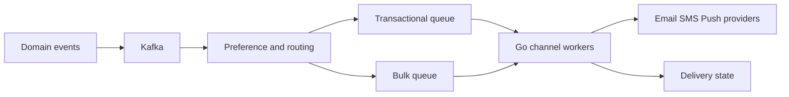
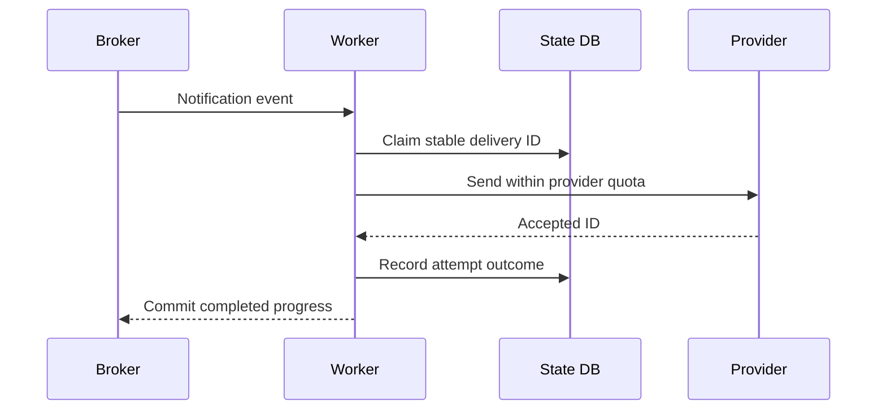
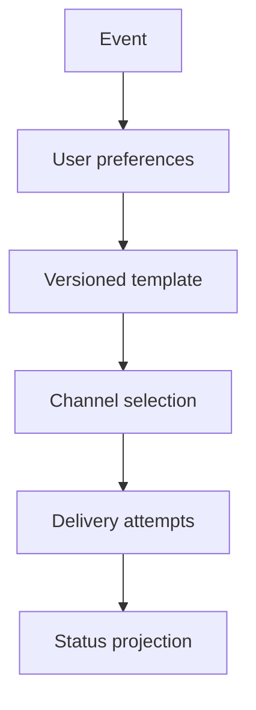
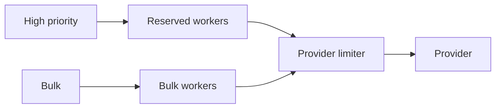
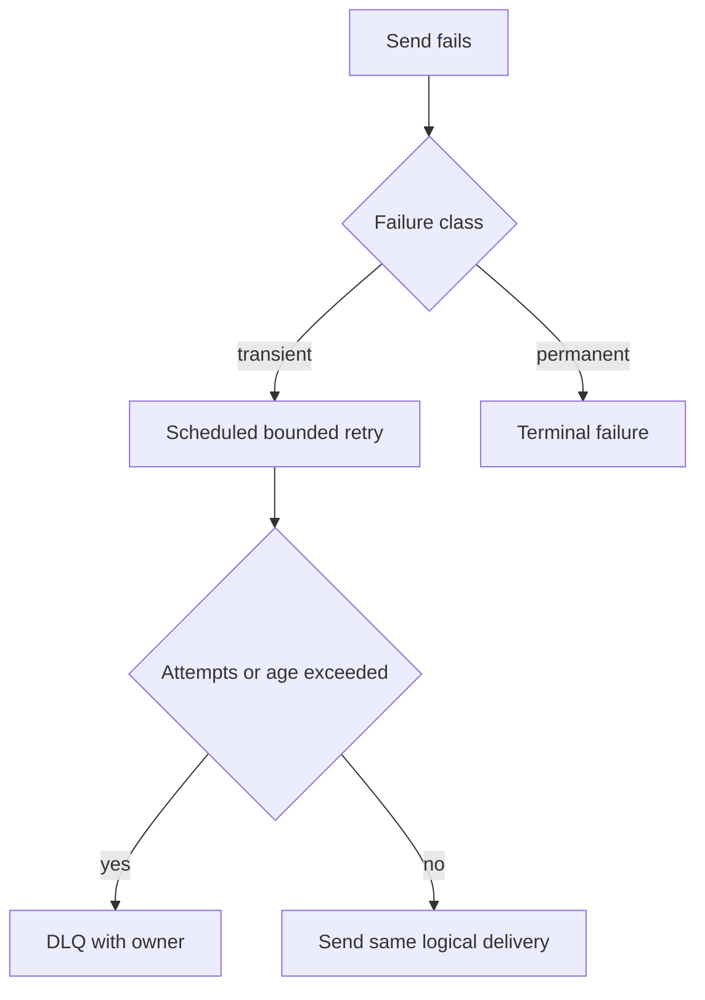

# Design Notification System

**Design lab:** các con số dưới đây là giả định để ước lượng, chưa phải kết quả benchmark. Khi phỏng vấn, xác nhận semantics và workload trước khi chọn hạ tầng.

## Requirements

Gửi email/SMS/push từ events, preferences và templates; support scheduling, retries, unsubscribe và delivery status. “Sent” khác provider accepted và user delivered.

## Non-functional Requirements

Giả định 10M notifications/ngày, peak2k/s; accepted durable P99<200ms, priority transactional nhanh hơn bulk. Duplicate tolerance khác nhau theo channel.

## Capacity Estimation

10M/86400≈116/s average; peak2k/s khoảng 17× average. Payload metadata1KiB≈9.5GiB/ngày trước retention/replicas. Provider500/s, backlog1M mất tối thiểu2000s để drain nếu không có arrivals mới.

## API

POST /notifications với event_id,user_id,template,channel; GET status; PUT /preferences; bulk submit trả batch ID và progress.

## Data Model

notification_jobs unique(event_id,user_id,channel,template_version); attempts(provider_id,state,next_attempt); preferences versioned; outbox/inbox; template immutable version.

## High-Level Architecture

## Request Flow

Consume event, enforce current opt-out policy theo product rule, claim logical delivery, render bounded payload và send. Provider webhook cập nhật status idempotently; không đánh delivered ngay khi API accepted.

## Data Flow

## Go Service Implementation

Goroutine workers bound riêng email/SMS/push; shared per-provider client, deadline và limiter. Queue chứa IDs thay giant rendered bodies; context cancel/join trước closing clients; scheduled retries durable thay sleep trong hàng triệu G.

## Scaling

Scale by queue age per priority/channel, cap provider rate globally và isolate tenants. Batch provider API nếu supported và giữ per-recipient IDs.

## Failure Modes

Provider outage, duplicate events, opt-out race, hot bulk campaign, template bad version. Transactional capacity reserve tránh bulk làm OTP chậm.

## Failure Scenarios

Thử crash/network loss tại từng durable boundary ở request flow; kiểm tra invariant sau recovery, không chỉ việc service khởi động lại. Permanent invalid destination chuyển terminal state; transient outage retry jitter; DLQ/replay giữ delivery ID. Provider không idempotent thì duplicate window phải được thừa nhận.

## Observability

Oldest age by priority, accepted/sent/delivered differences, retry/DLQ count, provider status and quota utilization.

## How I would debug this in production

Oldest age by priority, accepted/sent/delivered differences, retry/DLQ count, provider status and quota utilization. Tách offered, accepted và completed rates; chọn dependency/queue đầu tiên lệch baseline. Thu profile đúng triệu chứng, đối chiếu trace với durable state theo operation ID. Sau mitigation kiểm tra cả SLO và backlog/reconciliation để tránh tuyên bố phục hồi quá sớm.

## Security

Encrypt recipient data, redact content, signed unsubscribe links, tenant template isolation, anti-abuse send quotas.

## Trade-offs

| Option | Best for | Weakness |
|---|---|---|
| Shared queue | Simple | Bulk starves critical work |
| Priority bulkheads | Predictable latency | Reserved capacity cost |
| Multi-provider failover | Availability | Duplicate ambiguity |

## Evolution

One channel trước, sau đó template versioning/preferences, priority isolation; multi-provider routing chỉ khi có status reconciliation và duplicate policy.

## Interview rehearsal

1. What is the primary correctness invariant?
2. Which measured resource limits throughput first?
3. What happens if a response is lost after commit?
4. How would you handle a tenfold hot-key skew?
5. Which evidence would justify the next architectural change?

Trả lời bằng API semantics, capacity arithmetic và failure flow cụ thể của bài này. Một câu trả lời senior phải giải thích điểm commit, ownership trong Go, bounds của concurrency/pools và recovery cho unknown outcome.

## See also

- [capacity-estimation](capacity-estimation.md)
- [Worker pool và bounded concurrency](../04-concurrency/worker-pool.md)
- [Distributed idempotency và ambiguous outcomes](../12-distributed-systems/idempotency.md)
- [Transactional outbox](../12-distributed-systems/outbox-pattern.md)
