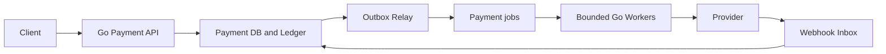
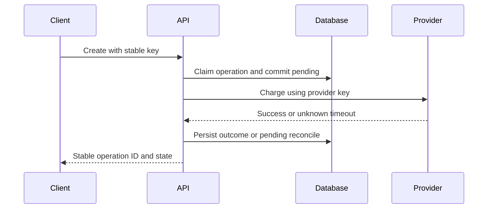
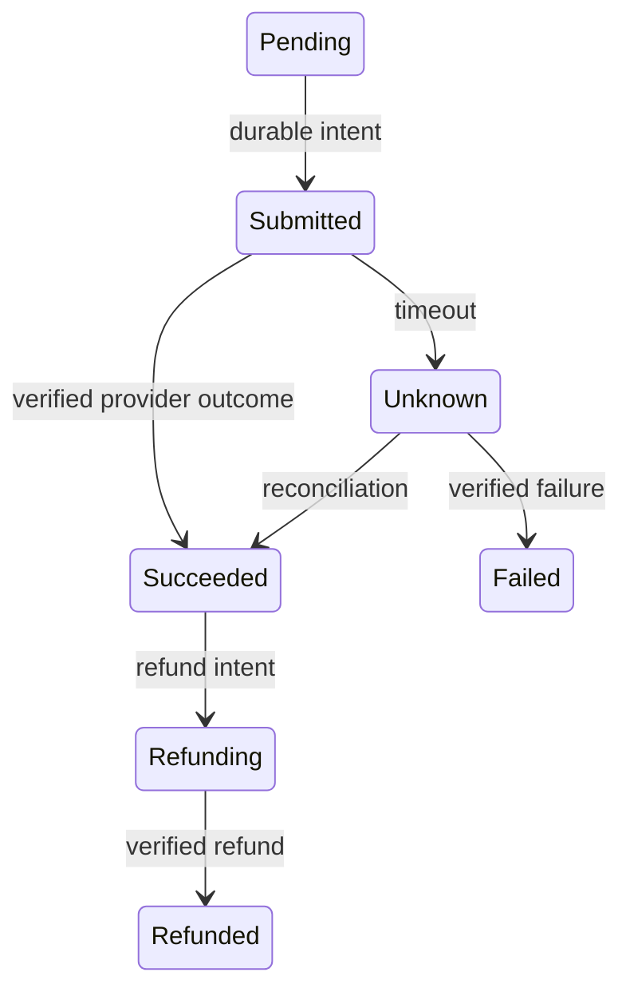
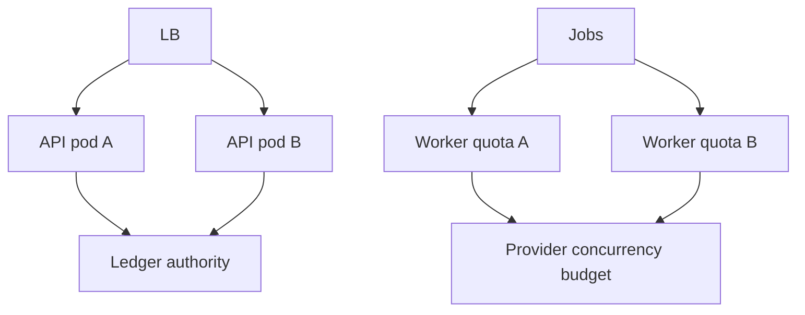
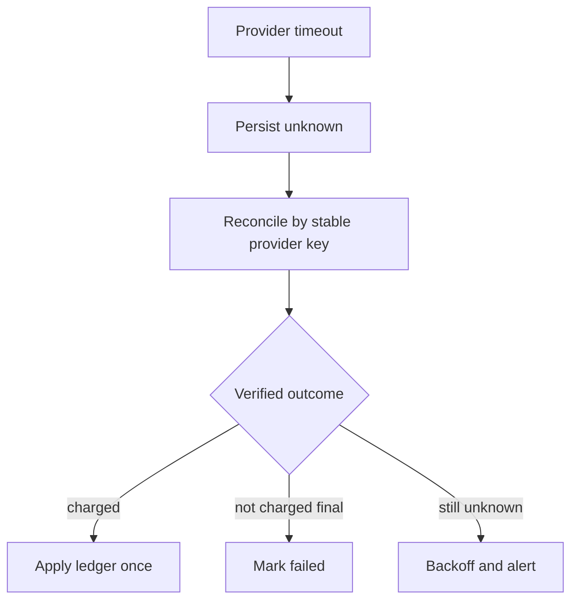

# Design Payment System

## Bài toán và ví dụ đầu tiên

Payment là workflow có kết quả chưa rõ khi network lỗi: ngân hàng có thể charge dù client timeout. Thiết kế cần operation identity, durable state và reconciliation trước khi tối ưu throughput. Các số dưới đây là mô hình học, không phải hướng dẫn tuân thủ tài chính cho một triển khai cụ thể.

## Đi từng bước qua một tình huống

Phiên bản 1 có payment API và DB lưu payment_id, idempotency key, amount/currency và state. Unique key chọn một operation; payload khác cùng key bị conflict. Gọi provider bằng reference/idempotency được provider hỗ trợ, lưu outcome và trả kết quả. Không giữ SQL transaction mở suốt remote call; state pending cho phép restart biết việc gì cần đối soát.

Khi API cần trả nhanh hoặc provider có độ trễ dài, phiên bản 2 ghi durable intent và để workers thực hiện trong budget. Client đọc status pending/completed/failed/unknown theo contract. Queue bền hoặc job table đủ cho bước đầu; thêm replicas phải giữ claim/dedup và provider concurrency limit toàn fleet.

## Hiểu cơ chế từ kết quả quan sát

Phiên bản 3 thêm outbox/events cho ledger, notifications và reconciliation consumers khi nhiều hệ thống cần cùng fact. Kafka có thể hữu ích cho replay và audit pipeline theo yêu cầu, nhưng không tạo atomic transaction với provider bên ngoài. Ledger entries và payment state có invariant riêng, dùng durable constraints/version và không sửa lịch sử tùy tiện để làm dashboard cân bằng.

Webhook có thể duplicate, đến trước response synchronous hoặc out of order. Verify nguồn theo provider contract, dedup event và dùng state transition/version hợp lệ. Một callback “success” không nên bị overwrite bởi timeout của attempt cũ đến sau. Reconciliation định kỳ query provider theo reference để giải quyết state treo.

**Design lab:** các con số dưới đây là giả định để ước lượng, chưa phải kết quả benchmark. Xác nhận semantics và workload trước khi chọn hạ tầng.

## Requirements

Tạo payment, xem status, refund và nhận provider webhook. Invariant: một logical charge không bị double-charge, ledger append-only và amount/currency chính xác.

## Non-functional Requirements

Giả định 500 create RPS peak, 2k status RPS; accepted response P99<300 ms khi async; final outcome có thể pending. Durability/audit quan trọng hơn chấp nhận mutation khi authority không hoạt động.

## Capacity Estimation

500 operations/s × 86400 =43.2M/ngày ở sustained peak, không được dùng peak làm average nếu business thấp hơn. Giả định average 50/s →4.32M/ngày; record+index 2KiB ≈8.2GiB/ngày trước replication. Provider cap200 concurrent và mean400 ms cho planning ceiling500/s.

## API

POST /payments với Idempotency-Key, amount_minor,currency,order_id; GET /payments/{id}; POST /payments/{id}/refunds với key riêng; POST /webhooks/provider có signature verification.

## Data Model

payments(id,tenant,request_hash,state,provider_key,version); unique(tenant,idempotency_key). ledger_entries immutable; refunds có unique operation ID; webhook_inbox unique provider_event_id; outbox cùng DB transaction.

## High-Level Architecture

### Cách đọc diagram

Client tới Payment API và DB/ledger authority. Outbox/jobs đưa work cho bounded workers gọi provider; provider webhooks đi qua inbox rồi cập nhật DB. Sơ đồ thể hiện cả synchronous và asynchronous đường vào cùng state, nên identity/version phải giữ hai bên không double-apply hoặc overwrite kết quả mới bằng outcome cũ.

## Request Flow

Claim idempotency row atomic cùng pending state; payload khác cùng key trả conflict. External call ngoài DB transaction. Webhook và polling có thể cạnh tranh; transition conditional theo version/state và ledger unique operation ID.

### Cách đọc diagram

Client gửi stable key, API claim operation và commit pending trước remote charge. Provider có thể trả success hoặc timeout chưa rõ; API lưu outcome hoặc pending reconcile rồi trả ID/state. Commit local và provider call là hai boundaries khác nhau; không suy pending đồng nghĩa chưa charge.

## Data Flow

### Cách đọc diagram

Pending tới Submitted theo durable intent; verified success tới Succeeded, timeout tới Unknown. Reconciliation mới quyết định Unknown thành Succeeded/Failed. Refund bắt đầu một intent mới rồi tới Refunded khi xác minh. Các mũi tên không có đường timeout→Failed trực tiếp vì thiếu bằng chứng remote chưa charge.

## Go Service Implementation

HTTP/gRPC handlers dùng ctx cho DB waits; provider worker dùng job/service context riêng với deadline. Shared client pool, bounded worker count, no goroutine per retry timer. Graceful drain không ack unknown work là done; persist reconcile state trước exit.

## Scaling

Scale stateless APIs riêng provider workers; provider semaphore global budget chia conservatively theo max pods hoặc distributed quota. Shard theo tenant/operation khi DB chứng minh bottleneck, giữ ledger/account invariant.

### Cách đọc diagram

LB chia API replicas nhưng cả hai dùng cùng ledger authority. Workers A/B cùng cạnh tranh provider concurrency budget. Tăng replica không được nhân vượt quota provider hoặc DB; idempotency và conditional state transitions phải hoạt động xuyên các instance.

## Failure Modes

Crash sau charge trước local persist; webhook trước response; duplicate refund; DB unavailable; provider partial outage. Không suy success/failure từ HTTP timeout đơn lẻ.

## Những đường lỗi cần hiểu

Thử crash/network loss tại từng durable boundary ở request flow; kiểm tra invariant sau recovery, không chỉ việc service khởi động lại. Timeout provider chuyển unknown để reconcile bằng cùng provider key; không tạo key mới. Webhook duplicate và out-of-order được guard bằng inbox ID và state transition/version.

### Cách đọc diagram

Provider timeout được lưu Unknown, sau đó reconcile bằng key ổn định. Kết quả verified charged áp ledger một lần; verified final not-charged mới failed; chưa rõ tiếp tục backoff/alert. Nhánh cuối cần owner/manual policy, không được tạo payment key mới chỉ để thoát trạng thái treo.

## Observability

Payment success theo final state, unknown age, reconcile backlog, ledger/provider mismatches, idempotency conflicts, provider quota utilization và DB lock waits.

## Lần theo bằng chứng khi có sự cố

Payment success theo final state, unknown age, reconcile backlog, ledger/provider mismatches, idempotency conflicts, provider quota utilization và DB lock waits. Tách offered, accepted và completed rates; chọn dependency/queue đầu tiên lệch baseline. Thu profile đúng triệu chứng, đối chiếu trace với durable state theo operation ID. Sau mitigation kiểm tra cả SLO và backlog/reconciliation để tránh tuyên bố phục hồi quá sớm.

## Security

Tokenize payment details qua provider, không lưu sensitive card data trong logs; tenant authorization, signed webhooks với replay window, least-privilege ledger writes và audit.

## Đánh đổi

| Option | Best for | Weakness |
|---|---|---|
| Synchronous charge | Kết quả nhanh khi provider khỏe | Timeout ambiguity |
| Async accepted payment | Bound API latency | Pending UX và status flow |
| Strict durable authority | Financial safety | Reject khi authority down |

## Evolution

Bắt đầu một provider/one-region authority với reconciliation; thêm routing/provider failover chỉ sau khi xác định operation chưa được provider cũ xử lý; multi-region cần ledger ownership/consistency strategy.

## Thực hành, debugging và kết luận

Test crash trước provider call, sau provider commit trước local finalize và sau finalize trước response. Mỗi điểm phải có cách tiếp tục cùng identity, không tạo charge mới. Compensation/refund là operation nghiệp vụ mới có thể thất bại và cần identity riêng; timeout không tự refund.

Metrics theo state age, unknown outcomes, provider latency và duplicate suppression giúp phát hiện sai lệch. Quyền truy cập, dữ liệu nhạy cảm và retention cần yêu cầu triển khai riêng. Throughput tốt chỉ có ý nghĩa khi invariant “một ý định không tạo nhiều charges” và quy trình đối soát giữ đúng.

## Đọc tiếp

- [capacity-estimation](capacity-estimation.md)
- [Worker pool và bounded concurrency](../04-concurrency/worker-pool.md)
- [Distributed idempotency và ambiguous outcomes](../12-distributed-systems/idempotency.md)
- [Transactional outbox](../12-distributed-systems/outbox-pattern.md)
