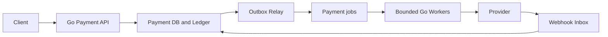
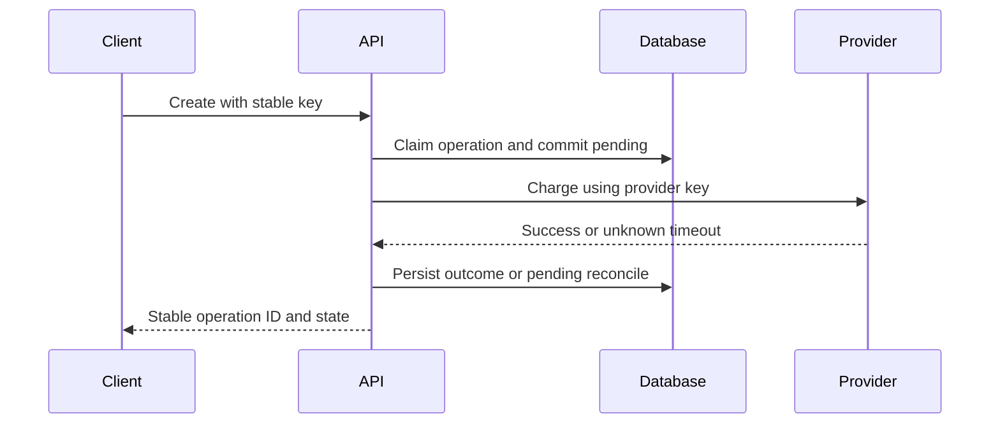
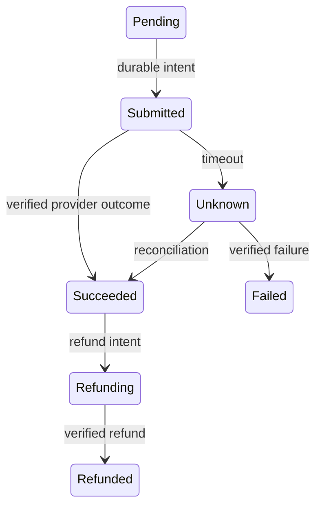
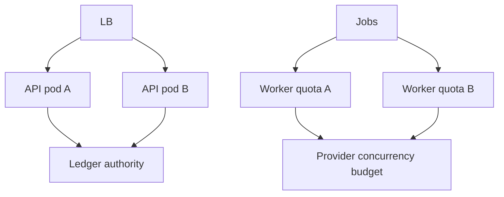
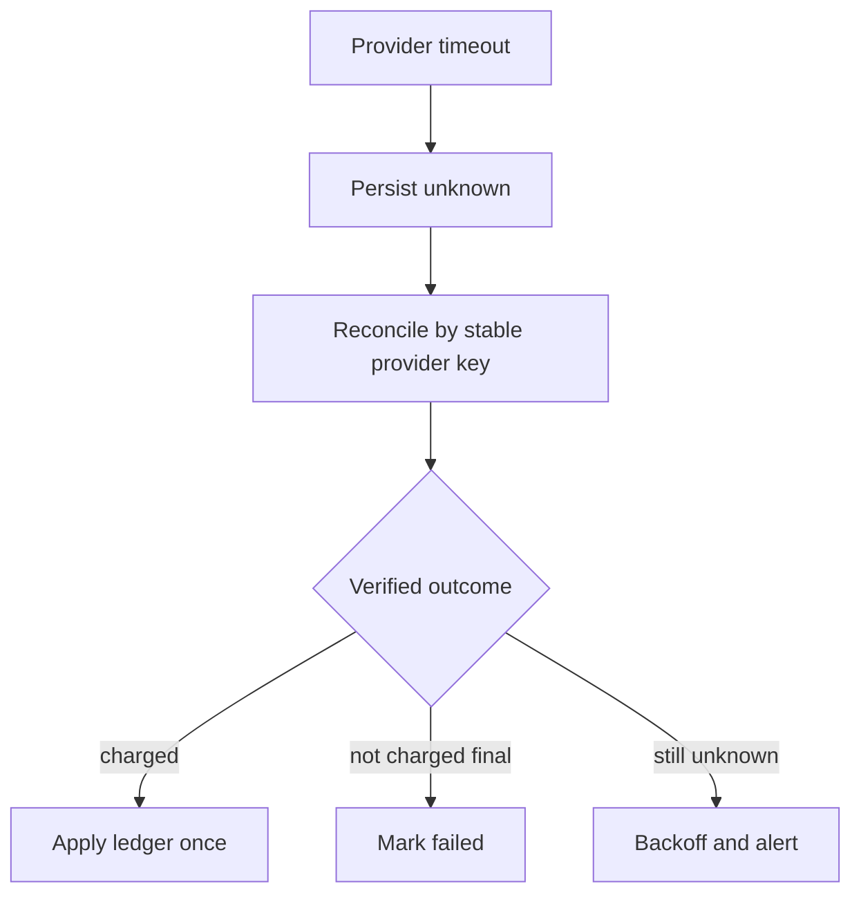

# Design Payment System

**Design lab:** các con số dưới đây là giả định để ước lượng, chưa phải kết quả benchmark. Khi phỏng vấn, xác nhận semantics và workload trước khi chọn hạ tầng.

## Requirements

Tạo payment, xem status, refund và nhận provider webhook. Invariant: một logical charge không bị double-charge, ledger append-only và amount/currency chính xác.

## Non-functional Requirements

Giả định 500 create RPS peak, 2k status RPS; accepted response P99<300ms khi async; final outcome có thể pending. Durability/audit quan trọng hơn chấp nhận mutation khi authority không hoạt động.

## Capacity Estimation

500 operations/s × 86400 =43.2M/ngày ở sustained peak, không được dùng peak làm average nếu business thấp hơn. Giả định average50/s →4.32M/ngày; record+index 2KiB ≈8.2GiB/ngày trước replication. Provider cap200 concurrent và mean400ms cho planning ceiling500/s.

## API

POST /payments với Idempotency-Key, amount_minor,currency,order_id; GET /payments/{id}; POST /payments/{id}/refunds với key riêng; POST /webhooks/provider có signature verification.

## Data Model

payments(id,tenant,request_hash,state,provider_key,version); unique(tenant,idempotency_key). ledger_entries immutable; refunds có unique operation ID; webhook_inbox unique provider_event_id; outbox cùng DB transaction.

## High-Level Architecture

## Request Flow

Claim idempotency row atomic cùng pending state; payload khác cùng key trả conflict. External call ngoài DB transaction. Webhook và polling có thể cạnh tranh; transition conditional theo version/state và ledger unique operation ID.

## Data Flow

## Go Service Implementation

HTTP/gRPC handlers dùng ctx cho DB waits; provider worker dùng job/service context riêng với deadline. Shared client pool, bounded worker count, no goroutine per retry timer. Graceful drain không ack unknown work là done; persist reconcile state trước exit.

## Scaling

Scale stateless APIs riêng provider workers; provider semaphore global budget chia conservatively theo max pods hoặc distributed quota. Shard theo tenant/operation khi DB chứng minh bottleneck, giữ ledger/account invariant.

## Failure Modes

Crash sau charge trước local persist; webhook trước response; duplicate refund; DB unavailable; provider partial outage. Không suy success/failure từ HTTP timeout đơn lẻ.

## Failure Scenarios

Thử crash/network loss tại từng durable boundary ở request flow; kiểm tra invariant sau recovery, không chỉ việc service khởi động lại. Timeout provider chuyển unknown để reconcile bằng cùng provider key; không tạo key mới. Webhook duplicate và out-of-order được guard bằng inbox ID và state transition/version.

## Observability

Payment success theo final state, unknown age, reconcile backlog, ledger/provider mismatches, idempotency conflicts, provider quota utilization và DB lock waits.

## How I would debug this in production

Payment success theo final state, unknown age, reconcile backlog, ledger/provider mismatches, idempotency conflicts, provider quota utilization và DB lock waits. Tách offered, accepted và completed rates; chọn dependency/queue đầu tiên lệch baseline. Thu profile đúng triệu chứng, đối chiếu trace với durable state theo operation ID. Sau mitigation kiểm tra cả SLO và backlog/reconciliation để tránh tuyên bố phục hồi quá sớm.

## Security

Tokenize payment details qua provider, không lưu sensitive card data trong logs; tenant authorization, signed webhooks với replay window, least-privilege ledger writes và audit.

## Trade-offs

| Option | Best for | Weakness |
|---|---|---|
| Synchronous charge | Kết quả nhanh khi provider khỏe | Timeout ambiguity |
| Async accepted payment | Bound API latency | Pending UX và status flow |
| Strict durable authority | Financial safety | Reject khi authority down |

## Evolution

Bắt đầu một provider/one-region authority với reconciliation; thêm routing/provider failover chỉ sau khi xác định operation chưa được provider cũ xử lý; multi-region cần ledger ownership/consistency strategy.

## Interview rehearsal

1. What is the primary correctness invariant?
2. Which measured resource limits throughput first?
3. What happens if a response is lost after commit?
4. How would you handle a tenfold hot-key skew?
5. Which evidence would justify the next architectural change?

Trả lời bằng API semantics, capacity arithmetic và failure flow cụ thể của bài này. Một câu trả lời senior phải giải thích điểm commit, ownership trong Go, bounds của concurrency/pools và recovery cho unknown outcome.

## See also

- [capacity-estimation](capacity-estimation.md)
- [Worker pool và bounded concurrency](../04-concurrency/worker-pool.md)
- [Distributed idempotency và ambiguous outcomes](../12-distributed-systems/idempotency.md)
- [Transactional outbox](../12-distributed-systems/outbox-pattern.md)
