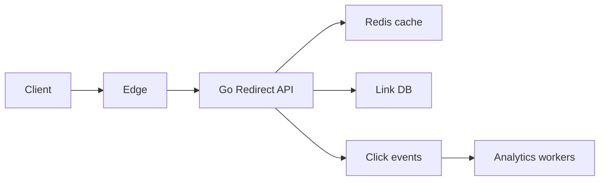
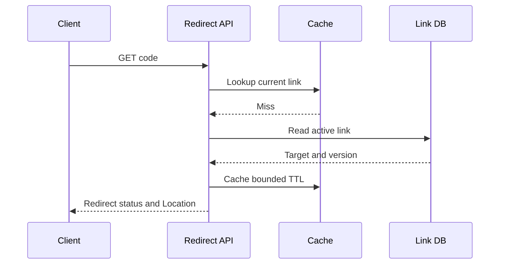
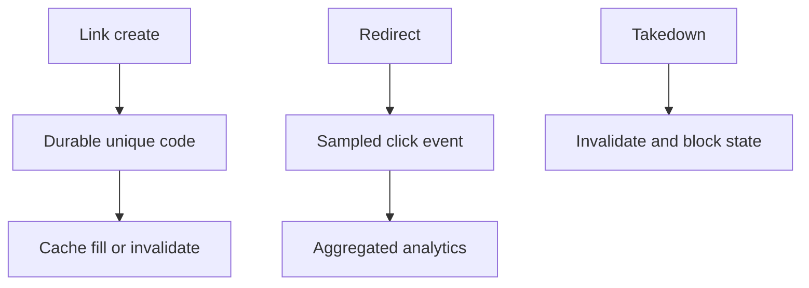
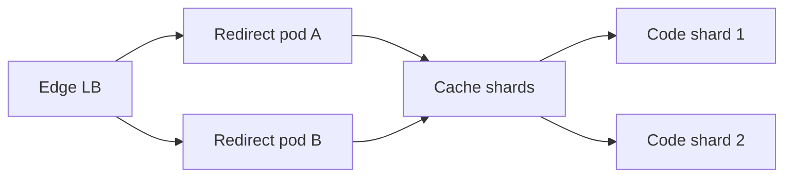
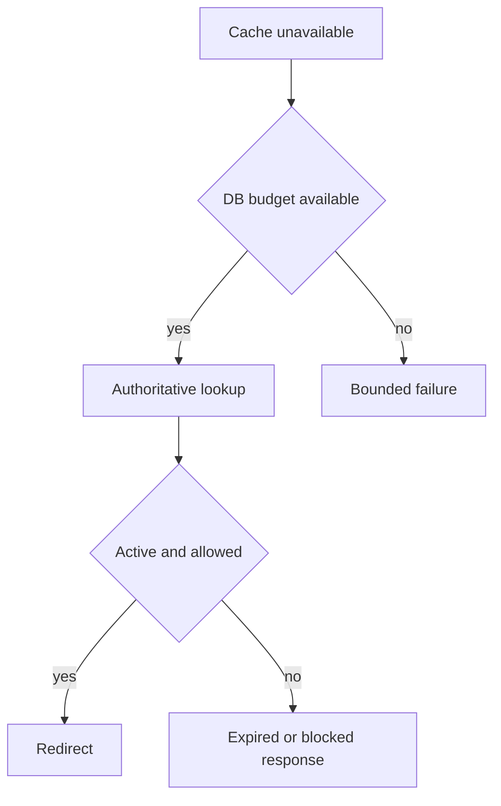

# Design URL Shortener

**Design lab:** các con số dưới đây là giả định để ước lượng, chưa phải kết quả benchmark. Khi phỏng vấn, xác nhận semantics và workload trước khi chọn hạ tầng.

## Requirements

Create short URL, redirect, expiration, abuse takedown và optional click analytics. Custom aliases scoped tenant, redirect behavior rõ khi target bị block.

## Non-functional Requirements

Giả định100M stored links,20k redirect RPS peak,200 create RPS; redirect P99<50ms khi cache hit; link ownership/durability và abuse response quan trọng.

## Capacity Estimation

100M×300B≈30GB raw metadata trước indexes/replication. 8 base62 chars cho 62^8≈2.18e14 candidates nhưng random collisions vẫn cần unique constraint/retry. Redirect body nhỏ, target URL và request headers chi phối bytes.

## API

POST /links {target,expires_at,custom_alias}; GET /{code} trả 302/307 theo method/cache contract; DELETE /links/{id} authenticated; analytics async.

## Data Model

links(code unique,tenant,target,created_at,expires_at,state,version); abuse decisions; click events pseudonymous có retention. Không dùng cache là authority cho takedown.

## High-Level Architecture

## Request Flow

Create validate scheme/length, allocate unpredictable code, INSERT unique retry on collision. Redirect đọc cache/DB và verify expiry/state; analytics enqueue best effort nếu product cho phép, không làm redirect chờ analytics DB.

## Data Flow

## Go Service Implementation

HTTP handlers shared Redis/SQL pools, request deadlines và same-key load coalescing. Click worker queue bounded với drop/sample policy; no unbounded goroutine mỗi click. Shutdown flush bounded analytics backlog hoặc chấp nhận measured loss theo contract.

## Scaling

Scale read API/cache, hot-key coalescing and negative caching with short TTL. DB shard theo code khi cần, alias creation uniqueness must route deterministic authority.

## Failure Modes

Hot viral code, malicious target, alias collision, stale takedown cache, cache miss storm, analytics outage.

## Failure Scenarios

Thử crash/network loss tại từng durable boundary ở request flow; kiểm tra invariant sau recovery, không chỉ việc service khởi động lại. Redis down fallback có bounded DB admission; stale target/takedown behavior theo security contract, không blindly serve stale blocked link.

## Observability

Redirect hit ratio, P99 by hit/miss, DB fallback load, blocked/expired hits, collision attempts và dropped analytics.

## How I would debug this in production

Redirect hit ratio, P99 by hit/miss, DB fallback load, blocked/expired hits, collision attempts và dropped analytics. Tách offered, accepted và completed rates; chọn dependency/queue đầu tiên lệch baseline. Thu profile đúng triệu chứng, đối chiếu trace với durable state theo operation ID. Sau mitigation kiểm tra cả SLO và backlog/reconciliation để tránh tuyên bố phục hồi quá sớm.

## Security

Prevent management IDOR, rate-limit creation, abuse scanning/takedown, avoid fetching arbitrary targets from privileged network; redirect service là open redirect có chủ đích nên phải có abuse policy.

## Trade-offs

| Option | Best for | Weakness |
|---|---|---|
| Random code | Unpredictable | Collision retry |
| Sequential IDs | Simple uniqueness | Enumeration exposure |
| Cache redirect | Low latency | Takedown staleness |

## Evolution

Single DB+cache trước; add edge caching khi invalidation/takedown SLA cho phép; analytics pipeline independent từ latency-critical redirect.

## Interview rehearsal

1. What is the primary correctness invariant?
2. Which measured resource limits throughput first?
3. What happens if a response is lost after commit?
4. How would you handle a tenfold hot-key skew?
5. Which evidence would justify the next architectural change?

Trả lời bằng API semantics, capacity arithmetic và failure flow cụ thể của bài này. Một câu trả lời senior phải giải thích điểm commit, ownership trong Go, bounds của concurrency/pools và recovery cho unknown outcome.

## See also

- [capacity-estimation](capacity-estimation.md)
- [Worker pool và bounded concurrency](../04-concurrency/worker-pool.md)
- [Distributed idempotency và ambiguous outcomes](../12-distributed-systems/idempotency.md)
- [Transactional outbox](../12-distributed-systems/outbox-pattern.md)
