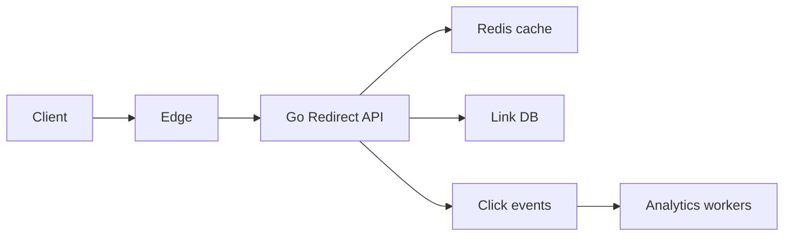
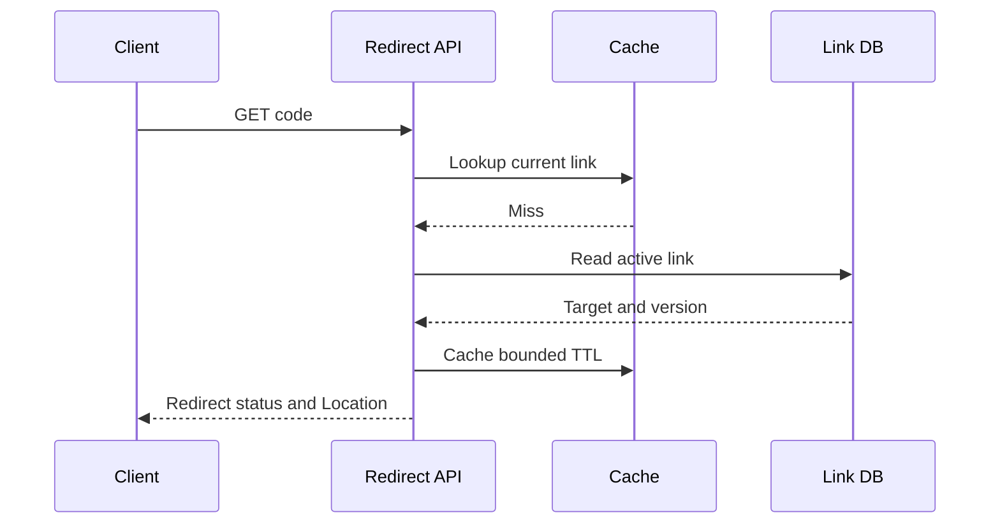
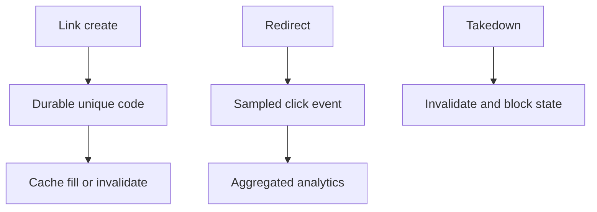
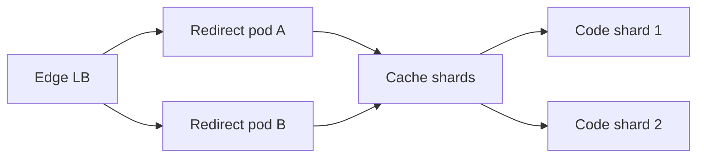
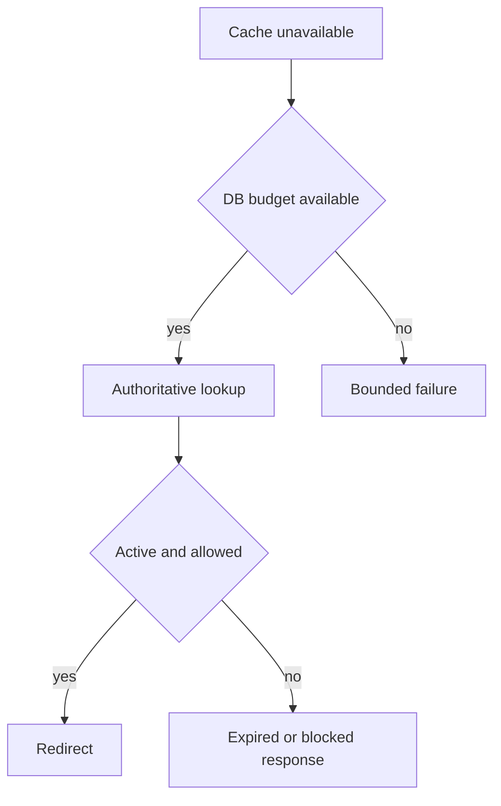

# Design URL Shortener

## Bài toán và ví dụ đầu tiên

Người dùng tạo một link ngắn rồi người khác mở link đó để được redirect. Bài toán cốt lõi là ánh xạ code tới URL, xử lý collision và bảo đảm một code không bất ngờ trỏ sang đích khác. Analytics có thể xử lý sau; redirect path cần nhanh và có policy an toàn cho URL/abuse.

## Đi từng bước qua một tình huống

Phiên bản 1 dùng Go API và bảng links(code unique, destination, owner, created_at). Tạo code ngẫu nhiên đủ không gian, insert với unique constraint và thử lại collision theo bound. Redirect lookup theo code rồi trả status theo contract. Không cần Kafka chỉ để redirect; log click có thể ở pipeline observability hoặc job phù hợp nếu volume còn nhỏ.

Khi read traffic lớn hơn write nhiều lần và lookup lặp, phiên bản 2 thêm API replicas và cache code→destination. Cache giảm DB reads nhưng phải giữ policy link bị khóa/xóa: TTL dài tăng stale window, invalidation có failure cần xử lý. Negative cache giảm lookup mã không tồn tại nhưng phải tránh giữ trạng thái missing quá lâu khi mã vừa được tạo.

## Hiểu cơ chế từ kết quả quan sát

Phiên bản 3 thêm pipeline click events khi analytics không được phép kéo latency redirect hoặc cần nhiều consumer/replay. Chỉ gửi event theo durability/SLO analytics đã chọn; không block mọi redirect vì analytics unavailable nếu sản phẩm cho phép mất telemetry. Kafka hợp lý khi log volume, replay và consumers độc lập biện minh vận hành; trước đó queue nhỏ hơn có thể đủ.

Capacity tách read QPS, create QPS và click event bytes. Giả sử 10000 redirects/s, cache hit 95% thì còn khoảng 500 read misses/s trước traffic mã ngẫu nhiên; abuse có thể làm hit ratio thấp hơn nhiều. Một hot code cần cache strategy nhưng không cần shard tất cả writes chỉ vì read peak cao.

**Design lab:** các con số dưới đây là giả định để ước lượng, chưa phải kết quả benchmark. Xác nhận semantics và workload trước khi chọn hạ tầng.

## Requirements

Create short URL, redirect, expiration, abuse takedown và optional click analytics. Custom aliases scoped tenant, redirect behavior rõ khi target bị block.

## Non-functional Requirements

Giả định100M stored links,20k redirect RPS peak,200 create RPS; redirect P99<50 ms khi cache hit; link ownership/durability và abuse response quan trọng.

## Capacity Estimation

100M×300B≈30GB raw metadata trước indexes/replication. 8 base62 chars cho 62^8≈2.18e14 candidates nhưng random collisions vẫn cần unique constraint/retry. Redirect body nhỏ, target URL và request headers chi phối bytes.

## API

POST /links {target,expires_at,custom_alias}; GET /{code} trả 302/307 theo method/cache contract; DELETE /links/{id} authenticated; analytics async.

## Data Model

links(code unique,tenant,target,created_at,expires_at,state,version); abuse decisions; click events pseudonymous có retention. Không dùng cache là authority cho takedown.

## High-Level Architecture

### Cách đọc diagram

Client qua edge tới redirect API, API đọc Redis hoặc link DB. Click events đi pipeline analytics riêng. Mũi tên analytics không có nghĩa redirect phải chờ aggregation hoàn tất; độ bền click events theo product contract, còn link DB là authority cho destination/block state.

## Request Flow

Create validate scheme/length, allocate unpredictable code, INSERT unique retry on collision. Redirect đọc cache/DB và verify expiry/state; analytics enqueue best effort nếu product cho phép, không làm redirect chờ analytics DB.

### Cách đọc diagram

GET code thử cache, miss thì đọc active link từ DB, nhận target/version rồi fill TTL và trả redirect Location. Đây là miss path normal; concurrent update/takedown có thể đua với fill nên cần freshness/version policy. Không suy thứ tự mũi tên tạo transaction atomic giữa DB và Redis.

## Data Flow

### Cách đọc diagram

Create link đi qua durable unique code rồi fill/invalidate cache. Redirect tạo sampled click event cho aggregation; takedown tạo block state/invalidation. Ba nhánh có semantics khác: analytics có thể sampled, nhưng block propagation phải theo policy an toàn của redirect.

## Go Service Implementation

HTTP handlers shared Redis/SQL pools, request deadlines và same-key load coalescing. Click worker queue bounded với drop/sample policy; no unbounded goroutine mỗi click. Shutdown flush bounded analytics backlog hoặc chấp nhận measured loss theo contract.

## Scaling

Scale read API/cache, hot-key coalescing and negative caching with short TTL. DB shard theo code khi cần, alias creation uniqueness must route deterministic authority.

### Cách đọc diagram

Edge LB phân traffic tới hai redirect pods dùng cache shards và code shards phía dữ liệu. Sharding là phiên bản mở rộng khi cần, không bắt buộc ngay từ đầu. Hot code có thể nằm ở một shard nên cache/skew handling vẫn quan trọng dù số shards tăng.

## Failure Modes

Hot viral code, malicious target, alias collision, stale takedown cache, cache miss storm, analytics outage.

## Những đường lỗi cần hiểu

Thử crash/network loss tại từng durable boundary ở request flow; kiểm tra invariant sau recovery, không chỉ việc service khởi động lại. Redis down fallback có bounded DB admission; stale target/takedown behavior theo security contract, không blindly serve stale blocked link.

### Cách đọc diagram

Cache unavailable dẫn tới kiểm tra DB budget: có capacity mới authoritative lookup, không thì fail có giới hạn. Lookup chỉ redirect nếu link active/allowed; expired/blocked trả response tương ứng. Không bỏ kiểm tra block để giảm latency hoặc cho fallback flood DB trong outage.

## Observability

Redirect hit ratio, P99 by hit/miss, DB fallback load, blocked/expired hits, collision attempts và dropped analytics.

## Lần theo bằng chứng khi có sự cố

Redirect hit ratio, P99 by hit/miss, DB fallback load, blocked/expired hits, collision attempts và dropped analytics. Tách offered, accepted và completed rates; chọn dependency/queue đầu tiên lệch baseline. Thu profile đúng triệu chứng, đối chiếu trace với durable state theo operation ID. Sau mitigation kiểm tra cả SLO và backlog/reconciliation để tránh tuyên bố phục hồi quá sớm.

## Security

Prevent management IDOR, rate-limit creation, abuse scanning/takedown, avoid fetching arbitrary targets from privileged network; redirect service là open redirect có chủ đích nên phải có abuse policy.

## Đánh đổi

| Option | Best for | Weakness |
|---|---|---|
| Random code | Unpredictable | Collision retry |
| Sequential IDs | Simple uniqueness | Enumeration exposure |
| Cache redirect | Low latency | Takedown staleness |

## Evolution

Single DB+cache trước; add edge caching khi invalidation/takedown SLA cho phép; analytics pipeline independent từ latency-critical redirect.

## Thực hành, debugging và kết luận

Failure quan trọng là cache trả link đã bị chặn, code collision, DB down và analytics backlog. Test tạo cùng candidate code đồng thời để constraint chọn đúng; test disable link khi cache stale và xác minh policy freshness. Metrics redirect latency/error theo reason, cache miss và blocked-link propagation cho biết product contract giữ được không.

Go handler giới hạn URL input, không tự fetch destination tùy ý và không dùng một goroutine không bound cho mỗi click log. HTTP response commit và cache write có lifetime rõ. Khi mở rộng multi-region, quyết định authority cấp code và replication freshness trước khi hứa redirect ở mọi region thấy link ngay.

## Đọc tiếp

- [capacity-estimation](capacity-estimation.md)
- [Worker pool và bounded concurrency](../04-concurrency/worker-pool.md)
- [Distributed idempotency và ambiguous outcomes](../12-distributed-systems/idempotency.md)
- [Transactional outbox](../12-distributed-systems/outbox-pattern.md)
