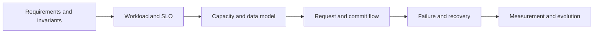

# System design framework cho Senior Go

**P0 · Must know**

## Concept, Why và Mental Model

System design nối product contract với capacity, consistency và operations. Bắt đầu bằng invariant và workload, sau đó chọn boundaries/cơ chế; không bắt đầu bằng danh sách Kafka/Redis/Kubernetes.



## How và Internals

Trong45 phút:5 phút clarify scope;5 phút estimates;10 phút API/data/architecture;10 phút deep dive bottleneck;10 phút failures/recovery/security;5 phút evolution và validation. Với30 phút giảm breadth, vẫn giữ commit boundary và unknown outcomes. Nêu assumptions bằng số, units và scope. Peak khác average; storage gồm indexes/replicas; concurrency dùng mean time với Little's Law trong trạng thái ổn định.

Runtime Go là một tầng của system: G park khi I/O nhưng giữ memory; GOMAXPROCS bound Go CPU execution, không bound requests. Worker count, queue bytes, client pools và DB capacity phải gắn vào model. Kafka partitions bound ordering/parallelism; context deadlines đi qua dependencies; graceful shutdown cần replay-safe state.

## Code Example

Capacity arithmetic có thể chạy để kiểm tra units:

```python
rps = 20_000
mean_seconds = 0.05
read_fraction, hit_ratio = 0.9, 0.95
print(rps * mean_seconds)  # 1000 mean in-flight
print(rps * read_fraction * (1 - hit_ratio))  # ~900 read misses/s
```

Đây là calculator, không benchmark. Go implementation patterns chạy được nằm ở [examples](../examples/README.md).

## Production Use Case

20k RPS: model cache-miss path, DB queries/Tx hold time, outbox event rate, connection budget tại max pods và one-zone loss. Design migration 5B: source log retention, snapshot+CDC ordering, target throughput và verification là trọng tâm hơn HTTP routing.

## Failure Scenarios

Response mất sau commit; dependency slow giữ pools; cache down tạo source overload; worker replay duplicate; schema rollout incompatible; region loss và stale leader. Mỗi case phải có owner, detection, mitigation và recovery invariant.

## Trade-offs

| Quyết định | Lợi ích | Giá phải trả |
|---|---|---|
| Sync result | UX trực tiếp | Tail latency coupling |
| Async accepted | Durable decoupling | Pending state và replay |
| Cache | Read capacity | Staleness/invalidation |
| Shard | Partitioned scale | Cross-shard operations |

## Common Misconceptions

Một diagram nhiều boxes không chứng minh capacity/correctness. “Exactly once” không có nghĩa nếu không nêu transaction boundary. HPA không mở rộng database tự động.

## When NOT to use

Không thêm cache/broker/microservice trước khi chỉ ra requirement hoặc measured bottleneck. Không hứa target RPS mà chưa nêu workload và test.

## How I would debug this in production

Vẽ lại path từ trace thật, so estimates với metrics. Xác định queue/capacity đầu tiên saturate, giảm admission hoặc isolate workload rồi mới scale. Kiểm tra correctness bằng durable IDs/state reconciliation sau mitigation. Đánh giá change ở offered load giống nhau và bao gồm failures/timeouts.

## Key Takeaways

Thiết kế tốt giải thích được cách chạy bình thường, cách hỏng và cách biết recovery đã đúng.

## Interview Questions

### Basic / Mid — 10

1. What is a functional requirement?
2. What is an SLO?
3. What is a correctness invariant?
4. How do peak and average traffic differ?
5. What is a capacity estimate?
6. What is a commit boundary?
7. What is a data ownership boundary?
8. What is a failure domain?
9. What is a recovery objective?
10. What is an architectural trade-off?

### Senior — 10

1. How do you apply Little's Law correctly?
2. How do Go runtime costs influence concurrency limits?
3. How should max replicas affect pool sizing?
4. Why does async processing require an accepted-state contract?
5. How do you avoid cache-induced overload?
6. What does exactly-once mean within a transaction boundary?
7. How do you choose a partition key?
8. How do you plan schema evolution?
9. How should shutdown affect accepted jobs?
10. How do you validate a design with failure injection?

### Production scenarios — 5

1. How would you design a 20k RPS API with P99 below 200ms?
2. How would you migrate five billion rows while writes continue?
3. How would you survive Redis failure without losing the DB?
4. How would you reconcile a payment timeout?
5. How would you recover from an out-of-order event?

### Senior Follow-ups — 5

1. What must never be violated?
2. Where is that invariant committed?
3. What happens if the response is lost?
4. Which resource bounds throughput?
5. Which test would falsify the design?

Chuỗi follow-up: trả lời lần lượt 5 câu cuối; mỗi câu cần một invariant, bằng chứng runtime hoặc trade-off cụ thể.


## See also

- [Design High-Throughput API — 20,000 RPS](design-high-throughput-api.md)
- [Design Migration Platform — 4–5 Billion Records](design-migration-platform.md)
- [Design Payment System](design-payment-system.md)

## Nguồn đối chiếu

- [Go diagnostics](https://go.dev/doc/diagnostics)
