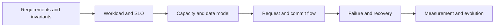

# System design framework cho Senior Go

## Bài toán và ví dụ đầu tiên

Thiết kế một hệ thống bắt đầu từ điều người dùng cần và điều không được phép sai. Với dịch vụ tạo đơn, “nhanh” chưa đủ: một lần xác nhận của người dùng không được tạo hai đơn khi response mất. Sau khi xác định invariant đó, ta mới chọn API, data model, cách commit và cách scale.

Một bản thiết kế có ích phải giải thích được phiên bản đầu chạy thế nào, vì sao thêm từng thành phần và khi thành phần lỗi thì dữ liệu còn đúng ra sao. Các con số capacity trong bài là giả định để kiểm tra reasoning, không phải benchmark đã đạt trên một cấu hình phần cứng.

## Đi từng bước qua một tình huống

Phiên bản 1 có một Go API và PostgreSQL. POST /orders nhận operation key, validate/auth, ghi order với unique constraint rồi trả ID sau commit. GET đọc DB. Chưa cần Redis/Kafka nếu latency, throughput và availability yêu cầu vẫn được đáp ứng. Dạng đơn giản này làm rõ nguồn sự thật và cửa sổ response mất sau commit.

Phiên bản 2 thêm nhiều API replicas khi CPU hoặc nhu cầu availability chứng minh cần. Load balancer chia traffic, nhưng DB vẫn có budget chung: 10 replicas × 20 pool connections đã là 200 khả năng kết nối. Nếu reads lặp lại chiếm phần lớn tải và sản phẩm chấp nhận stale data, thêm cache có key/version/TTL và phương án cache-down. Cache không giúp một write bottleneck bị khóa một row hot.

Phiên bản 3 chuyển email/report lâu sang durable jobs sau khi API đã commit intent. Trả accepted cùng job ID và để worker xử lý với retries/idempotency. Kafka chỉ xuất hiện nếu cần log/replay/nhiều consumer groups hoặc scale phù hợp; một job table có thể đủ cho giai đoạn đầu. Mỗi bước thêm phải trả lời được bottleneck nào giảm và failure mode mới nào được nhận.

## Hiểu cơ chế từ kết quả quan sát

Capacity estimation nối rate, size và thời gian. Với hệ ổn định, mean in-flight xấp xỉ arrival rate × mean time trong phạm vi đang đo. Không thay mean bằng P99 rồi gọi đó là Little's Law chính xác. Peak traffic, skew và mất một zone cần headroom riêng; disk storage phải tính indexes, replicas và retention theo giả định.

Data model thể hiện invariants qua keys/constraints/version. Request flow chỉ rõ nơi commit durable và nơi trả ack. Data flow giải thích event/projection/replay. Hai sơ đồ có thể dùng cùng components nhưng trả lời khác nhau: request latency đường đồng bộ và dữ liệu sống/đổi qua thời gian.

Go runtime là một phần capacity: goroutine chờ ít CPU nhưng giữ stack/payload; GOMAXPROCS không giới hạn requests. Worker count, queue bytes, HTTP/SQL pool và deadlines phải khớp budget. HPA tăng API replicas không làm database hoặc partition hot tự scale.

## Khái niệm và lý do tồn tại

System design nối product contract với capacity, consistency và operations. Bắt đầu bằng invariant và workload, sau đó chọn boundaries/cơ chế; không bắt đầu bằng danh sách Kafka/Redis/Kubernetes.



### Cách đọc diagram

Bắt đầu requirements/invariants rồi xác định workload và SLO để có đơn vị cho estimates. Từ capacity/data model đi tới request/commit flow, sau đó kiểm tra failure/recovery trước đo và tiến hóa. Các mũi tên là thứ tự lập luận có thể lặp lại khi đo bác bỏ assumption. Không có node chọn công nghệ đầu tiên vì components phải phục vụ constraint đã xác định.

## Cơ chế bên trong

Trong45 phút:5 phút clarify scope;5 phút estimates;10 phút API/data/architecture;10 phút deep dive bottleneck;10 phút failures/recovery/security;5 phút evolution và validation. Với 30 phút giảm breadth, vẫn giữ commit boundary và unknown outcomes. Nêu assumptions bằng số, units và scope. Peak khác average; storage gồm indexes/replicas; concurrency dùng mean time với Little's Law trong trạng thái ổn định.

Runtime Go là một tầng của system: G park khi I/O nhưng giữ memory; GOMAXPROCS bound Go CPU execution, không bound requests. Worker count, queue bytes, client pools và DB capacity phải gắn vào model. Kafka partitions bound ordering/parallelism; context deadlines đi qua dependencies; graceful shutdown cần replay-safe state.

## Ví dụ code

Capacity arithmetic có thể chạy để kiểm tra units:

```python
rps = 20_000
mean_seconds = 0.05
read_fraction, hit_ratio = 0.9, 0.95
print(rps * mean_seconds)  # 1000 mean in-flight
print(rps * read_fraction * (1 - hit_ratio))  # ~900 read misses/s
```

### Giải thích code và kết quả

Rps nhân mean_seconds cho mean in-flight 1000 trong steady state và cùng boundary đo. Nhánh read_fraction×miss_fraction ước khoảng900 read misses/s, chưa tính multiple queries/request hoặc cache-down. Calculator chỉ kiểm tra units/assumptions, không đo throughput thật. Đổi hit_ratio về0 để thấy DB read demand tăng lên18000/s và lý do cần fallback bound.

Đây là calculator, không benchmark. Go implementation patterns chạy được nằm ở [examples](../examples/README.md).

## Áp dụng vào hệ thống thật

20k RPS: model cache-miss path, DB queries/Tx hold time, outbox event rate, connection budget tại max pods và one-zone loss. Design migration 5B: source log retention, snapshot+CDC ordering, target throughput và verification là trọng tâm hơn HTTP routing.

## Những đường lỗi cần hiểu

Response mất sau commit; dependency slow giữ pools; cache down tạo source overload; worker replay duplicate; schema rollout incompatible; region loss và stale leader. Mỗi case phải có owner, detection, mitigation và recovery invariant.

## Đánh đổi

| Quyết định | Lợi ích | Giá phải trả |
|---|---|---|
| Sync result | UX trực tiếp | Tail latency coupling |
| Async accepted | Durable decoupling | Pending state và replay |
| Cache | Read capacity | Staleness/invalidation |
| Shard | Partitioned scale | Cross-shard operations |

## Những cách hiểu dễ sai

Một diagram nhiều boxes không chứng minh capacity/correctness. “Exactly once” không có nghĩa nếu không nêu transaction boundary. HPA không mở rộng database tự động.

## Khi nên chọn cách khác

Không thêm cache/broker/microservice trước khi chỉ ra requirement hoặc measured bottleneck. Không hứa target RPS mà chưa nêu workload và test.

## Lần theo bằng chứng khi có sự cố

Vẽ lại path từ trace thật, so estimates với metrics. Xác định queue/capacity đầu tiên saturate, giảm admission hoặc isolate workload rồi mới scale. Kiểm tra correctness bằng durable IDs/state reconciliation sau mitigation. Đánh giá change ở offered load giống nhau và bao gồm failures/timeouts.

## Thực hành, debugging và kết luận

Kiểm chứng design bằng failure timeline trước khi mở rộng thêm boxes. Crash trước commit phải không báo completed; crash sau commit trước response cần retry cùng identity; consumer crash sau effect trước checkpoint cần replay-safe. Nếu không giải thích được state sau restart thì diagram normal path chưa đủ.

Mỗi thay đổi cần metric chứng minh trigger và test bác bỏ assumptions: cache miss rate khi Redis down, DB wait ở max replicas, drain dưới rolling deploy, duplicate/reorder events. Trong review, trình bày contract, flow và trade-off thành câu đầy đủ trước khi rút gọn thành sơ đồ. Một thiết kế đơn giản với recovery rõ thường đáng tin hơn một hình nhiều thành phần chưa có ownership.


## Đọc tiếp

- [Design High-Throughput API — 20,000 RPS](design-high-throughput-api.md)
- [Design Migration Platform — 4–5 Billion Records](design-migration-platform.md)
- [Design Payment System](design-payment-system.md)

## Nguồn đối chiếu

- [Go diagnostics](https://go.dev/doc/diagnostics)
