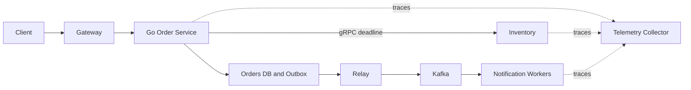

# Service communication contract

## Concept và Mental Model

HTTP/gRPC request-response và Kafka events mang khác nhau về latency, ownership và failure semantics.

## How it works

Sync calls propagate remaining deadline; async work durable trước accepted response, schema/version và idempotency rõ.

## Production Use Case

Checkout sync validate local invariant, async notification qua outbox.

## Failure Scenarios

Chatty chain A→B→C→D nhân latency/failure; retries mỗi hop khuếch đại load.

## How I would debug this in production

Service graph, fan-out width và per-hop budget; trace async links.

## Trade-offs và When NOT to use

Không thay call synchronous bằng event chỉ vì microservices; product consistency quyết định.

## Interview practice

When should a service use events instead of a direct call? Khi workflow chấp nhận async state và cần decoupled delivery.

## Key Takeaways

HTTP/gRPC request-response và Kafka events mang khác nhau về latency, ownership và failure semantics..

## See also

- [Microservices: independent ownership có chi phí](../11-software-architecture/microservices.md)
- [Distributed failure matrix](../12-distributed-systems/failure-scenarios.md)
- [tracing](../17-observability/tracing.md)

## Nguồn đối chiếu

- [Tài liệu chính thức](https://grpc.io/docs/guides/)

## Applied drill

Với A→B→C, parent còn150ms thì B không nên tạo timeout200ms độc lập. Pass ctx và child deadline theo remaining budget, reserve cleanup/response time. Async command khác: persist accepted work rồi worker có own attempt deadline/retry age policy. Dùng cùng trace metadata không có nghĩa phải giữ cùng cancellation lifetime xuyên durable boundary.
