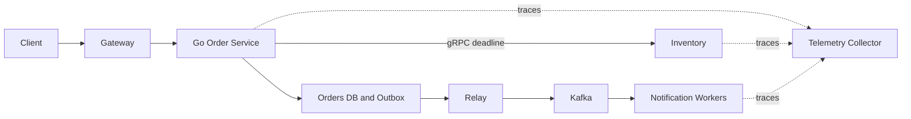

# Service communication contract

## Bài toán và ví dụ đầu tiên

Orders cần biết inventory còn hàng. Call đồng bộ cho kết quả ngay nhưng latency/failure của inventory đi vào request orders. Event bất đồng bộ tách thời điểm xử lý nhưng client phải chấp nhận trạng thái pending.

## Đi từng bước qua một tình huống

Với call sync, truyền deadline còn lại và operation identity cho mutation. Với event, ghi durable intent trước accepted rồi consumer xử lý/retry. Không dùng goroutine fire-and-forget để giả làm messaging bền: process chết thì ý định có thể mất.

## Hiểu cơ chế từ kết quả quan sát

Contract gồm schema, error categories, retry safety và ownership dữ liệu. Fan-out nhiều dependency làm latency chịu nhánh chậm và tăng xác suất partial failure. Bulkhead và bounded concurrency bảo vệ capacity, còn reconciliation xử lý trạng thái không rõ sau timeout.

## Khái niệm và mô hình làm việc

HTTP/gRPC request-response và Kafka events mang khác nhau về latency, ownership và failure semantics.

## Cơ chế và những ranh giới cần giữ

Sync calls propagate remaining deadline; async work durable trước accepted response, schema/version và idempotency rõ.

## Áp dụng vào hệ thống thật

Checkout sync validate local invariant, async notification qua outbox.

## Những đường lỗi cần hiểu

Chatty chain A→B→C→D nhân latency/failure; retries mỗi hop khuếch đại load.

## Lần theo bằng chứng khi có sự cố

Service graph, fan-out width và per-hop budget; trace async links.

## Đánh đổi và giới hạn sử dụng

Không thay call synchronous bằng event chỉ vì microservices; product consistency quyết định.

## Thực hành, debugging và kết luận

Trace một operation xuyên services, nối attempt IDs với operation ID. Test partner chậm/down và duplicate event. Chọn sync khi client cần kết quả tức thì và capacity đủ; chọn async khi semantics hoàn thành sau phù hợp, không chỉ vì muốn giảm thời gian handler.

## Đọc tiếp

- [Microservices: independent ownership có chi phí](../11-software-architecture/microservices.md)
- [Distributed failure matrix](../12-distributed-systems/failure-scenarios.md)
- [tracing](../17-observability/tracing.md)

## Nguồn đối chiếu

- [Tài liệu chính thức](https://grpc.io/docs/guides/)

### Cách đọc diagram

Client qua gateway tới order service. Nhánh synchronous gRPC tới inventory dùng deadline; nhánh durable ghi Orders DB/outbox rồi relay phát Kafka cho notification workers. Cạnh nét đứt đưa telemetry về collector, không nằm trong transaction nghiệp vụ. Sơ đồ tách response path khỏi event path để thấy notification có thể đến sau order commit và cần replay-safe.

## Thực hành có điều kiện kiểm chứng

Với A→B→C, parent còn150ms thì B không nên tạo timeout200ms độc lập. Pass ctx và child deadline theo remaining budget, reserve cleanup/response time. Async command khác: persist accepted work rồi worker có own attempt deadline/retry age policy. Dùng cùng trace metadata không có nghĩa phải giữ cùng cancellation lifetime xuyên durable boundary.
