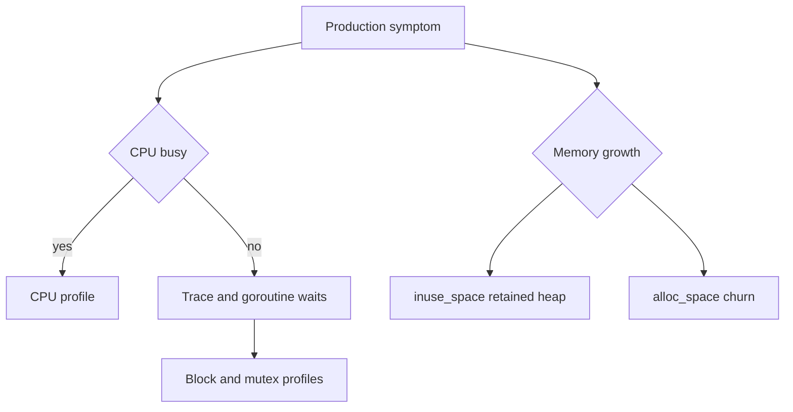

# pprof: chọn profile từ câu hỏi production

## Bài toán và ví dụ đầu tiên

Sau deploy, CPU từ 30% lên 95% trong khi RPS giữ nguyên và P99 từ 100 ms lên 2 giây. Nhìn code thay đổi có thể đoán nhiều nguyên nhân, nhưng cần biết CPU đang dùng vào việc gì. Pprof là bộ công cụ đọc profile — dữ liệu lấy mẫu về tài nguyên hoặc sự kiện — để nối chi phí đo được với stack/code.

## Đi từng bước qua một tình huống

Bắt đầu bằng câu hỏi cụ thể: CPU cao thì lấy CPU profile trong một cửa sổ có triệu chứng; memory tăng thì xem heap inuse và allocation; goroutine tăng thì lấy goroutine stacks. Lấy CPU profile khi phần lớn request đang chờ DB có thể không giải thích latency vì profile đó đo lúc CPU chạy, không đo toàn thời gian chờ.

```bash
cd golang/examples
go test -run '^$' -bench BenchmarkFormat -benchmem -cpuprofile cpu.out -memprofile mem.out
go tool pprof -top cpu.out
go tool pprof -sample_index=alloc_space -top mem.out
```

### Giải thích lệnh và cách đọc kết quả

-run với regex rỗng lựa chọn không chạy unit tests thông thường; -bench chạy benchmark phù hợp và -benchmem in allocation mỗi operation. Cpu.out là profile CPU của lần chạy, mem.out cung cấp các sample memory. Top xếp hạng các symbol theo loại sample đang chọn. Đây là lab để học thao tác; số đo máy cá nhân không chứng minh service production đạt throughput tương tự.

Trong pprof, flat là chi phí gắn trực tiếp với function theo sample, cumulative gồm cả phần của những callee dưới nó. Một wrapper có flat nhỏ nhưng cumulative lớn có thể là đường gọi dẫn tới chi phí thật. Dùng list và graph để thấy source/caller, kiểm tra binary/build ID đúng với profile trước khi diễn giải địa chỉ/symbol.

## Hiểu cơ chế từ kết quả quan sát

CPU profile lấy mẫu stack khi thực thi CPU, nên tần suất mẫu xấp xỉ tỷ trọng CPU trong cửa sổ đủ đại diện. Nó có sampling noise và overhead; không suy microsecond chính xác cho một hàm rất ngắn từ vài mẫu. Heap inuse_space cho memory còn giữ theo profile, alloc_space cho tổng allocation được lấy mẫu. Hai view trả lời retained set và churn khác nhau.

Goroutine profile cho stack tại thời điểm chụp, hữu ích tìm blocked groups nhưng không tự nói thời gian từng G đã chờ. Block profile lấy mẫu thời gian chờ ở các primitive được hỗ trợ và phải bật theo cấu hình; mutex profile quy chiếu contention theo semantics của profile, không phải tổng thời gian mọi Lock. Execution trace bổ sung timeline goroutine/scheduler/I/O để hiểu khoảng chờ mà CPU profile không cho thấy.

Endpoint debug/profile phải nằm trên boundary quản trị có kiểm soát, không vô tình expose DefaultServeMux admin ra public service. Profile có thể chứa tên đường code và thông tin vận hành; thu đúng phạm vi và thời lượng. Đừng bật mọi profiler ở mức tối đa mãi vì overhead có thể làm thay đổi chính incident đang đo.

## Khái niệm và lý do tồn tại

pprof phân tích profiles theo sampled call stacks. Profile trả lời một câu hỏi cụ thể, không phải báo cáo chung “service chậm vì function đứng đầu”. CPU đo thời gian thực thi được sample; heap đo allocations/live objects; goroutine cho trạng thái stacks; mutex/block cho contention/waits.



### Cách đọc diagram

Bắt đầu symptom rồi chọn câu hỏi: CPU busy dẫn tới CPU profile; CPU không bận nhưng chậm dẫn tới trace/goroutine waits và có thể block/mutex profiles. Nhánh memory tách retained heap inuse_space khỏi allocation churn alloc_space. Các nhánh là hướng điều tra có thể kết hợp, không là một classifier tự động; cần đối chiếu workload/quota và lifetime để kết luận cause.

## Cơ chế bên trong

Profile sampling có overhead/sai số; giữ build binary đúng để symbolization. `flat` là cost trong function, `cum` gồm callees. `top -cum` tìm callers gây cost, `list` đọc lines, graph/flame view xem call paths. Heap sample indices inuse_space/inuse_objects khác alloc_space/alloc_objects; alloc_space cao có thể chỉ short-lived churn. CPU profile không giải thích trực tiếp network wait vì parked G không chạy CPU.

## Ví dụ code

Từ `golang/examples`, các lệnh offline chạy được với benchmark trong module:

```bash
go test -run '^$' -bench BenchmarkFormat -benchmem -count=10 > before.txt
go test -run '^$' -bench BenchmarkFormat -cpuprofile=cpu.out -memprofile=mem.out
go tool pprof -top cpu.out
go tool pprof -sample_index=alloc_space -top mem.out
go test -run TestPoolCancellation -trace=trace.out
go tool trace trace.out
```

### Giải thích code và kết quả

Chạy từ examples. Lệnh đầu lấy 10 benchmark samples vào before.txt; các lệnh tiếp ghi/read CPU và allocation profiles. Trace chỉ chạy test pool cancellation để xem runtime timeline, rồi go tool trace mở UI. Những lần chạy có profiler có overhead và không so trực tiếp với benchmark thường như cùng điều kiện. Giữ binary/toolchain/workload metadata để diễn giải đúng.

`benchstat before.txt after.txt` so samples khi tool đã được cài/pin; không coi một run là bằng chứng. Muốn capture production qua net/http/pprof, dùng listener quản trị private có access control, không mount public mux. Ví dụ command khi operator đã mở tunnel được phép:

```bash
go tool pprof -top 'http://127.0.0.1:6060/debug/pprof/profile?seconds=30'
```

### Giải thích code và kết quả

Lệnh cuối lấy CPU profile 30 giây từ một process đã expose pprof trên loopback6060. Server lab mặc định không tự mở endpoint đó, nên đây là mẫu quan sát một service đã cấu hình admin listener. Chỉ dùng endpoint quản trị được phép, giới hạn thời lượng và đọc đúng binary. Đây không phải lệnh thay đổi business data nhưng profiling có overhead cần tính khi thu dưới tải.

Mutex/block cần enable sampling (`runtime.SetMutexProfileFraction`, `runtime.SetBlockProfileRate`) trước capture; revert theo operational policy. Không expose stack dumps cho internet vì có implementation/request metadata.

## Từ runtime đến production

CPU=95%, RPS bình thường, memory ổn, latency cao: tìm JSON/compression/regex/busy loop hoặc GC/assist. Lock contention có thể tạo wait hơn CPU; dùng thêm mutex/block/trace. Memory growth: so live heap sau nhiều GC, alloc rate, goroutine retention và RSS ngoài Go. 20k G: group stacks, xem plateau theo connections hay leak sau drain.

## Những đường lỗi cần hiểu

Profile từ binary khác làm source attribution sai; sampling quá dài trong outage tăng cost; benchmark compiler loại work; profile healthy interval không chứa burst; lấy heap rồi suy cgo memory.

## Đánh đổi

| Công cụ | Câu hỏi | Giới hạn |
|---|---|---|
| CPU profile | CPU tiêu ở đâu | Không đo wall wait trực tiếp |
| Heap/allocs | Retention hay churn | Sampling; không toàn RSS |
| Goroutine | Ai đang chờ gì | Snapshot, cần timeline |
| Trace | Scheduling/latency timeline | Volume/overhead |
| Mutex/block | Lock/channel waits | Cần enable và hiểu attribution |

## Những cách hiểu dễ sai

Hot function không luôn là root cause: nó có thể bị caller gọi quá nhiều. Low CPU không nghĩa không bottleneck. Một profile không chứng minh causal improvement; cần controlled comparison.

## Khi nên chọn cách khác

Không tối ưu theo microbenchmark không đại diện. Không lấy profile công khai hoặc enable maximum tracing mãi. Không tune GC nếu bottleneck thật là DB lock wait.

## Lần theo bằng chứng khi có sự cố

Xác định SLO regression, traffic/payload/build/config và thời điểm. Capture ngắn đúng triệu chứng, đối chiếu metrics/traces. Chọn top contributor, đưa một giả thuyết có cách bác bỏ, thay đổi nhỏ trong canary. So cùng offered load: throughput, P99, errors, CPU, heap và resource waits. Lưu profile và kết luận gồm giới hạn measurement.

## Thực hành, debugging và kết luận

Với incident giả định ở đầu, so profile trước/sau hoặc baseline/canary dưới cùng traffic. Nếu encoding/json hoặc format log tăng flat CPU, kiểm tra payload/logging path mới. Nếu runtime GC tăng, xem allocation per request và retained heap trước khi tune GOGC. Nếu CPU process không thực sự cao nhưng P99 tăng, chuyển sang pool wait, trace và quota metrics.

Một tối ưu tốt có giả thuyết và phép kiểm chứng: thay cách format ở hot loop, chạy benchmark đại diện để thấy CPU/alloc giảm, rồi canary xác nhận P99/errors không xấu và output vẫn đúng. Không rewrite phần code có tên nổi bật chỉ vì nó xuất hiện trong profile; runtime functions có thể là hậu quả của allocation do caller tạo.

Giữ artifact cùng commit, toolchain, flags, workload, duration và sample type. So sánh profile khác sample_index hoặc khác uptime dễ kết luận sai. Khi đã có bằng chứng đủ và regression checks pass, dừng mở rộng profiling không liên quan; mục tiêu là giải thích symptom và xác minh bản sửa, không thu mọi biểu đồ có thể.


## Đọc tiếp

- [performance-debugging](performance-debugging.md)
- [trace](trace.md)
- [high-cpu](../20-production-scenarios/high-cpu.md)

## Nguồn đối chiếu

- [Go diagnostics](https://go.dev/doc/diagnostics)
- [pprof command](https://pkg.go.dev/cmd/pprof)
