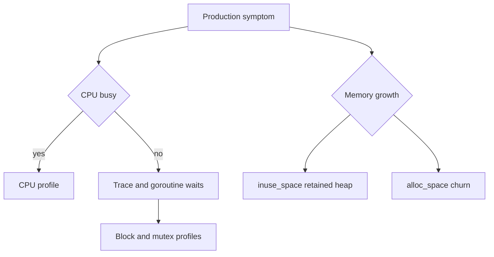

# pprof: chọn profile từ câu hỏi production

**P0 · Must know**

## Concept, Why và Mental Model

pprof phân tích profiles theo sampled call stacks. Profile trả lời một câu hỏi cụ thể, không phải báo cáo chung “service chậm vì function đứng đầu”. CPU đo thời gian thực thi được sample; heap đo allocations/live objects; goroutine cho trạng thái stacks; mutex/block cho contention/waits.



## How và Internals

Profile sampling có overhead/sai số; giữ build binary đúng để symbolization. `flat` là cost trong function, `cum` gồm callees. `top -cum` tìm callers gây cost, `list` đọc lines, graph/flame view xem call paths. Heap sample indices inuse_space/inuse_objects khác alloc_space/alloc_objects; alloc_space cao có thể chỉ short-lived churn. CPU profile không giải thích trực tiếp network wait vì parked G không chạy CPU.

## Code Example

Từ `golang/examples`, các lệnh offline chạy được với benchmark trong module:

```bash
go test -run '^$' -bench BenchmarkFormat -benchmem -count=10 > before.txt
go test -run '^$' -bench BenchmarkFormat -cpuprofile=cpu.out -memprofile=mem.out
go tool pprof -top cpu.out
go tool pprof -sample_index=alloc_space -top mem.out
go test -run TestPoolCancellation -trace=trace.out
go tool trace trace.out
```

`benchstat before.txt after.txt` so samples khi tool đã được cài/pin; không coi một run là bằng chứng. Muốn capture production qua net/http/pprof, dùng listener quản trị private có access control, không mount public mux. Ví dụ command khi operator đã mở tunnel được phép:

```bash
go tool pprof -top 'http://127.0.0.1:6060/debug/pprof/profile?seconds=30'
```

Mutex/block cần enable sampling (`runtime.SetMutexProfileFraction`, `runtime.SetBlockProfileRate`) trước capture; revert theo operational policy. Không expose stack dumps cho internet vì có implementation/request metadata.

## Runtime behavior và Production Use Case

CPU=95%, RPS bình thường, memory ổn, latency cao: tìm JSON/compression/regex/busy loop hoặc GC/assist. Lock contention có thể tạo wait hơn CPU; dùng thêm mutex/block/trace. Memory growth: so live heap sau nhiều GC, alloc rate, goroutine retention và RSS ngoài Go. 20k G: group stacks, xem plateau theo connections hay leak sau drain.

## Failure Scenarios

Profile từ binary khác làm source attribution sai; sampling quá dài trong outage tăng cost; benchmark compiler loại work; profile healthy interval không chứa burst; lấy heap rồi suy cgo memory.

## Trade-offs

| Công cụ | Câu hỏi | Giới hạn |
|---|---|---|
| CPU profile | CPU tiêu ở đâu | Không đo wall wait trực tiếp |
| Heap/allocs | Retention hay churn | Sampling; không toàn RSS |
| Goroutine | Ai đang chờ gì | Snapshot, cần timeline |
| Trace | Scheduling/latency timeline | Volume/overhead |
| Mutex/block | Lock/channel waits | Cần enable và hiểu attribution |

## Common Misconceptions

Hot function không luôn là root cause: nó có thể bị caller gọi quá nhiều. Low CPU không nghĩa không bottleneck. Một profile không chứng minh causal improvement; cần controlled comparison.

## When NOT to use

Không tối ưu theo microbenchmark không đại diện. Không lấy profile công khai hoặc enable maximum tracing mãi. Không tune GC nếu bottleneck thật là DB lock wait.

## How I would debug this in production

Xác định SLO regression, traffic/payload/build/config và thời điểm. Capture ngắn đúng triệu chứng, đối chiếu metrics/traces. Chọn top contributor, đưa một giả thuyết có cách bác bỏ, thay đổi nhỏ trong canary. So cùng offered load: throughput, P99, errors, CPU, heap và resource waits. Lưu profile và kết luận gồm giới hạn measurement.

## Key Takeaways

Chọn profile theo điều cần biết; phân biệt CPU, wait, allocation và retention trước khi tối ưu.

## Interview Questions

### Basic / Mid — 10

1. What is pprof?
2. What does a CPU profile sample?
3. What does a heap profile show?
4. What does alloc_space show?
5. What does inuse_space show?
6. What does a goroutine profile show?
7. What does flat mean?
8. What does cum mean?
9. How do you inspect source lines?
10. Why preserve the exact binary?

### Senior — 10

1. Why can high latency have low CPU samples?
2. How do allocation churn and retention differ?
3. How do mutex and block attribution differ?
4. Why must some profiles be enabled before capture?
5. How do you control capture overhead?
6. How do you compare profiles from equivalent loads?
7. Why is one benchmark run insufficient?
8. How can compiler optimization invalidate a benchmark?
9. How do traces complement profiles?
10. Why must profiling endpoints be protected?

### Production scenarios — 5

1. How would you debug CPU at 95 percent with normal RPS?
2. How would you investigate heap growth but stable alloc rate?
3. How would you group 20000 goroutine stacks?
4. Why did a mutex fix reduce races but raise latency?
5. Why does a profile not explain RSS dominated by native memory?

### Senior Follow-ups — 5

1. What symptom is measured?
2. Which profile answers that question?
3. Which call path explains the cost?
4. What controlled change tests the hypothesis?
5. Which SLO and resource metrics validate improvement?

Chuỗi follow-up: trả lời lần lượt 5 câu cuối; mỗi câu cần một invariant, bằng chứng runtime hoặc trade-off cụ thể.


## See also

- [performance-debugging](performance-debugging.md)
- [trace](trace.md)
- [high-cpu](../20-production-scenarios/high-cpu.md)

## Nguồn đối chiếu

- [Go diagnostics](https://go.dev/doc/diagnostics)
- [pprof command](https://pkg.go.dev/cmd/pprof)
