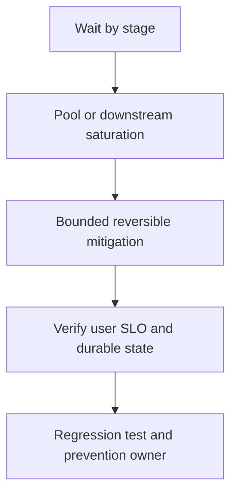

# API high latency

## Concept và Mental Model

P99 tăng từ80ms lên800ms, RPS không đổi, CPU40%; chưa đủ bằng chứng để scale CPU.

## How it works

Tách edge queue, admission, DB acquire, query execute, downstream và response write. Nếu handler time thấp nhưng edge cao, kiểm LB/network/queue trước.

## Production Use Case

Nếu optional downstream chậm, degrade có policy; nếu DB wait cao, giảm backfill/admission để giữ critical traffic.

## Failure Scenarios

Tăng pods nhân DB pools và làm bottleneck nặng hơn; retries giữ slots lâu; averages che một hot route.

## How I would debug this in production

Trace slow cohort, DB.Stats deltas, outbound httptrace và goroutine stacks; so deployment/config/hot-key changes.

## Trade-offs và When NOT to use

Không giảm timeout mù vì có thể tăng retry/unknown writes; canary một thay đổi và đo errors lẫn latency.

## Interview practice

How would you debug high latency with normal CPU? Phân loại wall wait trước CPU profile.

## Key Takeaways

P99 tăng từ80ms lên800ms, RPS không đổi, CPU40%; chưa đủ bằng chứng để scale CPU..

## See also

- [Performance debugging workflow](../16-performance/performance-debugging.md)
- [pprof: chọn profile từ câu hỏi production](../16-performance/pprof.md)
- [Incident debugging với evidence](../17-observability/incident-debugging.md)

## Nguồn đối chiếu

- [Tài liệu chính thức](https://go.dev/doc/diagnostics)

## Drill và exit criteria

Trong staging, tạo triệu chứng **API high latency** bằng failure injection có bounded duration. Trước khi thay đổi, ghi baseline traffic, version, resource limits và câu hỏi cần trả lời: **Wait by stage**. Thực hiện một mitigation, rồi so outcome theo cùng workload.

- Success: user-facing errors/latency trở về SLO, accepted durable work được hoàn tất hoặc replayable, queues không tiếp tục tăng.
- Regression guard: test tái hiện failure path, metrics/alert chỉ ra triệu chứng trước saturation, runbook có owner và rollback trigger.
- Follow-up: **What would make your diagnosis wrong?** Nêu một measurement có thể bác bỏ giả thuyết, không chỉ evidence xác nhận.
