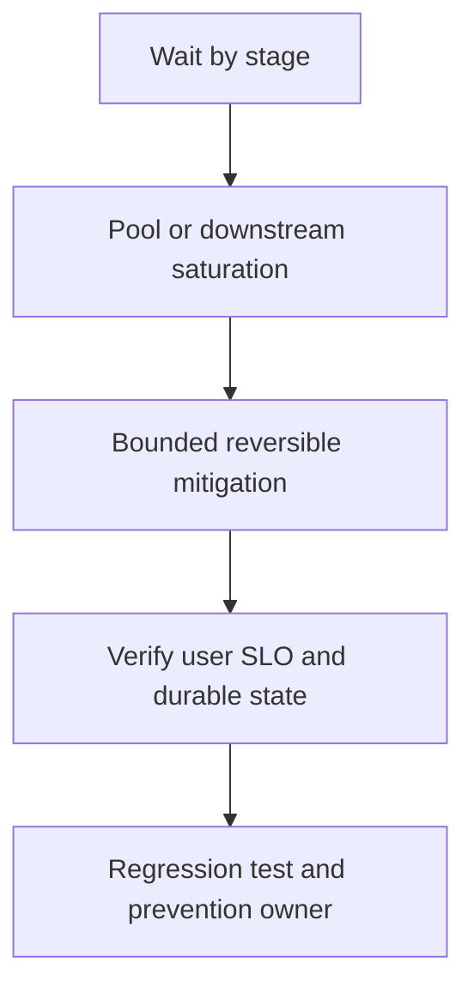

# API high latency

## Bài toán và ví dụ đầu tiên

**Tình huống mô phỏng.** P99 của GET /orders tăng từ 120 ms lên 1,8 giây, CPU chỉ 35%, error rate tăng nhẹ. Một số route khác vẫn bình thường. Không bắt đầu bằng thêm replicas vì dữ kiện ban đầu gợi ý nhiều thời gian chờ hơn CPU work.

## Đi từng bước qua một tình huống

Tách metrics theo route/status, so payload và query count sau deploy. Trace một request chậm cho thấy service span dài nhưng SQL execute chỉ 20 ms. Kiểm tra thời gian acquire pool, middleware auth và consume rows/encode; nếu span SQL bắt đầu sau acquire, phần wait có thể đang nằm trong khoảng trống.

Lấy goroutine profile cùng timestamp: nhiều stack ở database/sql acquire cộng InUse=max và delta WaitDuration tăng hỗ trợ pool-wait hypothesis. Nếu pool không chờ mà httptrace first-byte chậm, chuyển điều tra sang downstream. Một request mẫu không đại diện mọi P99, nên so vài trace và distribution.

## Hiểu cơ chế từ kết quả quan sát

Giảm admission của route đắt hoặc rollback N+1 regression nếu evidence chỉ rõ. Tăng timeout có thể làm user chờ lâu hơn và giữ nhiều in-flight resources, nên không là mitigation mặc định. Nếu query lock wait tăng, cần xác định transaction blocker trước khi tăng pool.

Một số client disconnect giữa response làm server latency metrics khó hiểu; kiểm tra actual completed responses và write duration. Queue latency khác execution latency, và mỗi phần cần có owner/bound.

## Khái niệm và mô hình làm việc

P99 tăng từ80ms lên800ms, RPS không đổi, CPU40%; chưa đủ bằng chứng để scale CPU.

## Cơ chế và những ranh giới cần giữ

Tách edge queue, admission, DB acquire, query execute, downstream và response write. Nếu handler time thấp nhưng edge cao, kiểm LB/network/queue trước.

### Cách đọc diagram

Đọc từ trên xuống: Wait by stage là điểm lấy bằng chứng từ pool acquisition và downstream spans; Pool or downstream saturation là nhóm giả thuyết cần kiểm chứng, không phải kết luận tự động. Mũi tên tới mitigation yêu cầu một thay đổi có bound và có thể đảo ngược. Sau đó kiểm tra P99 theo route, pool wait và completed rate, rồi chuyển cause đã xác nhận thành regression scenario và action có owner. Sơ đồ là trình tự điều tra; phần timeline ở đầu bài chỉ cách chọn bằng chứng để loại giả thuyết sai.

## Áp dụng vào hệ thống thật

Nếu optional downstream chậm, degrade có policy; nếu DB wait cao, giảm backfill/admission để giữ critical traffic.

## Những đường lỗi cần hiểu

Tăng pods nhân DB pools và làm bottleneck nặng hơn; retries giữ slots lâu; averages che một hot route.

## Lần theo bằng chứng khi có sự cố

Trace slow cohort, DB.Stats deltas, outbound httptrace và goroutine stacks; so deployment/config/hot-key changes.

## Đánh đổi và giới hạn sử dụng

Không giảm timeout mù vì có thể tăng retry/unknown writes; canary một thay đổi và đo errors lẫn latency.

## Thực hành, debugging và kết luận

Verify P99 ở cùng load và route mix, cả requests thành công lẫn bị reject. Kiểm tra pool wait giảm mà DB latency không tăng, và retries về baseline. Regression test đếm query/request hoặc test cancellation ở acquire theo cause đã xác nhận; load scenario phải chứa page size/payload gây lỗi. Ghi metric phân biệt cho lần sau thay vì chỉ ghi “xem pprof”.

## Đọc tiếp

- [Performance debugging workflow](../16-performance/performance-debugging.md)
- [pprof: chọn profile từ câu hỏi production](../16-performance/pprof.md)
- [Incident debugging với evidence](../17-observability/incident-debugging.md)

## Nguồn đối chiếu

- [Tài liệu chính thức](https://go.dev/doc/diagnostics)

## Drill và exit criteria

Trong staging, tạo triệu chứng **API high latency** bằng failure injection có bounded duration. Trước khi thay đổi, ghi baseline traffic, version, resource limits và câu hỏi cần trả lời: **Wait by stage**. Thực hiện một mitigation, rồi so outcome theo cùng workload.

- Success: user-facing errors/latency trở về SLO, accepted durable work được hoàn tất hoặc replayable, queues không tiếp tục tăng.
- Regression guard: test tái hiện failure path, metrics/alert chỉ ra triệu chứng trước saturation, runbook có owner và rollback trigger.
- Follow-up: **What would make your diagnosis wrong?** Nêu một measurement có thể bác bỏ giả thuyết, không chỉ evidence xác nhận.
