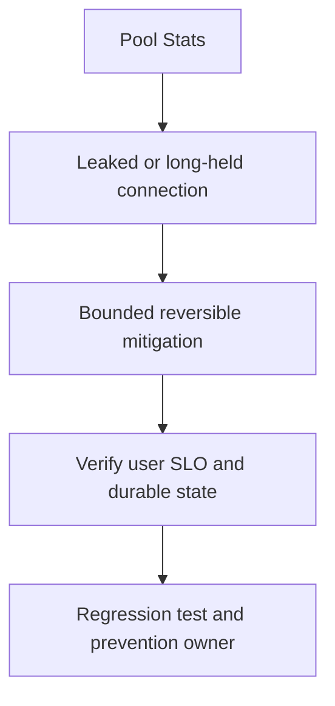

# DB pool exhausted

## Bài toán và ví dụ đầu tiên

**Tình huống mô phỏng.** HTTP timeout tăng, DB.Stats cho InUse=30 đúng MaxOpenConns và WaitCount tăng liên tục. PostgreSQL CPU chỉ 25%. Pool cạn không tự chứng minh cần nâng từ 30 lên300 connections.

## Đi từng bước qua một tình huống

Đối chiếu query duration, active/idle-in-transaction sessions và goroutine stacks. Giả sử sau release một handler Query rows rồi gọi external API trước khi Close; các connection bị giữ qua network wait dù DB đã làm xong phần lớn công việc. Hoặc một Tx giữ connection rồi gọi db.Query thay vì tx.Query, tạo yêu cầu slot thứ hai.

Tính delta WaitDuration/WaitCount theo cửa sổ để thấy áp lực mới. Kiểm tra số replica/surge: pool per-process không đổi nhưng rollout tăng tổng connections tới server có thể gây cạn ở tầng DB.

## Hiểu cơ chế từ kết quả quan sát

Giảm route concurrency hoặc rollback path giữ connection; chuyển I/O ngoài lifetime Rows/Tx nếu invariant cho phép. Đảm bảo defer Close/Rollback ở mọi đường lỗi và dùng Tx cho các statements cùng transaction. Không đóng DB handle toàn process để “trả connection” của từng request.

Chỉ tăng pool khi DB còn capacity và evidence cho thấy thiếu concurrency phù hợp, kèm fleet budget. Nếu queries bị lock, thêm sessions có thể chỉ thêm waiters.

## Khái niệm và mô hình làm việc

500 requests và max open 20 gây waits khi hold time/arrival vượt capacity; pool limit có thể đang bảo vệ database.

## Cơ chế và những ranh giới cần giữ

Check InUse/Idle/Open, delta WaitCount/WaitDuration; đối chiếu PostgreSQL locks/active/idle-in-transaction và rows iteration duration.

### Cách đọc diagram

Đọc từ trên xuống: Pool Stats là điểm lấy bằng chứng từ InUse/max, Rows/Tx lifetime và server sessions; Leaked or long-held connection là nhóm giả thuyết cần kiểm chứng, không phải kết luận tự động. Mũi tên tới mitigation yêu cầu một thay đổi có bound và có thể đảo ngược. Sau đó kiểm tra slot được trả, wait giảm và query latency không tăng, rồi chuyển cause đã xác nhận thành regression scenario và action có owner. Sơ đồ là trình tự điều tra; phần timeline ở đầu bài chỉ cách chọn bằng chứng để loại giả thuyết sai.

## Áp dụng vào hệ thống thật

Pause backfill, reduce admission/retries, cancel stale queries theo operational policy; tăng pool chỉ khi DB headroom rõ.

## Những đường lỗi cần hiểu

Unclosed Rows, missing rollback, external I/O trong Tx, nested db call với pool 1, HPA pool multiplication.

## Lần theo bằng chứng khi có sự cố

Correlate goroutine acquire stacks với query/Tx age; audit Close/Err/Commit paths, load-test fix.

## Đánh đổi và giới hạn sử dụng

Cap thấp tăng wait, cap cao tăng server contention; total fleet budget mới quyết định.

## Thực hành, debugging và kết luận

Test lỗi Scan, return sớm, dependency timeout và nested transaction behavior với driver/DB thật. Verify InUse giảm khi request hết, acquire wait giảm và DB execution không xấu hơn. Theo dõi pool và server metrics qua burst/scale-up. Runbook ghi mối quan hệ max replicas×pool cùng headroom cho admin/migrations.

## Đọc tiếp

- [Database connection pool: 500 requests và 20 connections](../08-database/database-sql-pool.md)
- [pprof: chọn profile từ câu hỏi production](../16-performance/pprof.md)
- [Incident debugging với evidence](../17-observability/incident-debugging.md)

## Nguồn đối chiếu

- [Tài liệu chính thức](https://go.dev/doc/diagnostics)
