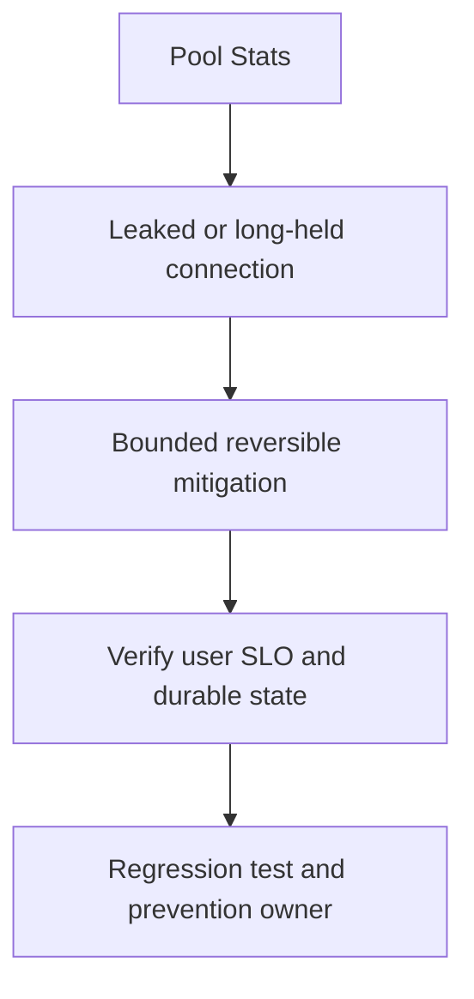

# DB pool exhausted

## Concept và Mental Model

500 requests và max open20 gây waits khi hold time/arrival vượt capacity; pool limit có thể đang bảo vệ database.

## How it works

Check InUse/Idle/Open, delta WaitCount/WaitDuration; đối chiếu PostgreSQL locks/active/idle-in-transaction và rows iteration duration.

## Production Use Case

Pause backfill, reduce admission/retries, cancel stale queries theo operational policy; tăng pool chỉ khi DB headroom rõ.

## Failure Scenarios

Unclosed Rows, missing rollback, external I/O trong Tx, nested db call với pool1, HPA pool multiplication.

## How I would debug this in production

Correlate goroutine acquire stacks với query/Tx age; audit Close/Err/Commit paths, load-test fix.

## Trade-offs và When NOT to use

Cap thấp tăng wait, cap cao tăng server contention; total fleet budget mới quyết định.

## Interview practice

Why can the database be idle while all pool slots are held? Rows/Tx/dedicated connections có thể được application giữ.

## Key Takeaways

500 requests và max open20 gây waits khi hold time/arrival vượt capacity; pool limit có thể đang bảo vệ database..

## See also

- [Database connection pool: 500 requests và 20 connections](../08-database/database-sql-pool.md)
- [pprof: chọn profile từ câu hỏi production](../16-performance/pprof.md)
- [Incident debugging với evidence](../17-observability/incident-debugging.md)

## Nguồn đối chiếu

- [Tài liệu chính thức](https://go.dev/doc/diagnostics)

## Drill và exit criteria

Trong staging, tạo triệu chứng **DB pool exhausted** bằng failure injection có bounded duration. Trước khi thay đổi, ghi baseline traffic, version, resource limits và câu hỏi cần trả lời: **Pool Stats**. Thực hiện một mitigation, rồi so outcome theo cùng workload.

- Success: user-facing errors/latency trở về SLO, accepted durable work được hoàn tất hoặc replayable, queues không tiếp tục tăng.
- Regression guard: test tái hiện failure path, metrics/alert chỉ ra triệu chứng trước saturation, runbook có owner và rollback trigger.
- Follow-up: **What would make your diagnosis wrong?** Nêu một measurement có thể bác bỏ giả thuyết, không chỉ evidence xác nhận.
