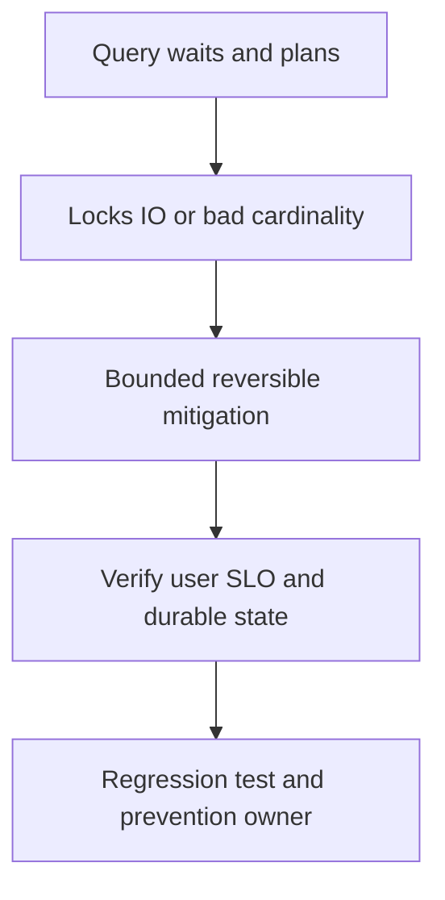

# Database query slowdown

## Concept và Mental Model

Latency DB có thể do plan/IO/CPU/locks hoặc app acquire wait; hai tầng cần measurements riêng.

## How it works

Fingerprint slow query, compare estimates/actual rows, indexes/statistics, lock blockers, WAL/replication và connection count. EXPLAIN ANALYZE thực thi workload.

## Production Use Case

Cancel/pause offending backfill hoặc rollback query regression khi impact rõ; preserve required transaction semantics.

## Failure Scenarios

N+1, missing composite index, skew generic plan, long snapshot/vacuum pressure, hot row lock.

## How I would debug this in production

Server wait_event/pg_stat_activity, plans trên safe environment và trace query vs pool time.

## Trade-offs và When NOT to use

Index mới tăng write/storage cost; replica không fix primary writes hoặc read-your-writes requirement.

## Interview practice

How would you distinguish a lock wait from a bad query plan? Wait events/blocker graph trước plan-only diagnosis.

## Key Takeaways

Latency DB có thể do plan/IO/CPU/locks hoặc app acquire wait; hai tầng cần measurements riêng..

## See also

- [Database performance bằng query evidence](../08-database/database-performance.md)
- [pprof: chọn profile từ câu hỏi production](../16-performance/pprof.md)
- [Incident debugging với evidence](../17-observability/incident-debugging.md)

## Nguồn đối chiếu

- [Tài liệu chính thức](https://go.dev/doc/diagnostics)

## Drill và exit criteria

Trong staging, tạo triệu chứng **Database query slowdown** bằng failure injection có bounded duration. Trước khi thay đổi, ghi baseline traffic, version, resource limits và câu hỏi cần trả lời: **Query waits and plans**. Thực hiện một mitigation, rồi so outcome theo cùng workload.

- Success: user-facing errors/latency trở về SLO, accepted durable work được hoàn tất hoặc replayable, queues không tiếp tục tăng.
- Regression guard: test tái hiện failure path, metrics/alert chỉ ra triệu chứng trước saturation, runbook có owner và rollback trigger.
- Follow-up: **What would make your diagnosis wrong?** Nêu một measurement có thể bác bỏ giả thuyết, không chỉ evidence xác nhận.
