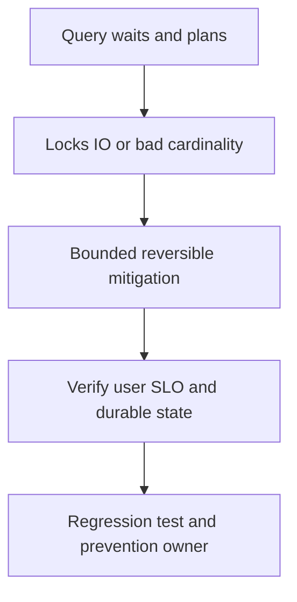

# Database query slowdown

## Bài toán và ví dụ đầu tiên

**Tình huống mô phỏng.** Một query từ20ms lên800ms sau khi dữ liệu tenant lớn hơn nhiều. DB CPU/IO tăng còn API goroutines chờ. Cần phân biệt execution plan, lock contention và pool wait trước chọn index hoặc thêm replicas.

## Đi từng bước qua một tình huống

Tìm normalized query/parameters shape có latency thay đổi, kiểm tra query count/request. Xem pg_stat_activity và lock wait: nếu bị blocker, đọc transaction holder trước. Nếu execution thật đắt, lấy plan trên môi trường phù hợp, xem estimated rows lệch actual và index scan/seq scan có khớp data distribution. EXPLAIN ANALYZE thực thi query nên không chạy tùy tiện với mutation production.

Một tenant hot có thể làm average che p99; payload/result size lớn còn tốn network/Scan/encode sau DB execute.

## Hiểu cơ chế từ kết quả quan sát

Mitigation có thể giới hạn page size/route concurrency, hủy query sai theo quy trình hoặc rollback query regression. Index phù hợp cần xét thời gian build, locks và write overhead; không tạo hàng loạt index không có plan. Tách một report đắt khỏi request sync nếu product chấp nhận async.

Nếu query giữ transaction mở qua network, sửa hold time có thể quan trọng hơn micro-optimization SQL. Read replica không giúp write locks trên primary hoặc một query không thể chịu stale reads.

## Khái niệm và mô hình làm việc

Latency DB có thể do plan/IO/CPU/locks hoặc app acquire wait; hai tầng cần measurements riêng.

## Cơ chế và những ranh giới cần giữ

Fingerprint slow query, compare estimates/actual rows, indexes/statistics, lock blockers, WAL/replication và connection count. EXPLAIN ANALYZE thực thi workload.

### Cách đọc diagram

Đọc từ trên xuống: Query waits and plans là điểm lấy bằng chứng từ lock waits và estimates/actual query plan; Locks IO or bad cardinality là nhóm giả thuyết cần kiểm chứng, không phải kết luận tự động. Mũi tên tới mitigation yêu cầu một thay đổi có bound và có thể đảo ngược. Sau đó kiểm tra execution, lock time và API P99, rồi chuyển cause đã xác nhận thành regression scenario và action có owner. Sơ đồ là trình tự điều tra; phần timeline ở đầu bài chỉ cách chọn bằng chứng để loại giả thuyết sai.

## Áp dụng vào hệ thống thật

Cancel/pause offending backfill hoặc rollback query regression khi impact rõ; preserve required transaction semantics.

## Những đường lỗi cần hiểu

N+1, missing composite index, skew generic plan, long snapshot/vacuum pressure, hot row lock.

## Lần theo bằng chứng khi có sự cố

Server wait_event/pg_stat_activity, plans trên safe environment và trace query vs pool time.

## Đánh đổi và giới hạn sử dụng

Index mới tăng write/storage cost; replica không fix primary writes hoặc read-your-writes requirement.

## Thực hành, debugging và kết luận

Verify plan và latency trên parameter distribution đại diện, gồm tenant hot. Theo dõi DB CPU/IO, lock wait, pool acquire và API P99. Integration/load tests giữ query shape và page bound; alert theo slow query/queue trước saturation. Kiểm tra migration/index rollout có tương thích code cũ và có phương án recovery rõ.

## Đọc tiếp

- [Database performance bằng query evidence](../08-database/database-performance.md)
- [pprof: chọn profile từ câu hỏi production](../16-performance/pprof.md)
- [Incident debugging với evidence](../17-observability/incident-debugging.md)

## Nguồn đối chiếu

- [Tài liệu chính thức](https://go.dev/doc/diagnostics)

## Drill và exit criteria

Trong staging, tạo triệu chứng **Database query slowdown** bằng failure injection có bounded duration. Trước khi thay đổi, ghi baseline traffic, version, resource limits và câu hỏi cần trả lời: **Query waits and plans**. Thực hiện một mitigation, rồi so outcome theo cùng workload.

- Success: user-facing errors/latency trở về SLO, accepted durable work được hoàn tất hoặc replayable, queues không tiếp tục tăng.
- Regression guard: test tái hiện failure path, metrics/alert chỉ ra triệu chứng trước saturation, runbook có owner và rollback trigger.
- Follow-up: **What would make your diagnosis wrong?** Nêu một measurement có thể bác bỏ giả thuyết, không chỉ evidence xác nhận.
