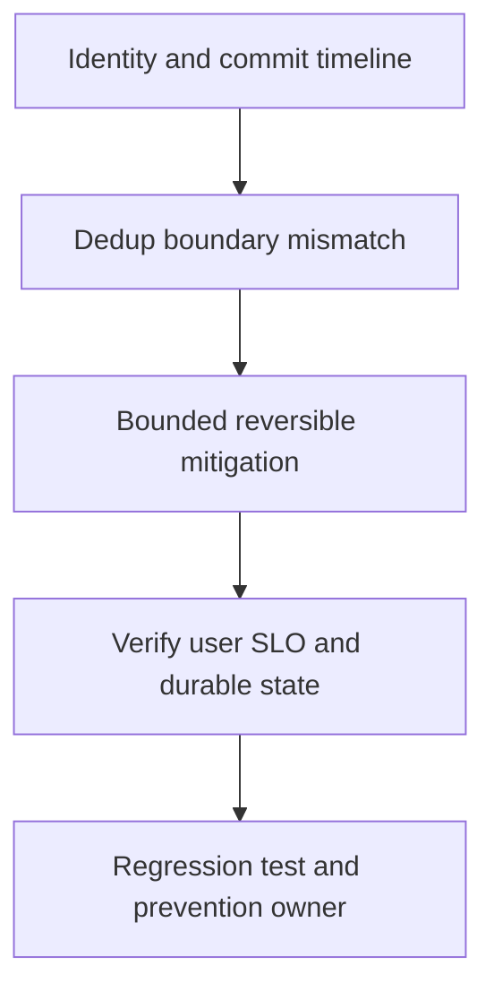

# Duplicate business effect

## Concept và Mental Model

Duplicate delivery bình thường trong at-least-once; double effect là idempotency boundary chưa đúng.

## How it works

Trace event ID, operation ID, source offset, consumer attempt, DB commit và offset commit. Tìm dedup/effect có chung Tx không.

## Production Use Case

Contain unsafe retries/consumer path, reconcile duplicate effects theo domain policy; không xóa evidence audit.

## Failure Scenarios

Key mới mỗi retry, TTL hết trước replay, dedup mark trước effect khác Tx, concurrent replicas check-then-act.

## How I would debug this in production

Crash injection sau effect trước ack, unique constraint test và retention horizon review.

## Trade-offs và When NOT to use

End-to-end exactly-once không được suy từ producer idempotence; external effects cần provider key/reconcile.

## Interview practice

What should happen if DB succeeded and offset commit failed? Replay no-op effect, sau đó progress commit lại.

## Key Takeaways

Duplicate delivery bình thường trong at-least-once; double effect là idempotency boundary chưa đúng..

## See also

- [Idempotent consumer transaction](../10-messaging/idempotent-consumer.md)
- [pprof: chọn profile từ câu hỏi production](../16-performance/pprof.md)
- [Incident debugging với evidence](../17-observability/incident-debugging.md)

## Nguồn đối chiếu

- [Tài liệu chính thức](https://go.dev/doc/diagnostics)

## Drill và exit criteria

Trong staging, tạo triệu chứng **Duplicate business effect** bằng failure injection có bounded duration. Trước khi thay đổi, ghi baseline traffic, version, resource limits và câu hỏi cần trả lời: **Identity and commit timeline**. Thực hiện một mitigation, rồi so outcome theo cùng workload.

- Success: user-facing errors/latency trở về SLO, accepted durable work được hoàn tất hoặc replayable, queues không tiếp tục tăng.
- Regression guard: test tái hiện failure path, metrics/alert chỉ ra triệu chứng trước saturation, runbook có owner và rollback trigger.
- Follow-up: **What would make your diagnosis wrong?** Nêu một measurement có thể bác bỏ giả thuyết, không chỉ evidence xác nhận.
