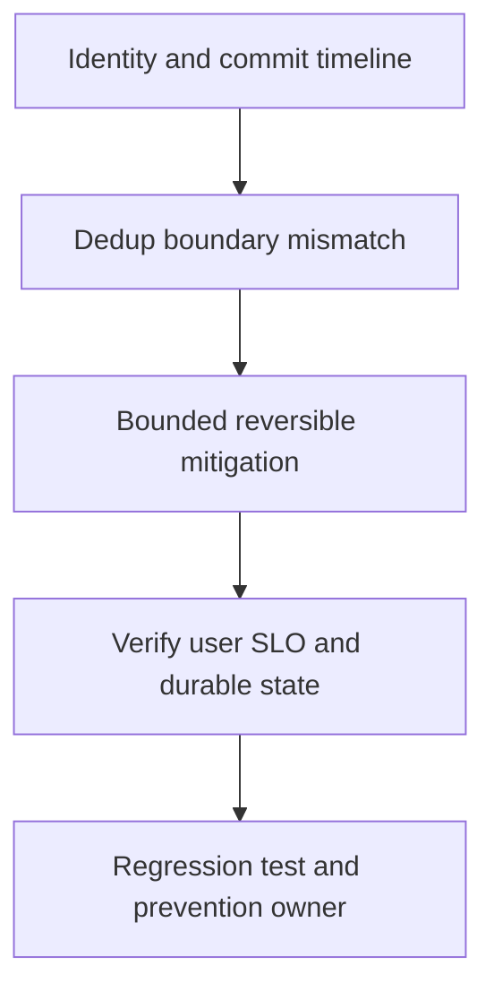

# Duplicate business effect

## Bài toán và ví dụ đầu tiên

**Tình huống mô phỏng.** User được cộng điểm hai lần sau consumer restart. Logs có hai processing attempts cho cùng event ID; broker redelivery có thể đúng theo at-least-once contract. Lỗi nằm ở effect không chịu replay.

## Đi từng bước qua một tình huống

Dựng timeline: attempt A update points commit, crash trước offset ack; attempt B đọc lại rồi update lần nữa. Kiểm tra dedup record có cùng transaction với points không. Nếu check-then-insert ngoài transaction, hai attempts concurrent cũng có thể cùng vượt check dù không crash.

Đối chiếu durable ledger/state và IDs, không chỉ log success vì log có thể mất sau commit. Xác nhận producer có giữ event ID qua retry hay đang phát ID mới cho cùng business operation.

## Hiểu cơ chế từ kết quả quan sát

Chặn tiếp tục double-apply bằng durable unique claim/dedup cùng transaction effect, hoặc conditional versioned update phù hợp. Side effect ngoài DB cần provider idempotency/reconcile; không cho local marker che một remote outcome chưa biết. Dữ liệu đã sai cần repair theo nghiệp vụ có audit, không xóa message rồi coi đã xong.

Mitigation giảm consumer rate có thể hạn chế ảnh hưởng trong lúc triển khai nhưng không chữa semantics replay.

## Khái niệm và mô hình làm việc

Duplicate delivery bình thường trong at-least-once; double effect là idempotency boundary chưa đúng.

## Cơ chế và những ranh giới cần giữ

Trace event ID, operation ID, source offset, consumer attempt, DB commit và offset commit. Tìm dedup/effect có chung Tx không.

### Cách đọc diagram

Đọc từ trên xuống: Identity and commit timeline là điểm lấy bằng chứng từ event ID cùng điểm effect/marker/ack commit; Dedup boundary mismatch là nhóm giả thuyết cần kiểm chứng, không phải kết luận tự động. Mũi tên tới mitigation yêu cầu một thay đổi có bound và có thể đảo ngược. Sau đó kiểm tra một durable effect cho cùng identity và repair dữ liệu cũ, rồi chuyển cause đã xác nhận thành regression scenario và action có owner. Sơ đồ là trình tự điều tra; phần timeline ở đầu bài chỉ cách chọn bằng chứng để loại giả thuyết sai.

## Áp dụng vào hệ thống thật

Contain unsafe retries/consumer path, reconcile duplicate effects theo domain policy; không xóa evidence audit.

## Những đường lỗi cần hiểu

Key mới mỗi retry, TTL hết trước replay, dedup mark trước effect khác Tx, concurrent replicas check-then-act.

## Lần theo bằng chứng khi có sự cố

Crash injection sau effect trước ack, unique constraint test và retention horizon review.

## Đánh đổi và giới hạn sử dụng

End-to-end exactly-once không được suy từ producer idempotence; external effects cần provider key/reconcile.

## Thực hành, debugging và kết luận

Test crash sau effect trước ack, concurrent duplicate và replay sau dedup retention. Verify cùng event chỉ có một durable effect và conflicting payload cùng ID được phát hiện. Theo dõi duplicate suppression và sửa records affected theo operation identity. Runbook replay phải giữ ID gốc, không tạo identity mới để vượt dedup.

## Đọc tiếp

- [Idempotent consumer transaction](../10-messaging/idempotent-consumer.md)
- [pprof: chọn profile từ câu hỏi production](../16-performance/pprof.md)
- [Incident debugging với evidence](../17-observability/incident-debugging.md)

## Nguồn đối chiếu

- [Tài liệu chính thức](https://go.dev/doc/diagnostics)
