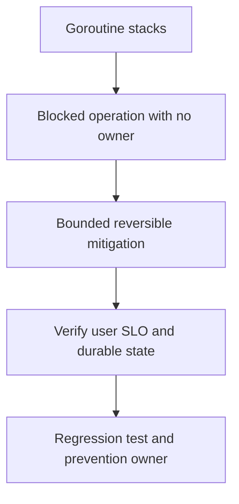

# 20,000 goroutines trong production

## Concept và Mental Model

High count có thể do20k connections hoặc leak; phải nhìn trends và lifetime owner.

## How it works

Group stacks theo chan send/receive, DB acquire, net I/O, mutex/runnable; compare trước/trong/sau drain và connection counts.

## Production Use Case

Cancel owned work, stop intake, fix missing receiver/timeout; đừng restart toàn fleet trước khi hiểu replay/accepted work.

## Failure Scenarios

First-result fan-out bỏ senders, ticker loop không exit, library bỏ ctx, unbounded background G.

## How I would debug this in production

runtime.NumGoroutine trend, goroutine profile repeated, creation sites và queue/DB/downstream latency.

## Trade-offs và When NOT to use

Bound G count chưa đủ nếu payload/FD unlimited; buffered channel chỉ hợp đúng protocol.

## Interview practice

Which evidence separates healthy concurrency from leakage? Workload đã drain nhưng orphan stack group không giảm.

## Key Takeaways

High count có thể do20k connections hoặc leak; phải nhìn trends và lifetime owner..

## See also

- [Goroutine leaks: blocked work còn giữ tài nguyên](../04-concurrency/goroutine-leak.md)
- [pprof: chọn profile từ câu hỏi production](../16-performance/pprof.md)
- [Incident debugging với evidence](../17-observability/incident-debugging.md)

## Nguồn đối chiếu

- [Tài liệu chính thức](https://go.dev/doc/diagnostics)

## Drill và exit criteria

Trong staging, tạo triệu chứng **20,000 goroutines trong production** bằng failure injection có bounded duration. Trước khi thay đổi, ghi baseline traffic, version, resource limits và câu hỏi cần trả lời: **Goroutine stacks**. Thực hiện một mitigation, rồi so outcome theo cùng workload.

- Success: user-facing errors/latency trở về SLO, accepted durable work được hoàn tất hoặc replayable, queues không tiếp tục tăng.
- Regression guard: test tái hiện failure path, metrics/alert chỉ ra triệu chứng trước saturation, runbook có owner và rollback trigger.
- Follow-up: **What would make your diagnosis wrong?** Nêu một measurement có thể bác bỏ giả thuyết, không chỉ evidence xác nhận.
