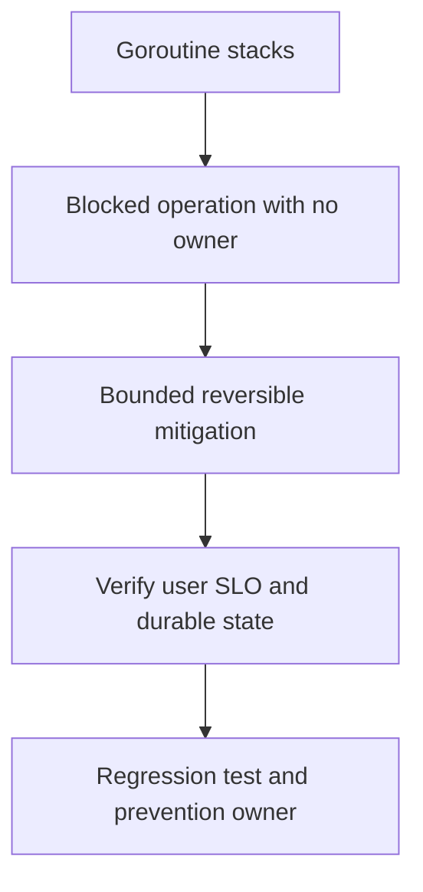

# 20,000 goroutines trong production

## Bài toán và ví dụ đầu tiên

**Tình huống mô phỏng.** Goroutine count từ 800 lên 15000 sau nhiều đợt client timeout. CPU không tăng tương ứng, memory tăng dần và count không về baseline khi traffic hết. Cần tìm công việc không còn owner hữu ích, không chỉ kết luận “quá nhiều goroutine”.

## Đi từng bước qua một tình huống

Lấy profile trong burst và sau drain, nhóm stacks theo blocking site và nơi tạo. Giả sử phần lớn đứng ở results <- response trong helper fetch. Dựng timeline handler timeout ở100ms, helper nhận remote response ở500ms rồi send vào channel không còn receiver. Group stack không tiến triển qua nhiều snapshots hỗ trợ giả thuyết này.

Kiểm tra input/output và context: helper có thể đã dùng ctx cho HTTP nhưng caller return trước worker send; hoặc worker dùng Background. Count connections giúp loại trừ trường hợp nhiều long-lived sessions hợp lệ.

## Hiểu cơ chế từ kết quả quan sát

Sửa send có đường cancellation hoặc dùng one-shot buffered result khi contract thật sự chỉ có một kết quả, rồi join khi owner cần cleanup trước return. Mọi blocking point của worker cần xem lại, không chỉ receive đầu vòng. Nếu job cần sống sau request, chuyển sang durable owner thay vì lén tách context.

Giảm admission để chặn tốc độ tạo worker lỗi trong lúc rollout bản sửa; restart chỉ giải phóng triệu chứng hiện tại. Profile trước restart có giá trị vì sau đó creation stacks của backlog đã mất.

## Khái niệm và mô hình làm việc

High count có thể do20k connections hoặc leak; phải nhìn trends và lifetime owner.

## Cơ chế và những ranh giới cần giữ

Group stacks theo chan send/receive, DB acquire, net I/O, mutex/runnable; compare trước/trong/sau drain và connection counts.

### Cách đọc diagram

Đọc từ trên xuống: Goroutine stacks là điểm lấy bằng chứng từ nhóm blocked stacks sau drain và owner send/receive; Blocked operation with no owner là nhóm giả thuyết cần kiểm chứng, không phải kết luận tự động. Mũi tên tới mitigation yêu cầu một thay đổi có bound và có thể đảo ngược. Sau đó kiểm tra worker finished và goroutine/memory trend sau tải, rồi chuyển cause đã xác nhận thành regression scenario và action có owner. Sơ đồ là trình tự điều tra; phần timeline ở đầu bài chỉ cách chọn bằng chứng để loại giả thuyết sai.

## Áp dụng vào hệ thống thật

Cancel owned work, stop intake, fix missing receiver/timeout; đừng restart toàn fleet trước khi hiểu replay/accepted work.

## Những đường lỗi cần hiểu

First-result fan-out bỏ senders, ticker loop không exit, library bỏ ctx, unbounded background G.

## Lần theo bằng chứng khi có sự cố

runtime.NumGoroutine trend, goroutine profile repeated, creation sites và queue/DB/downstream latency.

## Đánh đổi và giới hạn sử dụng

Bound G count chưa đủ nếu payload/FD unlimited; buffered channel chỉ hợp đúng protocol.

## Thực hành, debugging và kết luận

Test tạo worker, chờ started signal, làm caller bỏ cuộc, cancel và đợi worker-owned finished. Không Sleep rồi đếm runtime.NumGoroutine bằng số tuyệt đối vì background goroutines làm test nhiễu. Sau rollout, kiểm tra trend sau drain, memory và dependency in-flight cùng trở lại baseline. Document owner close/cancel/join tại API helper để người sửa sau không tái tạo leak.

## Đọc tiếp

- [Goroutine leaks: blocked work còn giữ tài nguyên](../04-concurrency/goroutine-leak.md)
- [pprof: chọn profile từ câu hỏi production](../16-performance/pprof.md)
- [Incident debugging với evidence](../17-observability/incident-debugging.md)

## Nguồn đối chiếu

- [Tài liệu chính thức](https://go.dev/doc/diagnostics)

## Drill và exit criteria

Trong staging, tạo triệu chứng **20,000 goroutines trong production** bằng failure injection có bounded duration. Trước khi thay đổi, ghi baseline traffic, version, resource limits và câu hỏi cần trả lời: **Goroutine stacks**. Thực hiện một mitigation, rồi so outcome theo cùng workload.

- Success: user-facing errors/latency trở về SLO, accepted durable work được hoàn tất hoặc replayable, queues không tiếp tục tăng.
- Regression guard: test tái hiện failure path, metrics/alert chỉ ra triệu chứng trước saturation, runbook có owner và rollback trigger.
- Follow-up: **What would make your diagnosis wrong?** Nêu một measurement có thể bác bỏ giả thuyết, không chỉ evidence xác nhận.
