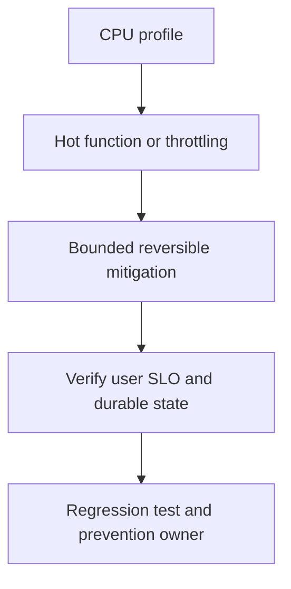

# CPU95%, memory normal, RPS normal

## Concept và Mental Model

CPU95% cùng high latency chỉ ra execution cost hoặc throttle; memory bình thường không loại GC churn.

## How it works

Capture CPU profile khi symptom còn xảy ra; top/cum/list tìm JSON, regex, compression, busy select/default, allocator/GC. Check quota throttled time ngoài profile.

## Production Use Case

Rollback encoder/compression regression hoặc stop runaway loop nếu evidence rõ; shed optional compute.

## Failure Scenarios

Tăng workers trên CPU-bound workload làm runnable queue dài; lock contention có thể cần mutex profile dù CPU cũng cao.

## How I would debug this in production

go tool pprof CPU, scheduler trace ngắn và GC alloc rate; compare per-request CPU before/after build.

## Trade-offs và When NOT to use

CPU optimization có thể tăng retained memory; verify P99, throughput và heap headroom cùng tải.

## Interview practice

How would you distinguish busy looping from useful serialization work? Stack hotspots và operations completed per CPU-second.

## Key Takeaways

CPU95% cùng high latency chỉ ra execution cost hoặc throttle; memory bình thường không loại GC churn..

## See also

- [CPU profile: execution cost](../16-performance/cpu-profile.md)
- [pprof: chọn profile từ câu hỏi production](../16-performance/pprof.md)
- [Incident debugging với evidence](../17-observability/incident-debugging.md)

## Nguồn đối chiếu

- [Tài liệu chính thức](https://go.dev/doc/diagnostics)

## Drill và exit criteria

Trong staging, tạo triệu chứng **CPU95%, memory normal, RPS normal** bằng failure injection có bounded duration. Trước khi thay đổi, ghi baseline traffic, version, resource limits và câu hỏi cần trả lời: **CPU profile**. Thực hiện một mitigation, rồi so outcome theo cùng workload.

- Success: user-facing errors/latency trở về SLO, accepted durable work được hoàn tất hoặc replayable, queues không tiếp tục tăng.
- Regression guard: test tái hiện failure path, metrics/alert chỉ ra triệu chứng trước saturation, runbook có owner và rollback trigger.
- Follow-up: **What would make your diagnosis wrong?** Nêu một measurement có thể bác bỏ giả thuyết, không chỉ evidence xác nhận.
