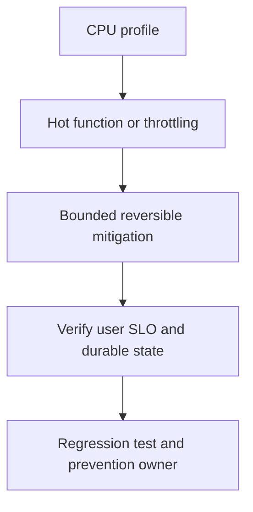

# CPU95%, memory normal, RPS normal

## Bài toán và ví dụ đầu tiên

**Tình huống mô phỏng.** Trước deploy, CPU service khoảng 30%, P99 100 ms. Năm phút sau release, CPU lên 95%, P99 gần 2 giây, RPS và payload distribution chưa đổi đáng kể. Memory tương đối ổn định. Các số này giúp dựng một cuộc điều tra có giả thuyết, không phải số liệu của một incident thật trong repository.

## Đi từng bước qua một tình huống

Đầu tiên xác minh CPU95% đang so với quota process/container nào và có throttling không. Đánh dấu release/config time rồi kiểm tra errors, completed RPS và routes bị ảnh hưởng. RPS đầu vào không đổi chưa nói công việc bên trong không đổi: retry hoặc log mới có thể tăng CPU/request.

Thu CPU profile ngắn trong cửa sổ triệu chứng và so baseline/canary cùng build metadata. Nếu top samples nằm ở fmt/JSON encoding do log payload mới, giả thuyết là formatting allocation/CPU tăng. Nếu nằm trong for-select default không làm việc, giả thuyết là busy loop. Nếu nhiều GC work, đọc alloc_space và allocation/request; memory ổn định không loại trừ allocation churn.

## Hiểu cơ chế từ kết quả quan sát

Với giả thuyết log regression, tắt path log mới trên canary hoặc rollback release theo quy trình để kiểm chứng. Không tăng workers ngay: CPU-bound workload đã gần quota thì thêm runnable goroutines có thể làm queue delay cao hơn. Nếu quota throttling là phần lớn, xem resource/GOMAXPROCS thực tế và workload burst trước đổi limits.

Bằng chứng bác bỏ cũng quan trọng: nếu CPU/request của release cũ và mới như nhau nhưng input payload lớn hơn, nguyên nhân không chỉ là release. Nếu latency nằm ở mutex/network wait, CPU profile một mình chưa đủ; trace và profiles khác phải nối cùng timeline.

## Khái niệm và mô hình làm việc

CPU95% cùng high latency chỉ ra execution cost hoặc throttle; memory bình thường không loại GC churn.

## Cơ chế và những ranh giới cần giữ

Capture CPU profile khi symptom còn xảy ra; top/cum/list tìm JSON, regex, compression, busy select/default, allocator/GC. Check quota throttled time ngoài profile.

### Cách đọc diagram

Đọc từ trên xuống: CPU profile là điểm lấy bằng chứng từ CPU samples cùng quota throttling và allocation/request; Hot function or throttling là nhóm giả thuyết cần kiểm chứng, không phải kết luận tự động. Mũi tên tới mitigation yêu cầu một thay đổi có bound và có thể đảo ngược. Sau đó kiểm tra CPU/request, P99 và completion dưới cùng load, rồi chuyển cause đã xác nhận thành regression scenario và action có owner. Sơ đồ là trình tự điều tra; phần timeline ở đầu bài chỉ cách chọn bằng chứng để loại giả thuyết sai.

## Áp dụng vào hệ thống thật

Rollback encoder/compression regression hoặc stop runaway loop nếu evidence rõ; shed optional compute.

## Những đường lỗi cần hiểu

Tăng workers trên CPU-bound workload làm runnable queue dài; lock contention có thể cần mutex profile dù CPU cũng cao.

## Lần theo bằng chứng khi có sự cố

go tool pprof CPU, scheduler trace ngắn và GC alloc rate; compare per-request CPU before/after build.

## Đánh đổi và giới hạn sử dụng

CPU optimization có thể tăng retained memory; verify P99, throughput và heap headroom cùng tải.

## Thực hành, debugging và kết luận

Sau mitigation, giữ offered load tương đương và kiểm tra CPU/request, P99, errors và completion rate cùng giảm về mục tiêu. Không chỉ nhìn CPU hạ vì server đang reject hết requests. So live heap/alloc để bảo đảm tối ưu không chuyển chi phí thành retention.

Bản sửa giữ output/log semantics cần thiết, có benchmark hot path nếu đáng đo và regression test busy-loop/cancel nếu đó là lỗi. Runbook chỉ rõ profile cần thu khi symptom còn xảy ra, thời lượng có kiểm soát và owner xử lý. Sự cố kết thúc khi user SLO phục hồi và backlog phát sinh được xử lý, không chỉ khi pod restart.

## Đọc tiếp

- [CPU profile: execution cost](../16-performance/cpu-profile.md)
- [pprof: chọn profile từ câu hỏi production](../16-performance/pprof.md)
- [Incident debugging với evidence](../17-observability/incident-debugging.md)

## Nguồn đối chiếu

- [Tài liệu chính thức](https://go.dev/doc/diagnostics)

## Drill và exit criteria

Trong staging, tạo triệu chứng **CPU95%, memory normal, RPS normal** bằng failure injection có bounded duration. Trước khi thay đổi, ghi baseline traffic, version, resource limits và câu hỏi cần trả lời: **CPU profile**. Thực hiện một mitigation, rồi so outcome theo cùng workload.

- Success: user-facing errors/latency trở về SLO, accepted durable work được hoàn tất hoặc replayable, queues không tiếp tục tăng.
- Regression guard: test tái hiện failure path, metrics/alert chỉ ra triệu chứng trước saturation, runbook có owner và rollback trigger.
- Follow-up: **What would make your diagnosis wrong?** Nêu một measurement có thể bác bỏ giả thuyết, không chỉ evidence xác nhận.
