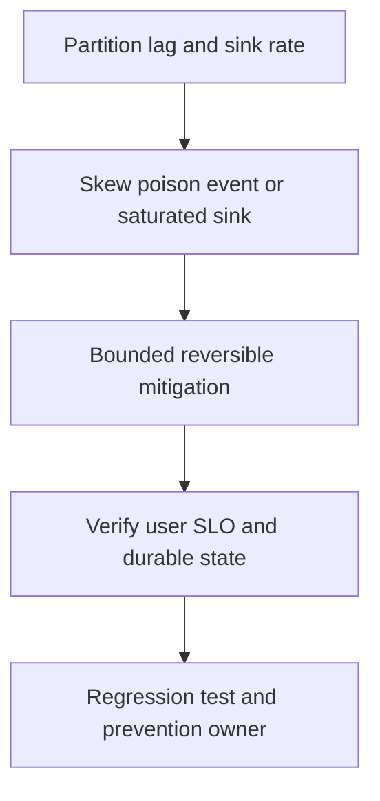

# Kafka consumer lag tăng

## Concept và Mental Model

Lag offset count và oldest event age trả lời hai câu khác nhau; skew một partition có thể bị aggregate che.

## How it works

So produce/consume rates, processing duration, rebalance, retry/DLQ và target DB waits. Check partitions versus active consumers.

## Production Use Case

Pause noncritical work, fix poison record/quarantine theo policy, scale only khi sink và partitions còn headroom.

## Failure Scenarios

Thêm consumers vượt partitions vô ích; larger batches kéo processing quá liveness budget; commit ahead tạo false low lag và mất work.

## How I would debug this in production

Per-partition lag/age, contiguous completed offsets, worker queue bytes và DB throughput.

## Trade-offs và When NOT to use

Retry topic giữ progress nhưng có thể reorder; giải thích consistency impact trước dùng.

## Interview practice

How do you estimate recovery time while new events arrive? Backlog chia net service rate μ−λ.

## Key Takeaways

Lag offset count và oldest event age trả lời hai câu khác nhau; skew một partition có thể bị aggregate che..

## See also

- [Ordering và contiguous commit](../10-messaging/ordering.md)
- [pprof: chọn profile từ câu hỏi production](../16-performance/pprof.md)
- [Incident debugging với evidence](../17-observability/incident-debugging.md)

## Nguồn đối chiếu

- [Tài liệu chính thức](https://go.dev/doc/diagnostics)

## Drill và exit criteria

Trong staging, tạo triệu chứng **Kafka consumer lag tăng** bằng failure injection có bounded duration. Trước khi thay đổi, ghi baseline traffic, version, resource limits và câu hỏi cần trả lời: **Partition lag and sink rate**. Thực hiện một mitigation, rồi so outcome theo cùng workload.

- Success: user-facing errors/latency trở về SLO, accepted durable work được hoàn tất hoặc replayable, queues không tiếp tục tăng.
- Regression guard: test tái hiện failure path, metrics/alert chỉ ra triệu chứng trước saturation, runbook có owner và rollback trigger.
- Follow-up: **What would make your diagnosis wrong?** Nêu một measurement có thể bác bỏ giả thuyết, không chỉ evidence xác nhận.
