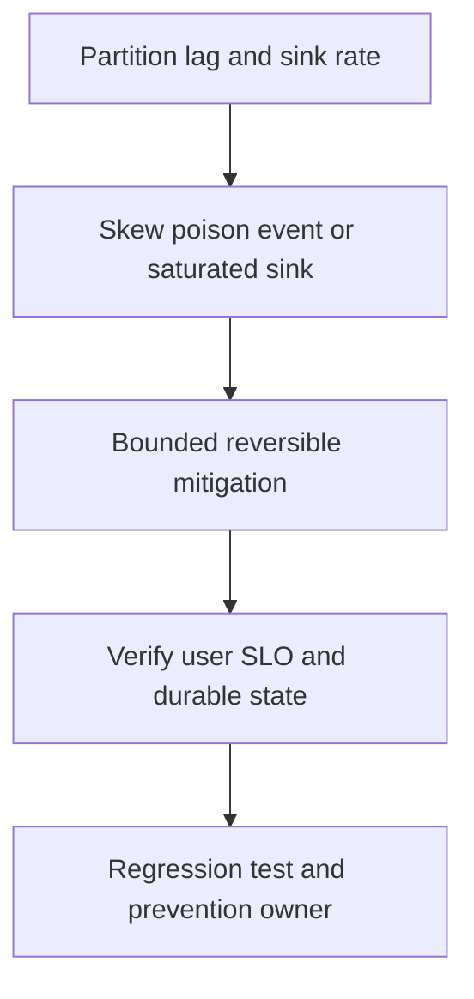

# Kafka consumer lag tăng

## Bài toán và ví dụ đầu tiên

**Tình huống mô phỏng.** Lag tăng50k records mỗi phút trong khi producer rate gần như cũ. Một vài partitions tăng mạnh hơn phần còn lại. Chưa có lý do để kết luận cần thêm consumer replicas; cần biết capacity nào không theo kịp.

## Đi từng bước qua một tình huống

Đo arrival và completed rate per partition, oldest record age, processing latency và rebalance rate. Giả sử DB call trong handler từ10ms lên100ms khiến mỗi worker chậm10 lần. Consumer CPU thấp là điều dễ hiểu vì chờ DB. Nếu chỉ một partition lag, xem hot key hoặc poison record làm retry blocking.

Kiểm tra actual assignment và số partitions so với members; thêm member vượt parallelism group không tạo thêm partition work.

## Hiểu cơ chế từ kết quả quan sát

Giảm retries lặp, sửa query hoặc giới hạn concurrency để DB phục hồi. Nếu downstream còn capacity và còn partitions chưa phân tải tốt, scale consumers có thể giúp. Nếu ordering per key bắt buộc, không song song hóa tùy ý rồi commit highest offset trong khi offsets trước chưa xong.

Đánh giá retention: backlog có nguy cơ vượt log window thì cần kế hoạch bảo toàn/rebuild dữ liệu, không chỉ dashboard lag. Pause/retry phải theo client protocol để không gây rebalance liên tục.

## Khái niệm và mô hình làm việc

Lag offset count và oldest event age trả lời hai câu khác nhau; skew một partition có thể bị aggregate che.

## Cơ chế và những ranh giới cần giữ

So produce/consume rates, processing duration, rebalance, retry/DLQ và target DB waits. Check partitions versus active consumers.

### Cách đọc diagram

Đọc từ trên xuống: Partition lag and sink rate là điểm lấy bằng chứng từ per-partition age, sink latency và rebalance; Skew poison event or saturated sink là nhóm giả thuyết cần kiểm chứng, không phải kết luận tự động. Mũi tên tới mitigation yêu cầu một thay đổi có bound và có thể đảo ngược. Sau đó kiểm tra completed rate vượt arrival và không gap checkpoint, rồi chuyển cause đã xác nhận thành regression scenario và action có owner. Sơ đồ là trình tự điều tra; phần timeline ở đầu bài chỉ cách chọn bằng chứng để loại giả thuyết sai.

## Áp dụng vào hệ thống thật

Pause noncritical work, fix poison record/quarantine theo policy, scale only khi sink và partitions còn headroom.

## Những đường lỗi cần hiểu

Thêm consumers vượt partitions vô ích; larger batches kéo processing quá liveness budget; commit ahead tạo false low lag và mất work.

## Lần theo bằng chứng khi có sự cố

Per-partition lag/age, contiguous completed offsets, worker queue bytes và DB throughput.

## Đánh đổi và giới hạn sử dụng

Retry topic giữ progress nhưng có thể reorder; giải thích consistency impact trước dùng.

## Thực hành, debugging và kết luận

Test slow dependency và rebalance khi còn in-flight, kiểm tra contiguous checkpoints/dedup. Recovery đo completion>arrival đủ lâu và oldest age giảm, không chỉ lag total giảm vì retention xóa record. Ramp workers sau fix để DB không bị burst. Ghi owner cho DLQ/replay và invariant kiểm chứng sau catch-up.

## Đọc tiếp

- [Ordering và contiguous commit](../10-messaging/ordering.md)
- [pprof: chọn profile từ câu hỏi production](../16-performance/pprof.md)
- [Incident debugging với evidence](../17-observability/incident-debugging.md)

## Nguồn đối chiếu

- [Tài liệu chính thức](https://go.dev/doc/diagnostics)

## Drill và exit criteria

Trong staging, tạo triệu chứng **Kafka consumer lag tăng** bằng failure injection có bounded duration. Trước khi thay đổi, ghi baseline traffic, version, resource limits và câu hỏi cần trả lời: **Partition lag and sink rate**. Thực hiện một mitigation, rồi so outcome theo cùng workload.

- Success: user-facing errors/latency trở về SLO, accepted durable work được hoàn tất hoặc replayable, queues không tiếp tục tăng.
- Regression guard: test tái hiện failure path, metrics/alert chỉ ra triệu chứng trước saturation, runbook có owner và rollback trigger.
- Follow-up: **What would make your diagnosis wrong?** Nêu một measurement có thể bác bỏ giả thuyết, không chỉ evidence xác nhận.
