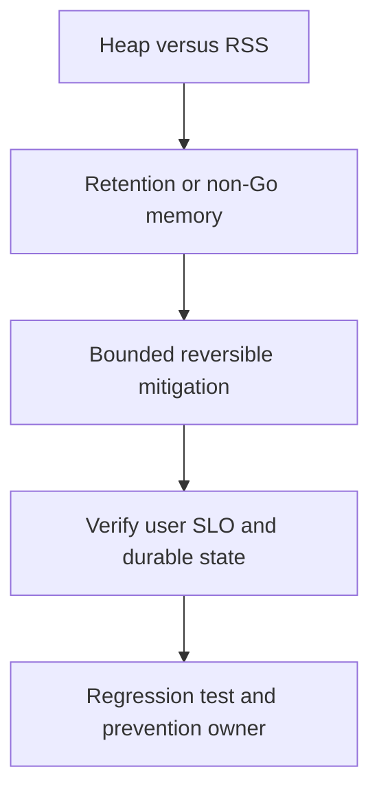

# Memory tăng liên tục

## Concept và Mental Model

RSS tăng theo giờ: phân biệt heap live, allocation churn, stacks, native memory và healthy cache warm-up.

## How it works

Capture heap profiles cùng load nhiều thời điểm; inuse_space/inuse_objects cho retained set, alloc_space cho churn. Check GC cycles và memory limits.

## Production Use Case

Bound cache/queue và pause memory-heavy backfill; nếu OOM imminent có thể drain/replace controlled để restore capacity, vẫn giữ evidence khi được.

## Failure Scenarios

Tiny slice giữ huge array, unbounded labels, leaked G, pooled outlier buffers; lowering GOMEMLIMIT gây thrash.

## How I would debug this in production

Diff profiles, goroutine count/stacks, cache entries/bytes và process RSS; kiểm cgo/mmap nếu heap không giải thích.

## Trade-offs và When NOT to use

Clone giảm retention nhưng tăng alloc; pool giảm churn nhưng tăng live set. Chọn theo bottleneck thật.

## Interview practice

Why can alloc_space be huge while inuse_space is stable? Short-lived allocations đã được GC.

## Key Takeaways

RSS tăng theo giờ: phân biệt heap live, allocation churn, stacks, native memory và healthy cache warm-up..

## See also

- [Heap và allocs profiles](../16-performance/memory-profile.md)
- [pprof: chọn profile từ câu hỏi production](../16-performance/pprof.md)
- [Incident debugging với evidence](../17-observability/incident-debugging.md)

## Nguồn đối chiếu

- [Tài liệu chính thức](https://go.dev/doc/diagnostics)

## Drill và exit criteria

Trong staging, tạo triệu chứng **Memory tăng liên tục** bằng failure injection có bounded duration. Trước khi thay đổi, ghi baseline traffic, version, resource limits và câu hỏi cần trả lời: **Heap versus RSS**. Thực hiện một mitigation, rồi so outcome theo cùng workload.

- Success: user-facing errors/latency trở về SLO, accepted durable work được hoàn tất hoặc replayable, queues không tiếp tục tăng.
- Regression guard: test tái hiện failure path, metrics/alert chỉ ra triệu chứng trước saturation, runbook có owner và rollback trigger.
- Follow-up: **What would make your diagnosis wrong?** Nêu một measurement có thể bác bỏ giả thuyết, không chỉ evidence xác nhận.
