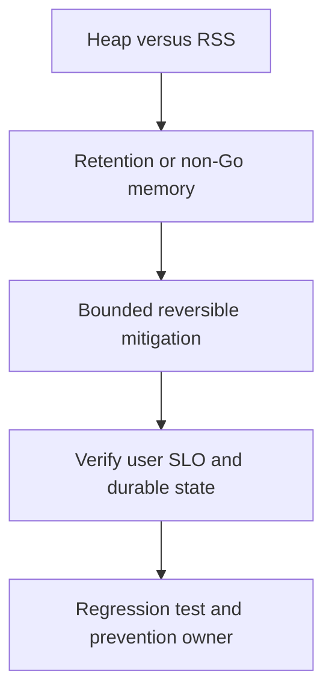

# Memory tăng liên tục

## Bài toán và ví dụ đầu tiên

**Tình huống mô phỏng.** RSS từ 400 MB lên 1,6 GB qua ba giờ, RPS ổn định. Một lần GC làm heap giảm ít, restart kéo memory về thấp rồi lại tăng. Restart là bằng chứng lifetime process có liên quan, chưa xác định object nào leak.

## Đi từng bước qua một tình huống

So RSS với Go live heap, heap goal, stacks và phần native/runtime để biết heap profile giải thích được bao nhiêu. Lấy hai profiles cùng điều kiện sau các khoảng workload tương đương, xem inuse_space/inuse_objects thay vì chỉ alloc_space. Nếu alloc_space tăng mà retained set ổn định, đó có thể là churn chứ không leak.

Giả sử map cache profile giữ nhiều entries theo request ID và cardinality tăng theo traffic tích lũy. Đọc ownership/eviction code: field TTL không tự xóa entry nếu cleanup không chạy. Một khả năng khác là sub-slice nhỏ giữ buffer lớn hoặc goroutine bị kẹt giữ request graph; dùng stacks và code để nối retaining path.

## Hiểu cơ chế từ kết quả quan sát

Mitigation có thể bound/clear cache có kiểm soát hoặc giảm nhận work giữ memory, nhưng cache clear có thể tạo stampede vào DB. Restart theo từng phần nếu cần và giữ profile trước khi mất evidence khi khả thi. Không hạ GOMEMLIMIT cực thấp để ép GC thu object vẫn reachable; nó có thể chỉ tăng GC CPU.

Bản sửa đặt max entries/bytes, eviction và ownership rõ hoặc copy phần dữ liệu nhỏ cần sống lâu. Với goroutine leak, sửa cancel/send/join protocol thay vì chỉ tăng RAM.

## Khái niệm và mô hình làm việc

RSS tăng theo giờ: phân biệt heap live, allocation churn, stacks, native memory và healthy cache warm-up.

## Cơ chế và những ranh giới cần giữ

Capture heap profiles cùng load nhiều thời điểm; inuse_space/inuse_objects cho retained set, alloc_space cho churn. Check GC cycles và memory limits.

### Cách đọc diagram

Đọc từ trên xuống: Heap versus RSS là điểm lấy bằng chứng từ inuse profiles cùng RSS/runtime/native accounting; Retention or non-Go memory là nhóm giả thuyết cần kiểm chứng, không phải kết luận tự động. Mũi tên tới mitigation yêu cầu một thay đổi có bound và có thể đảo ngược. Sau đó kiểm tra retained set đạt plateau sau burst/drain, rồi chuyển cause đã xác nhận thành regression scenario và action có owner. Sơ đồ là trình tự điều tra; phần timeline ở đầu bài chỉ cách chọn bằng chứng để loại giả thuyết sai.

## Áp dụng vào hệ thống thật

Bound cache/queue và pause memory-heavy backfill; nếu OOM imminent có thể drain/replace controlled để restore capacity, vẫn giữ evidence khi được.

## Những đường lỗi cần hiểu

Tiny slice giữ huge array, unbounded labels, leaked G, pooled outlier buffers; lowering GOMEMLIMIT gây thrash.

## Lần theo bằng chứng khi có sự cố

Diff profiles, goroutine count/stacks, cache entries/bytes và process RSS; kiểm cgo/mmap nếu heap không giải thích.

## Đánh đổi và giới hạn sử dụng

Clone giảm retention nhưng tăng alloc; pool giảm churn nhưng tăng live set. Chọn theo bottleneck thật.

## Thực hành, debugging và kết luận

Load test qua nhiều chu kỳ burst rồi drain và kiểm tra retained heap đạt plateau hợp lý. RSS có thể không giảm tức thì giống live heap nên đọc cả hai cùng thời gian. Test capacity/eviction và long-lived references theo lỗi cụ thể. Kiểm tra latency, DB miss load và GC CPU sau sửa để memory giảm không kéo theo một bottleneck mới.

## Đọc tiếp

- [Heap và allocs profiles](../16-performance/memory-profile.md)
- [pprof: chọn profile từ câu hỏi production](../16-performance/pprof.md)
- [Incident debugging với evidence](../17-observability/incident-debugging.md)

## Nguồn đối chiếu

- [Tài liệu chính thức](https://go.dev/doc/diagnostics)
