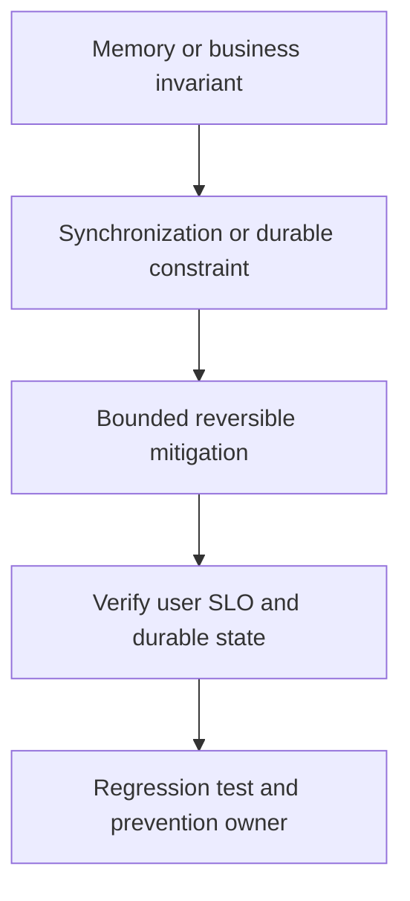

# Production race/data corruption

## Concept và Mental Model

Race symptom có thể crash, corrupt response hoặc duplicate state; cần tách memory race và business race.

## How it works

Read stack/evidence, identify shared locations/invariant và conflicting operations. Reproduce memory path dưới -race; DB duplicate dùng concurrent transaction test.

## Production Use Case

Rollback unsafe shared-buffer optimization; protect invariant bằng lock/ownership, giữ data reconciliation plan.

## Failure Scenarios

Lock chỉ map nhưng pointer values mutable ngoài lock; test sleeps che race; local lock không bảo vệ nhiều pods.

## How I would debug this in production

Both race access stacks, goroutine creators, business IDs và transaction order; vet copylocks.

## Trade-offs và When NOT to use

Fix lock có thể thêm contention/deadlock; verify correctness rồi measure latency.

## Interview practice

Why can duplicates remain after go test -race passes? Distributed check-then-act không nằm trong detector scope.

## Key Takeaways

Race symptom có thể crash, corrupt response hoặc duplicate state; cần tách memory race và business race..

## See also

- [Race condition versus data race](../04-concurrency/race-condition.md)
- [pprof: chọn profile từ câu hỏi production](../16-performance/pprof.md)
- [Incident debugging với evidence](../17-observability/incident-debugging.md)

## Nguồn đối chiếu

- [Tài liệu chính thức](https://go.dev/doc/diagnostics)

## Drill và exit criteria

Trong staging, tạo triệu chứng **Production race/data corruption** bằng failure injection có bounded duration. Trước khi thay đổi, ghi baseline traffic, version, resource limits và câu hỏi cần trả lời: **Memory or business invariant**. Thực hiện một mitigation, rồi so outcome theo cùng workload.

- Success: user-facing errors/latency trở về SLO, accepted durable work được hoàn tất hoặc replayable, queues không tiếp tục tăng.
- Regression guard: test tái hiện failure path, metrics/alert chỉ ra triệu chứng trước saturation, runbook có owner và rollback trigger.
- Follow-up: **What would make your diagnosis wrong?** Nêu một measurement có thể bác bỏ giả thuyết, không chỉ evidence xác nhận.
